```mermaid
flowchart TB
    subgraph upstream["Dependants (3)"]
        P1["<b>📦&nbsp;TrackYourDay.Tests.csproj</b><br/><small>net8.0</small>"]
        P2["<b>📦&nbsp;TrackYourDay.MAUI.csproj</b><br/><small>net8.0-windows10.0.19041.0</small>"]
        P4["<b>📦&nbsp;TrackYourDay.Web.csproj</b><br/><small>net8.0</small>"]
        click P1 "#teststrackyourdayteststrackyourdaytestscsproj"
        click P2 "#srctrackyourdaymauitrackyourdaymauicsproj"
        click P4 "#srctrackyourdaywebtrackyourdaywebcsproj"
    end
    subgraph current["TrackYourDay.Core.csproj"]
        MAIN["<b>📦&nbsp;TrackYourDay.Core.csproj</b><br/><small>net8.0</small>"]
        click MAIN "#srctrackyourdaycoretrackyourdaycorecsproj"
    end
    P1 --> MAIN
    P2 --> MAIN
    P4 --> MAIN

```

```mermaid
flowchart TB
    subgraph current["TrackYourDay.MAUI.csproj"]
        MAIN["<b>📦&nbsp;TrackYourDay.MAUI.csproj</b><br/><small>net8.0-windows10.0.19041.0</small>"]
        click MAIN "#srctrackyourdaymauitrackyourdaymauicsproj"
    end
    subgraph downstream["Dependencies (2"]
        P4["<b>📦&nbsp;TrackYourDay.Web.csproj</b><br/><small>net8.0</small>"]
        P3["<b>📦&nbsp;TrackYourDay.Core.csproj</b><br/><small>net8.0</small>"]
        click P4 "#srctrackyourdaywebtrackyourdaywebcsproj"
        click P3 "#srctrackyourdaycoretrackyourdaycorecsproj"
    end
    MAIN --> P4
    MAIN --> P3

```

```mermaid
flowchart TB
    subgraph upstream["Dependants (1)"]
        P2["<b>📦&nbsp;TrackYourDay.MAUI.csproj</b><br/><small>net8.0-windows10.0.19041.0</small>"]
        click P2 "#srctrackyourdaymauitrackyourdaymauicsproj"
    end
    subgraph current["TrackYourDay.Web.csproj"]
        MAIN["<b>📦&nbsp;TrackYourDay.Web.csproj</b><br/><small>net8.0</small>"]
        click MAIN "#srctrackyourdaywebtrackyourdaywebcsproj"
    end
    subgraph downstream["Dependencies (1"]
        P3["<b>📦&nbsp;TrackYourDay.Core.csproj</b><br/><small>net8.0</small>"]
        click P3 "#srctrackyourdaycoretrackyourdaycorecsproj"
    end
    P2 --> MAIN
    MAIN --> P3

```

```mermaid
flowchart TB
    subgraph current["TrackYourDay.Tests.csproj"]
        MAIN["<b>📦&nbsp;TrackYourDay.Tests.csproj</b><br/><small>net8.0</small>"]
        click MAIN "#teststrackyourdayteststrackyourdaytestscsproj"
    end
    subgraph downstream["Dependencies (1"]
        P3["<b>📦&nbsp;TrackYourDay.Core.csproj</b><br/><small>net8.0</small>"]
        click P3 "#srctrackyourdaycoretrackyourdaycorecsproj"
    end
    MAIN --> P3

```

# Projects and dependencies analysis

This document provides a comprehensive overview of the projects and their dependencies in the context of upgrading to .NETCoreApp,Version=v9.0.

## Table of Contents

- [Executive Summary](#executive-Summary)
  - [Highlevel Metrics](#highlevel-metrics)
  - [Projects Compatibility](#projects-compatibility)
  - [Package Compatibility](#package-compatibility)
  - [API Compatibility](#api-compatibility)
- [Aggregate NuGet packages details](#aggregate-nuget-packages-details)
- [Top API Migration Challenges](#top-api-migration-challenges)
  - [Technologies and Features](#technologies-and-features)
  - [Most Frequent API Issues](#most-frequent-api-issues)
- [Projects Relationship Graph](#projects-relationship-graph)
- [Project Details](#project-details)

  - [src\TrackYourDay.Core\TrackYourDay.Core.csproj](#srctrackyourdaycoretrackyourdaycorecsproj)
  - [src\TrackYourDay.MAUI\TrackYourDay.MAUI.csproj](#srctrackyourdaymauitrackyourdaymauicsproj)
  - [src\TrackYourDay.Web\TrackYourDay.Web.csproj](#srctrackyourdaywebtrackyourdaywebcsproj)
  - [Tests\TrackYourDay.Tests\TrackYourDay.Tests.csproj](#teststrackyourdayteststrackyourdaytestscsproj)

## Executive Summary

### Highlevel Metrics

| Metric | Count | Status |
| :--- | :---: | :--- |
| Total Projects | 4 | All require upgrade |
| Total NuGet Packages | 30 | 6 need upgrade |
| Total Code Files | 204 |  |
| Total Code Files with Incidents | 49 |  |
| Total Lines of Code | 13570 |  |
| Total Number of Issues | 433 |  |
| Estimated LOC to modify | 422+ | at least 3,1% of codebase |

### Projects Compatibility

| Project | Target Framework | Difficulty | Package Issues | API Issues | Est. LOC Impact | Description |
| :--- | :---: | :---: | :---: | :---: | :---: | :--- |
| [src\TrackYourDay.Core\TrackYourDay.Core.csproj](#srctrackyourdaycoretrackyourdaycorecsproj) | net8.0 | 🟢 Low | 3 | 12 | 12+ | ClassLibrary, Sdk Style = True |
| [src\TrackYourDay.MAUI\TrackYourDay.MAUI.csproj](#srctrackyourdaymauitrackyourdaymauicsproj) | net8.0-windows10.0.19041.0 | 🟢 Low | 1 | 333 | 333+ | WinForms, Sdk Style = True |
| [src\TrackYourDay.Web\TrackYourDay.Web.csproj](#srctrackyourdaywebtrackyourdaywebcsproj) | net8.0 | 🟢 Low | 3 | 2 | 2+ | AspNetCore, Sdk Style = True |
| [Tests\TrackYourDay.Tests\TrackYourDay.Tests.csproj](#teststrackyourdayteststrackyourdaytestscsproj) | net8.0 | 🟢 Low | 0 | 75 | 75+ | DotNetCoreApp, Sdk Style = True |

### Package Compatibility

| Status | Count | Percentage |
| :--- | :---: | :---: |
| ✅ Compatible | 24 | 80,0% |
| ⚠️ Incompatible | 0 | 0,0% |
| 🔄 Upgrade Recommended | 6 | 20,0% |
| ***Total NuGet Packages*** | ***30*** | ***100%*** |

### API Compatibility

| Category | Count | Impact |
| :--- | :---: | :--- |
| 🔴 Binary Incompatible | 23 | High - Require code changes |
| 🟡 Source Incompatible | 399 | Medium - Needs re-compilation and potential conflicting API error fixing |
| 🔵 Behavioral change | 0 | Low - Behavioral changes that may require testing at runtime |
| ✅ Compatible | 28571 |  |
| ***Total APIs Analyzed*** | ***28993*** |  |

## Aggregate NuGet packages details

| Package | Current Version | Suggested Version | Projects | Description |
| :--- | :---: | :---: | :--- | :--- |
| coverlet.collector | 6.0.0 |  | [TrackYourDay.Tests.csproj](#teststrackyourdayteststrackyourdaytestscsproj) | ✅Compatible |
| FluentAssertions | 6.12.0 |  | [TrackYourDay.Tests.csproj](#teststrackyourdayteststrackyourdaytestscsproj) | ✅Compatible |
| MediatR | 12.1.1 |  | [TrackYourDay.Core.csproj](#srctrackyourdaycoretrackyourdaycorecsproj) [TrackYourDay.MAUI.csproj](#srctrackyourdaymauitrackyourdaymauicsproj) | ✅Compatible |
| Microsoft.AspNetCore.Components.WebAssembly | 8.0.10 | 9.0.11 | [TrackYourDay.Web.csproj](#srctrackyourdaywebtrackyourdaywebcsproj) | NuGet package upgrade is recommended |
| Microsoft.AspNetCore.Components.WebAssembly.DevServer | 8.0.10 | 9.0.11 | [TrackYourDay.Web.csproj](#srctrackyourdaywebtrackyourdaywebcsproj) | NuGet package upgrade is recommended |
| Microsoft.AspNetCore.Components.WebView.Maui | 8.0.3 |  | [TrackYourDay.MAUI.csproj](#srctrackyourdaymauitrackyourdaymauicsproj) | ✅Compatible |
| Microsoft.Data.Sqlite | 8.0.1 | 9.0.11 | [TrackYourDay.Core.csproj](#srctrackyourdaycoretrackyourdaycorecsproj) [TrackYourDay.Web.csproj](#srctrackyourdaywebtrackyourdaywebcsproj) | NuGet package upgrade is recommended |
| Microsoft.Extensions.Logging.Abstractions | 8.0.0 | 9.0.11 | [TrackYourDay.Core.csproj](#srctrackyourdaycoretrackyourdaycorecsproj) | NuGet package upgrade is recommended |
| Microsoft.Extensions.Logging.Debug | 8.0.0 | 9.0.11 | [TrackYourDay.MAUI.csproj](#srctrackyourdaymauitrackyourdaymauicsproj) | NuGet package upgrade is recommended |
| Microsoft.Maui.Controls | 8.0.3 |  | [TrackYourDay.MAUI.csproj](#srctrackyourdaymauitrackyourdaymauicsproj) | ✅Compatible |
| Microsoft.Maui.Controls.Compatibility | 8.0.3 |  | [TrackYourDay.MAUI.csproj](#srctrackyourdaymauitrackyourdaymauicsproj) | ✅Compatible |
| Microsoft.ML | 3.0.0 |  | [TrackYourDay.Core.csproj](#srctrackyourdaycoretrackyourdaycorecsproj) | ✅Compatible |
| Microsoft.ML.FastTree | 3.0.0 |  | [TrackYourDay.Core.csproj](#srctrackyourdaycoretrackyourdaycorecsproj) | ✅Compatible |
| Microsoft.ML.TensorFlow | 3.0.0 |  | [TrackYourDay.Core.csproj](#srctrackyourdaycoretrackyourdaycorecsproj) | ✅Compatible |
| Microsoft.ML.TimeSeries | 3.0.0 |  | [TrackYourDay.Core.csproj](#srctrackyourdaycoretrackyourdaycorecsproj) | ✅Compatible |
| Microsoft.NET.Test.Sdk | 17.7.2 |  | [TrackYourDay.Tests.csproj](#teststrackyourdayteststrackyourdaytestscsproj) | ✅Compatible |
| Moq | 4.20.69 |  | [TrackYourDay.Tests.csproj](#teststrackyourdayteststrackyourdaytestscsproj) | ✅Compatible |
| MudBlazor | 6.10.0 |  | [TrackYourDay.MAUI.csproj](#srctrackyourdaymauitrackyourdaymauicsproj) [TrackYourDay.Web.csproj](#srctrackyourdaywebtrackyourdaywebcsproj) | ✅Compatible |
| Newtonsoft.Json | 13.0.3 | 13.0.4 | [TrackYourDay.Core.csproj](#srctrackyourdaycoretrackyourdaycorecsproj) | NuGet package upgrade is recommended |
| Quartz | 3.7.0 |  | [TrackYourDay.MAUI.csproj](#srctrackyourdaymauitrackyourdaymauicsproj) | ✅Compatible |
| Quartz.Extensions.DependencyInjection | 3.7.0 |  | [TrackYourDay.MAUI.csproj](#srctrackyourdaymauitrackyourdaymauicsproj) | ✅Compatible |
| Quartz.Extensions.Hosting | 3.7.0 |  | [TrackYourDay.MAUI.csproj](#srctrackyourdaymauitrackyourdaymauicsproj) | ✅Compatible |
| Serilog | 3.0.1 |  | [TrackYourDay.MAUI.csproj](#srctrackyourdaymauitrackyourdaymauicsproj) | ✅Compatible |
| Serilog.Extensions.Logging | 7.0.0 |  | [TrackYourDay.MAUI.csproj](#srctrackyourdaymauitrackyourdaymauicsproj) | ✅Compatible |
| Serilog.Sinks.Console | 4.1.0 |  | [TrackYourDay.MAUI.csproj](#srctrackyourdaymauitrackyourdaymauicsproj) | ✅Compatible |
| Serilog.Sinks.Debug | 2.0.0 |  | [TrackYourDay.MAUI.csproj](#srctrackyourdaymauitrackyourdaymauicsproj) | ✅Compatible |
| Serilog.Sinks.File | 5.0.0 |  | [TrackYourDay.MAUI.csproj](#srctrackyourdaymauitrackyourdaymauicsproj) | ✅Compatible |
| Serilog.Sinks.Map | 1.0.2 |  | [TrackYourDay.MAUI.csproj](#srctrackyourdaymauitrackyourdaymauicsproj) | ✅Compatible |
| xunit | 2.5.1 |  | [TrackYourDay.Tests.csproj](#teststrackyourdayteststrackyourdaytestscsproj) | ✅Compatible |
| xunit.runner.visualstudio | 2.5.1 |  | [TrackYourDay.Tests.csproj](#teststrackyourdayteststrackyourdaytestscsproj) | ✅Compatible |

## Top API Migration Challenges

### Technologies and Features

| Technology | Issues | Percentage | Migration Path |
| :--- | :---: | :---: | :--- |
| Legacy Cryptography | 2 | 0,5% | Obsolete or insecure cryptographic algorithms that have been deprecated for security reasons. These algorithms are no longer considered secure by modern standards. Migrate to modern cryptographic APIs using secure algorithms. |

### Most Frequent API Issues

| API | Count | Percentage | Category |
| :--- | :---: | :---: | :--- |
| M:System.TimeSpan.FromMinutes(System.Double) | 45 | 10,7% | Source Incompatible |
| M:System.TimeSpan.FromHours(System.Double) | 41 | 9,7% | Source Incompatible |
| T:Microsoft.Maui.Controls.Label | 36 | 8,5% | Source Incompatible |
| T:Microsoft.Maui.Controls.Application | 25 | 5,9% | Source Incompatible |
| P:Microsoft.Maui.Hosting.MauiAppBuilder.Services | 14 | 3,3% | Source Incompatible |
| P:Microsoft.Maui.Controls.Application.Current | 12 | 2,8% | Source Incompatible |
| P:Microsoft.Maui.Controls.Element.Id | 10 | 2,4% | Source Incompatible |
| T:Microsoft.Maui.Controls.ProgressBar | 10 | 2,4% | Source Incompatible |
| T:Microsoft.Maui.Controls.Window | 9 | 2,1% | Source Incompatible |
| T:Microsoft.Maui.Controls.NameScopeExtensions | 9 | 2,1% | Source Incompatible |
| M:Microsoft.Maui.Controls.NameScopeExtensions.FindByName''1(Microsoft.Maui.Controls.Element,System.String) | 9 | 2,1% | Source Incompatible |
| T:Microsoft.Maui.Controls.Page | 8 | 1,9% | Source Incompatible |
| M:Microsoft.Maui.Controls.ContentPage.#ctor | 8 | 1,9% | Source Incompatible |
| T:Microsoft.Maui.Controls.BindableProperty | 8 | 1,9% | Source Incompatible |
| F:Microsoft.Maui.Controls.Label.TextProperty | 8 | 1,9% | Source Incompatible |
| T:Microsoft.Maui.Controls.BindableObjectExtensions | 8 | 1,9% | Source Incompatible |
| M:Microsoft.Maui.Controls.BindableObjectExtensions.SetBinding(Microsoft.Maui.Controls.BindableObject,Microsoft.Maui.Controls.BindableProperty,System.String,Microsoft.Maui.Controls.BindingMode,Microsoft.Maui.Controls.IValueConverter,System.String) | 8 | 1,9% | Source Incompatible |
| P:Microsoft.Maui.Controls.BindableObject.BindingContext | 8 | 1,9% | Source Incompatible |
| M:System.TimeSpan.FromSeconds(System.Double) | 6 | 1,4% | Source Incompatible |
| T:Microsoft.Maui.IElementHandler | 6 | 1,4% | Source Incompatible |
| P:Microsoft.Maui.IElementHandler.PlatformView | 6 | 1,4% | Source Incompatible |
| P:Microsoft.Maui.Controls.Window.Height | 6 | 1,4% | Source Incompatible |
| P:Microsoft.Maui.Controls.Window.Page | 6 | 1,4% | Source Incompatible |
| P:Microsoft.Maui.Controls.Application.Windows | 6 | 1,4% | Source Incompatible |
| T:Microsoft.Maui.Hosting.MauiApp | 5 | 1,2% | Source Incompatible |
| T:Microsoft.Maui.Controls.Xaml.Extensions | 5 | 1,2% | Source Incompatible |
| P:Microsoft.Maui.Controls.Window.Width | 4 | 0,9% | Source Incompatible |
| T:Microsoft.Maui.ApplicationModel.MainThread | 4 | 0,9% | Source Incompatible |
| M:Microsoft.Maui.ApplicationModel.MainThread.BeginInvokeOnMainThread(System.Action) | 4 | 0,9% | Source Incompatible |
| T:Microsoft.Maui.Controls.ContentPage | 4 | 0,9% | Source Incompatible |
| P:Microsoft.Maui.Controls.ProgressBar.Progress | 4 | 0,9% | Source Incompatible |
| M:System.TimeSpan.FromMilliseconds(System.Double) | 4 | 0,9% | Source Incompatible |
| P:Microsoft.Maui.Controls.Element.Handler | 3 | 0,7% | Source Incompatible |
| M:Microsoft.Maui.Controls.Application.OpenWindow(Microsoft.Maui.Controls.Window) | 3 | 0,7% | Source Incompatible |
| P:Microsoft.Maui.Controls.Window.Title | 3 | 0,7% | Source Incompatible |
| M:Microsoft.Maui.Controls.Window.#ctor(Microsoft.Maui.Controls.Page) | 3 | 0,7% | Source Incompatible |
| M:Microsoft.Maui.Controls.Application.CloseWindow(Microsoft.Maui.Controls.Window) | 3 | 0,7% | Source Incompatible |
| T:Microsoft.Maui.VisualTreeElementExtensions | 3 | 0,7% | Source Incompatible |
| T:Microsoft.Maui.IWindow | 3 | 0,7% | Source Incompatible |
| M:Microsoft.Maui.VisualTreeElementExtensions.GetVisualElementWindow(Microsoft.Maui.IVisualTreeElement) | 3 | 0,7% | Source Incompatible |
| P:Microsoft.Maui.IElement.Handler | 3 | 0,7% | Source Incompatible |
| T:Microsoft.Extensions.DependencyInjection.ServiceCollectionExtensions | 3 | 0,7% | Binary Incompatible |
| T:Microsoft.Maui.Hosting.MauiAppBuilder | 3 | 0,7% | Source Incompatible |
| M:System.Security.Cryptography.Rfc2898DeriveBytes.#ctor(System.String,System.Byte[]) | 2 | 0,5% | Source Incompatible |
| P:Microsoft.Maui.Platform.MauiNavigationView.NavigationViewBackButtonMargin | 2 | 0,5% | Binary Incompatible |
| M:Microsoft.Maui.MauiWinUIApplication.#ctor | 2 | 0,5% | Binary Incompatible |
| P:Microsoft.Maui.Controls.Page.Title | 2 | 0,5% | Source Incompatible |
| P:Microsoft.Maui.Controls.Application.MainPage | 2 | 0,5% | Source Incompatible |
| M:Microsoft.Maui.Controls.Application.#ctor | 2 | 0,5% | Source Incompatible |
| T:Microsoft.Maui.IApplication | 1 | 0,2% | Source Incompatible |

## Projects Relationship Graph

Legend:
📦 SDK-style project
⚙️ Classic project

```mermaid
flowchart LR
    P1["<b>📦&nbsp;TrackYourDay.Tests.csproj</b><br/><small>net8.0</small>"]
    P2["<b>📦&nbsp;TrackYourDay.MAUI.csproj</b><br/><small>net8.0-windows10.0.19041.0</small>"]
    P3["<b>📦&nbsp;TrackYourDay.Core.csproj</b><br/><small>net8.0</small>"]
    P4["<b>📦&nbsp;TrackYourDay.Web.csproj</b><br/><small>net8.0</small>"]
    P1 --> P3
    P2 --> P4
    P2 --> P3
    P4 --> P3
    click P1 "#teststrackyourdayteststrackyourdaytestscsproj"
    click P2 "#srctrackyourdaymauitrackyourdaymauicsproj"
    click P3 "#srctrackyourdaycoretrackyourdaycorecsproj"
    click P4 "#srctrackyourdaywebtrackyourdaywebcsproj"

```

## Project Details

### src\TrackYourDay.Core\TrackYourDay.Core.csproj

#### Project Info

- **Current Target Framework:** net8.0
- **Proposed Target Framework:** net9.0
- **SDK-style**: True
- **Project Kind:** ClassLibrary
- **Dependencies**: 0
- **Dependants**: 3
- **Number of Files**: 114
- **Number of Files with Incidents**: 7
- **Lines of Code**: 6501
- **Estimated LOC to modify**: 12+ (at least 0,2% of the project)

#### Dependency Graph

Legend:
📦 SDK-style project
⚙️ Classic project

### API Compatibility

| Category | Count | Impact |
| :--- | :---: | :--- |
| 🔴 Binary Incompatible | 0 | High - Require code changes |
| 🟡 Source Incompatible | 12 | Medium - Needs re-compilation and potential conflicting API error fixing |
| 🔵 Behavioral change | 0 | Low - Behavioral changes that may require testing at runtime |
| ✅ Compatible | 8209 |  |
| ***Total APIs Analyzed*** | ***8221*** |  |

#### Project Technologies and Features

| Technology | Issues | Percentage | Migration Path |
| :--- | :---: | :---: | :--- |
| Legacy Cryptography | 2 | 16,7% | Obsolete or insecure cryptographic algorithms that have been deprecated for security reasons. These algorithms are no longer considered secure by modern standards. Migrate to modern cryptographic APIs using secure algorithms. |

### src\TrackYourDay.MAUI\TrackYourDay.MAUI.csproj

#### Project Info

- **Current Target Framework:** net8.0-windows10.0.19041.0
- **Proposed Target Framework:** net9.0-windows10.0.22000.0
- **SDK-style**: True
- **Project Kind:** WinForms
- **Dependencies**: 2
- **Dependants**: 0
- **Number of Files**: 38
- **Number of Files with Incidents**: 21
- **Lines of Code**: 1226
- **Estimated LOC to modify**: 333+ (at least 27,2% of the project)

#### Dependency Graph

Legend:
📦 SDK-style project
⚙️ Classic project

### API Compatibility

| Category | Count | Impact |
| :--- | :---: | :--- |
| 🔴 Binary Incompatible | 22 | High - Require code changes |
| 🟡 Source Incompatible | 311 | Medium - Needs re-compilation and potential conflicting API error fixing |
| 🔵 Behavioral change | 0 | Low - Behavioral changes that may require testing at runtime |
| ✅ Compatible | 5121 |  |
| ***Total APIs Analyzed*** | ***5454*** |  |

### src\TrackYourDay.Web\TrackYourDay.Web.csproj

#### Project Info

- **Current Target Framework:** net8.0
- **Proposed Target Framework:** net9.0
- **SDK-style**: True
- **Project Kind:** AspNetCore
- **Dependencies**: 1
- **Dependants**: 1
- **Number of Files**: 56
- **Number of Files with Incidents**: 3
- **Lines of Code**: 187
- **Estimated LOC to modify**: 2+ (at least 1,1% of the project)

#### Dependency Graph

Legend:
📦 SDK-style project
⚙️ Classic project

### API Compatibility

| Category | Count | Impact |
| :--- | :---: | :--- |
| 🔴 Binary Incompatible | 1 | High - Require code changes |
| 🟡 Source Incompatible | 1 | Medium - Needs re-compilation and potential conflicting API error fixing |
| 🔵 Behavioral change | 0 | Low - Behavioral changes that may require testing at runtime |
| ✅ Compatible | 7840 |  |
| ***Total APIs Analyzed*** | ***7842*** |  |

### Tests\TrackYourDay.Tests\TrackYourDay.Tests.csproj

#### Project Info

- **Current Target Framework:** net8.0
- **Proposed Target Framework:** net9.0
- **SDK-style**: True
- **Project Kind:** DotNetCoreApp
- **Dependencies**: 1
- **Dependants**: 0
- **Number of Files**: 48
- **Number of Files with Incidents**: 18
- **Lines of Code**: 5656
- **Estimated LOC to modify**: 75+ (at least 1,3% of the project)

#### Dependency Graph

Legend:
📦 SDK-style project
⚙️ Classic project

### API Compatibility

| Category | Count | Impact |
| :--- | :---: | :--- |
| 🔴 Binary Incompatible | 0 | High - Require code changes |
| 🟡 Source Incompatible | 75 | Medium - Needs re-compilation and potential conflicting API error fixing |
| 🔵 Behavioral change | 0 | Low - Behavioral changes that may require testing at runtime |
| ✅ Compatible | 7401 |  |
| ***Total APIs Analyzed*** | ***7476*** |  |

