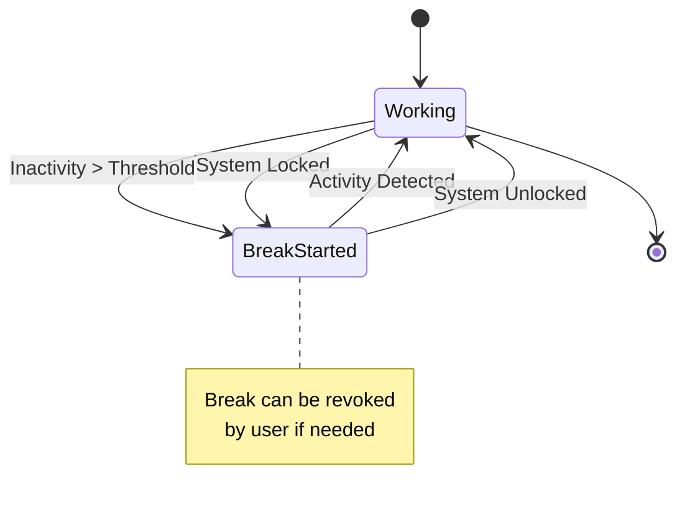
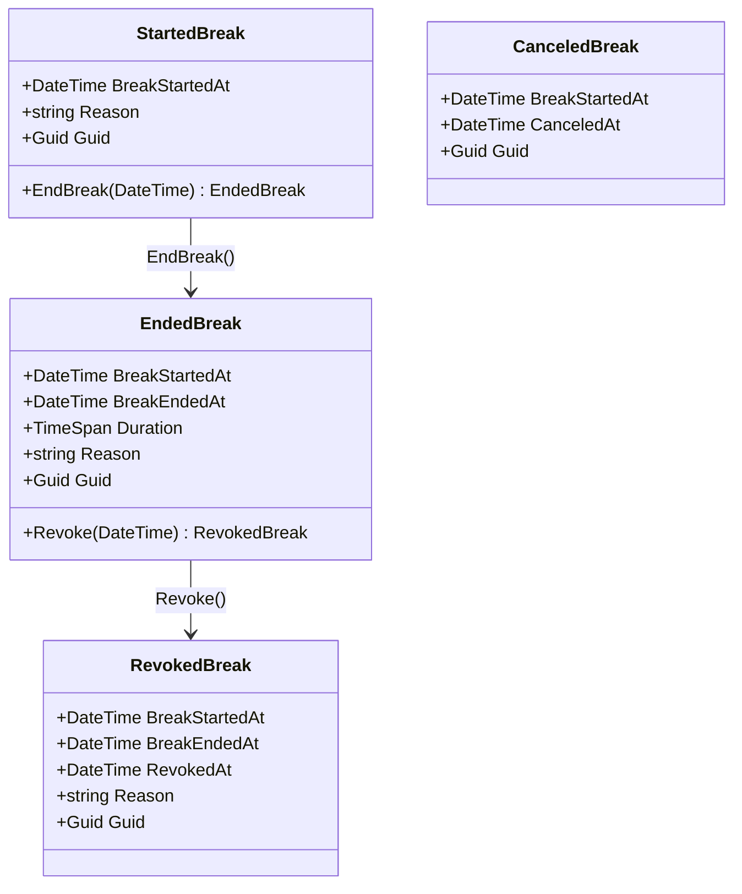
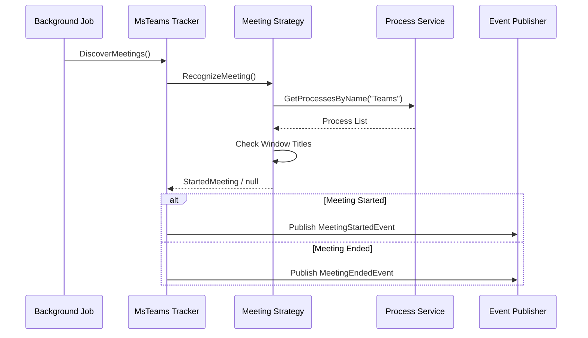
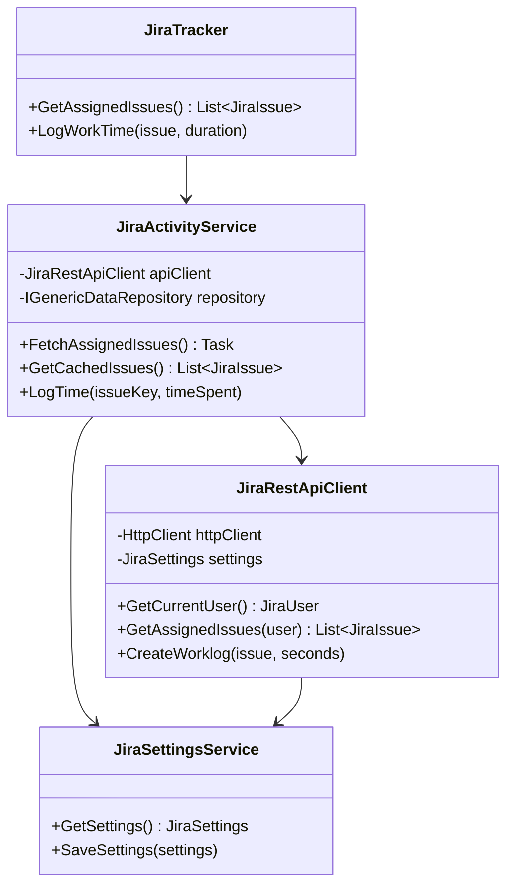
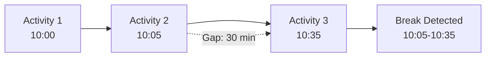
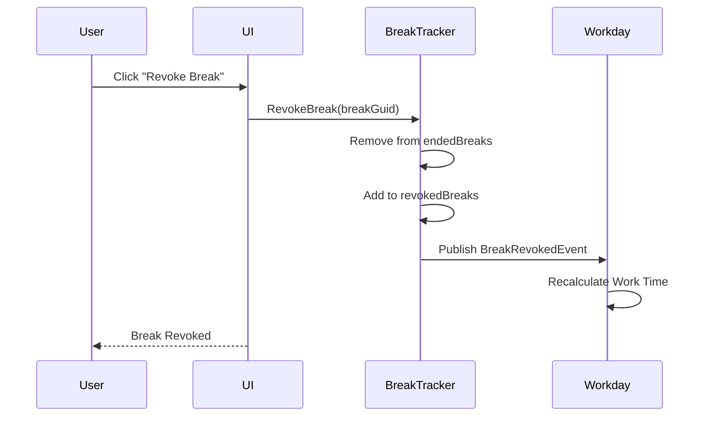

# Application Trackers

## Overview

Application Trackers sit at the middle layer of TrackYourDay's architecture. They consume events from System Trackers and other sources to provide domain-specific tracking functionality such as break detection, meeting tracking, and integration with external services.

## Core Components

### Break Tracker

**Location**: `TrackYourDay.Core.ApplicationTrackers.Breaks.BreakTracker`

**Responsibility**: Detects and manages user breaks based on inactivity patterns and system lock events.

**Key Features**:
- Detects breaks when system is locked
- Identifies breaks based on prolonged inactivity
- Tracks break duration
- Supports break revocation (marking a break as work time)
- Publishes break lifecycle events

**Algorithm**:
1. Monitors queue of activities to process
2. Calculates time between activities
3. If gap > threshold (configurable), starts a break
4. If system locked state detected, immediately starts a break
5. Ends break when activity resumes
6. Publishes `BreakStartedEvent` and `BreakEndedEvent`

**Dependencies**:
- `IPublisher`: For publishing break events
- `IClock`: For time tracking
- `TimeSpan timeOfNoActivityToStartBreak`: Configurable threshold

#### Break Types

**Events**:
- `BreakStartedEvent`: Published when a break begins
- `BreakEndedEvent`: Published when a break ends
- `BreakRevokedEvent`: Published when user revokes a break

### MS Teams Meeting Tracker

**Location**: `TrackYourDay.Core.ApplicationTrackers.MsTeams.MsTeamsMeetingTracker`

**Responsibility**: Tracks Microsoft Teams meetings by detecting Teams processes and window states.

**Key Features**:
- Detects when a Teams meeting starts
- Tracks meeting duration
- Identifies meeting end
- Publishes meeting events

**How it works**:
1. Uses `ProcessBasedMeetingRecognizingStrategy` to detect Teams meetings
2. Checks for Teams process with meeting-specific window titles
3. Tracks meeting state transitions
4. Publishes events for meeting lifecycle

**Components**:
- `IMeetingDiscoveryStrategy`: Interface for meeting detection
- `ProcessBasedMeetingRecognizingStrategy`: Implementation using process inspection
- `IProcessService`: Abstraction for OS process queries

**Events**:
- `MeetingStartedEvent`: Published when a meeting begins
- `MeetingEndedEvent`: Published when a meeting ends

### Jira Tracker

**Location**: `TrackYourDay.Core.ApplicationTrackers.Jira`

**Responsibility**: Integrates with Atlassian Jira for work item tracking and time logging.

**Key Features**:
- Fetches assigned Jira issues
- Logs work time to issues
- Enriches activity summaries with Jira context
- Caches issue data for performance

**Architecture**:

**Configuration** (`JiraSettings`):
- `BaseUrl`: Jira instance URL
- `ApiToken`: Authentication token
- `Email`: User email for authentication
- `Enabled`: Toggle integration on/off

**Data Flow**:
1. Authenticate with Jira API using email + API token
2. Fetch current user information
3. Query assigned issues for the user
4. Cache issues locally for offline access
5. When logging time, post worklog entries to Jira

### GitLab Tracker

**Location**: `TrackYourDay.Core.ApplicationTrackers.GitLab`

**Responsibility**: Integrates with GitLab for commit and merge request tracking.

**Key Features**:
- Tracks commits by user
- Monitors merge request activity
- Enriches summaries with repository context
- Caches GitLab data

**Components**:
- `GitLabActivityService`: Main service for GitLab operations
- `GitLabRestApiClient`: HTTP client for GitLab API
- `GitLabSettingsService`: Configuration management

**Configuration** (`GitLabSettings`):
- `BaseUrl`: GitLab instance URL
- `PrivateToken`: Personal access token
- `ProjectIds`: List of tracked projects
- `Enabled`: Toggle integration

**Tracked Data**:
- Commits with messages and timestamps
- Merge requests created/updated
- Repository activity
- Time estimates and spent time

### User Tasks Tracker

**Location**: `TrackYourDay.Core.ApplicationTrackers.UserTasks`

**Responsibility**: Allows users to manually log tasks and activities.

**Key Features**:
- Manual task entry
- Task categorization
- Time tracking for tasks
- Integration with activity summaries

**Use Cases**:
- Logging activities not automatically tracked
- Adding context to work periods
- Recording offline work
- Categorizing miscellaneous activities

## Break Detection Details

### Activity Processing Queue

The Break Tracker maintains a queue of activities to process:

**Process**:
1. Activities are added to queue as they occur
2. Queue is processed sequentially
3. Time gaps between activities are calculated
4. If gap exceeds threshold, a break is inserted
5. Break duration = time between activities

### Break Revocation

Users can revoke breaks if they were actually working:

## Settings and Configuration

### BreaksSettings
- `TimeOfNoActivityToStartBreak`: Duration threshold for break detection (default: 5 minutes)
- `MinimumBreakDuration`: Minimum duration to record as break

### Break Settings Service
Manages persistence and retrieval of break settings.

## Integration Points

### With System Trackers
Application trackers consume system-level events:
- **Break Tracker** ← `PeriodicActivityEndedEvent`, `InstantActivityOccuredEvent`
- **MS Teams Tracker** ← Window focus events for Teams processes

### With Insights
Application tracker data feeds insights:
- **Breaks** → Workday calculations
- **Jira Issues** → Activity summarization with context
- **GitLab Commits** → Development activity reporting
- **Meetings** → Time allocation analysis

### With External Systems
- **Jira API**: RESTful integration for issue and worklog management
- **GitLab API**: RESTful integration for repository data
- **MS Teams**: Process-level detection (no API integration)

## Event Handlers

Several event handlers connect application trackers to other parts of the system:

- `AddActivityToProcessWhenActivityStartedEventHandler`: Feeds activities to Break Tracker
- `AddActivityToProcessWhenInstantActivityOccuredEventHandler`: Feeds instant activities to Break Tracker
- `AddActivityToAnalyseWhenPeriodicActivityEndedEventHandler`: Sends activities to analytics

## Testing Strategy

Application trackers are tested with:
- **Mocks**: For external APIs (Jira, GitLab)
- **Time Manipulation**: Using `IClock` to control time flow
- **Event Verification**: Assert correct events are published
- **State Verification**: Check break states and transitions

## Security Considerations

### API Credentials
- Stored encrypted using `IEncryptionService`
- Windows DPAPI for encryption (user-specific)
- Never logged or transmitted insecurely

### Network Communication
- HTTPS required for all external APIs
- API tokens preferred over passwords
- Token validation before use

## Performance Optimizations

### Caching
- Jira issues cached locally with TTL
- GitLab data cached to reduce API calls
- Cache invalidation on settings change

### Rate Limiting
- Respect API rate limits
- Batch operations when possible
- Configurable polling intervals

## Error Handling

- Network failures: Graceful degradation, use cached data
- API errors: Log and continue, don't crash application
- Invalid data: Validate and sanitize before processing

## Future Enhancements

- **Slack Integration**: Track Slack conversations and status
- **Calendar Integration**: Sync with Outlook/Google Calendar for meeting detection
- **GitHub Integration**: Similar to GitLab tracker
- **Smart Break Detection**: ML-based break prediction
- **Break Suggestions**: Notify user when break is recommended
