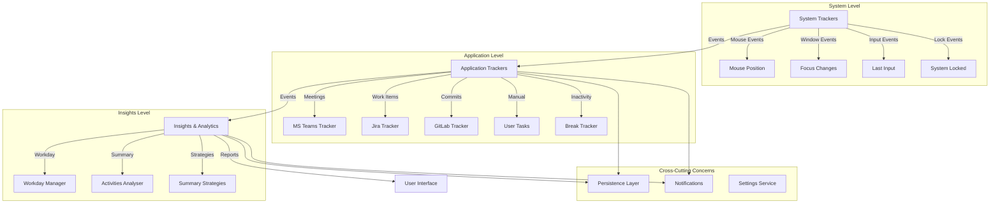
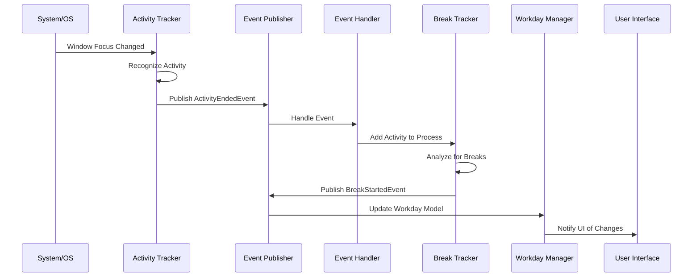

# TrackYourDay - Architecture Overview

## Introduction

TrackYourDay is a time tracking application built on .NET 8.0 that automatically monitors user activities, detects breaks, and provides insights into work patterns. The application follows a layered architecture with clear separation of concerns.

## High-Level Architecture

The application is organized into three main levels, each responsible for different aspects of activity tracking:



## Project Structure

### Core Projects

- **TrackYourDay.Core**: Contains all business logic, domain models, and core services
- **TrackYourDay.MAUI**: Cross-platform UI built with .NET MAUI (primarily Windows support)
- **TrackYourDay.Web**: Web-based components using Blazor

### Key Namespaces

```
TrackYourDay.Core
├── SystemTrackers/          # System-level activity detection
├── ApplicationTrackers/     # Application-specific trackers
│   ├── Breaks/             # Break detection logic
│   ├── MsTeams/            # MS Teams meeting tracker
│   ├── Jira/               # Jira integration
│   ├── GitLab/             # GitLab integration
│   └── UserTasks/          # Manual task tracking
├── Insights/               # Data analysis and reporting
│   ├── Workdays/           # Workday calculations
│   └── Analytics/          # Activity summarization
├── Persistence/            # Data storage
├── Notifications/          # Notification system
└── Settings/               # Configuration management
```

## Architectural Patterns

### Event-Driven Architecture

The application uses **MediatR** for implementing an event-driven architecture. Components communicate through events rather than direct coupling:

- **Events**: Published when activities start, end, or change state
- **Event Handlers**: Subscribe to events and perform actions (e.g., update read models, trigger notifications)

### Repository Pattern

Data persistence is abstracted through repository interfaces:
- `IGenericDataRepository<T>`: Generic CRUD operations
- `IHistoricalDataRepository<T>`: Time-based data queries
- Implementation uses SQLite for local storage

### Strategy Pattern

The Analytics subsystem uses the Strategy pattern for different summarization approaches:
- `DurationBasedSummaryStrategy`: Groups by time spent
- `ContextBasedSummaryStrategy`: Groups by application context
- `HybridContextualSummaryStrategy`: Combines multiple strategies
- `JiraEnrichedSummaryStrategy`: Enriches with Jira data

### Dependency Injection

The application heavily uses dependency injection (DI) for loose coupling and testability:
- Services registered in `ServiceRegistration` namespace
- Scoped lifetimes for stateful services
- Singleton lifetimes for configuration services

## Data Flow



## Key Design Decisions

### 1. Three-Layer Architecture
The system is divided into System, Application, and Insights levels to maintain clear separation between raw system events, domain-specific events, and business insights.

### 2. Immutable Activities
Activities are represented as immutable records (`StartedActivity`, `EndedActivity`) to ensure data integrity and simplify reasoning about state.

### 3. Event Sourcing Light
While not full event sourcing, the application maintains a historical log of activities and uses events as the primary mechanism for state changes.

### 4. Local-First Storage
SQLite is used for local storage, ensuring the application works offline and maintains data privacy.

### 5. Pluggable Integrations
External integrations (Jira, GitLab, MS Teams) are designed as optional, pluggable components that can be enabled/disabled independently.

## Technology Stack

- **.NET 8.0**: Core framework
- **MediatR**: Event handling and CQRS
- **SQLite**: Local data persistence
- **MAUI**: Cross-platform UI framework
- **Blazor**: Web components
- **Quartz.NET**: Background job scheduling
- **Serilog**: Structured logging
- **MudBlazor**: UI component library
- **ML.NET**: Machine learning for activity categorization

## Platform Support

- **Primary**: Windows 10 and higher
- **Planned**: Cross-platform support via MAUI

## Next Steps

For detailed information on specific components, see:
- [System Trackers Documentation](./System-Trackers.md)
- [Application Trackers Documentation](./Application-Trackers.md)
- [Insights Documentation](./Insights.md)
- [Data Flow Documentation](./Data-Flow.md)
