# Data Flow

## Overview

This document describes how data flows through TrackYourDay from low-level system events to high-level insights and UI updates.

## Complete Data Flow

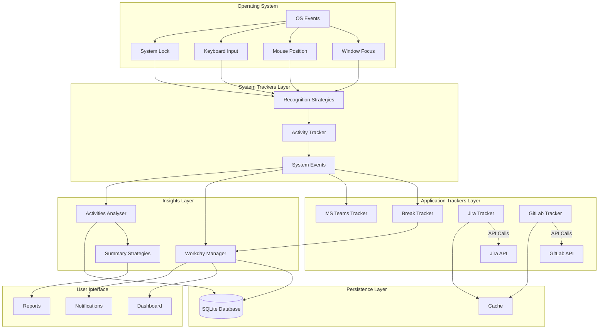

## Detailed Flow Scenarios

### Scenario 1: User Switches Application

This scenario shows what happens when a user switches from one application to another.

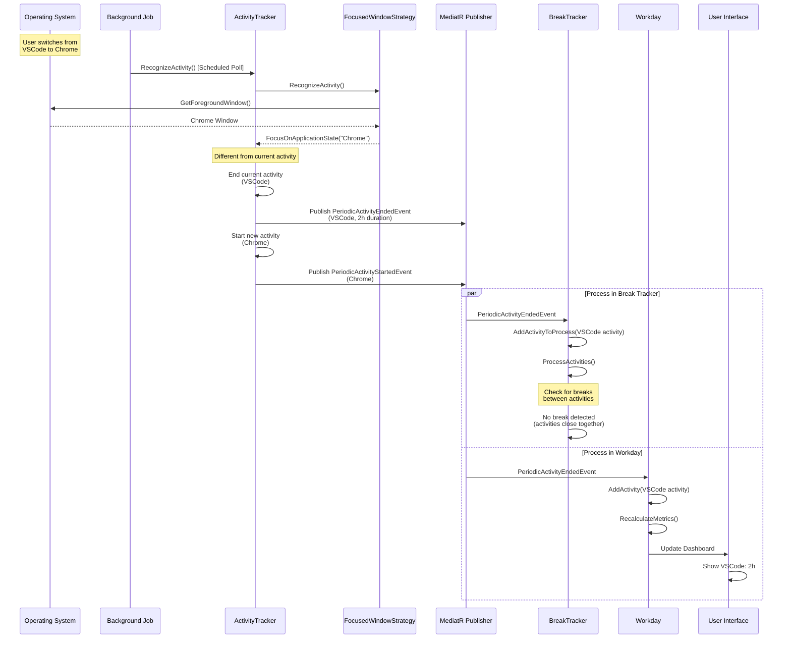

### Scenario 2: Break Detection and End

This scenario demonstrates how breaks are detected and ended.

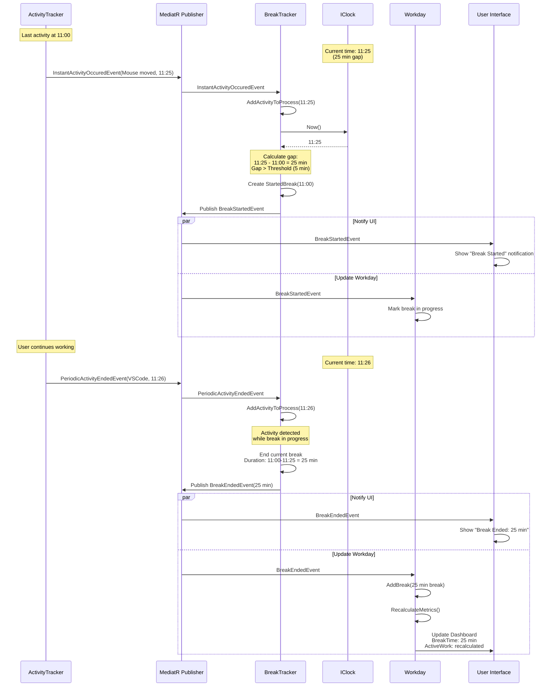

### Scenario 3: Jira Integration Flow

This scenario shows how Jira integration enriches activity tracking.

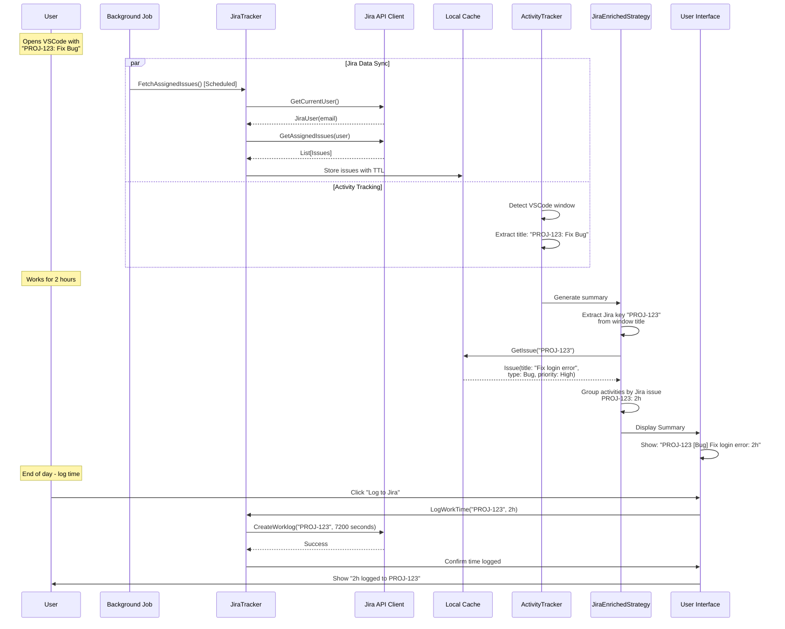

### Scenario 4: System Lock and Break

This scenario shows immediate break detection when system is locked.

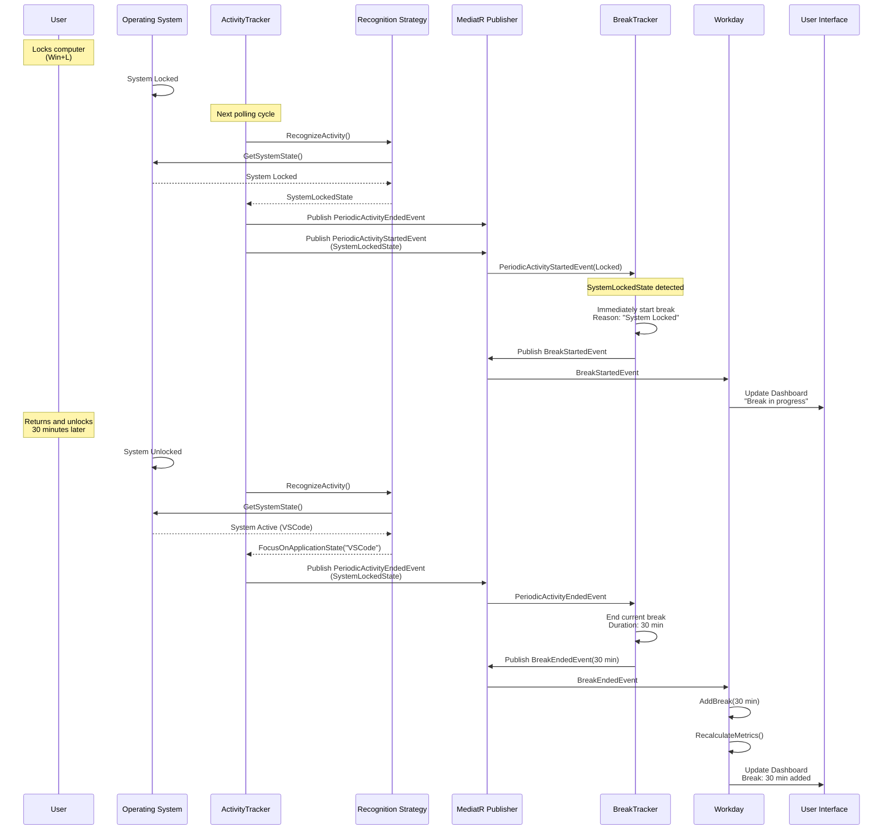

### Scenario 5: End of Workday Summary

This scenario shows how the end-of-day summary is generated.

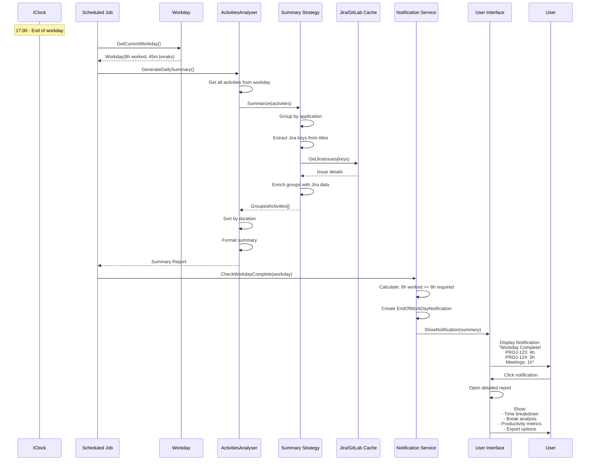

## Background Job Scheduling

TrackYourDay uses Quartz.NET for scheduling recurring jobs:

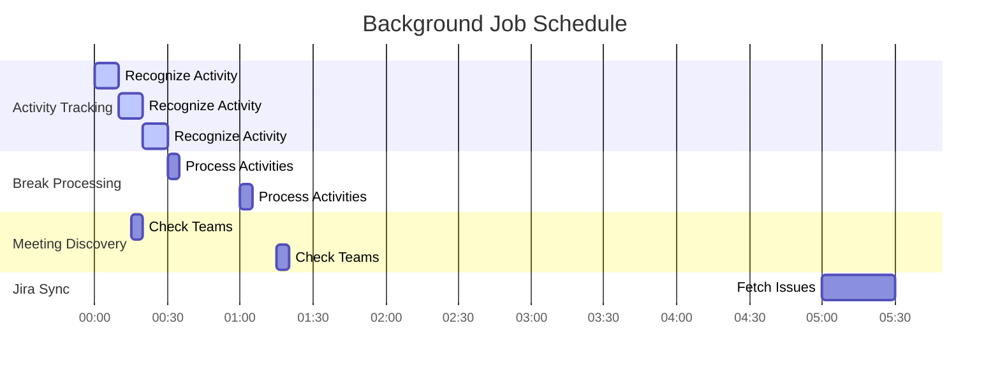

**Job Types**:

1. **ActivityEventTrackerJob**: Every 10 seconds
   - Polls system for activity changes
   - Most frequent job

2. **MsTeamsMeetingsTrackerJob**: Every 60 seconds
   - Checks for Teams meetings
   - Less frequent as meetings don't change quickly

3. **NotificationsProcessorJob**: Every 60 seconds
   - Evaluates notification rules
   - Triggers UI notifications

4. **JiraDataSyncJob**: Every 5 minutes (configurable)
   - Fetches assigned Jira issues
   - Updates local cache

5. **GitLabDataSyncJob**: Every 5 minutes (configurable)
   - Fetches commits and MRs
   - Updates local cache

## Event Flow Patterns

### Fire and Forget

Used for logging and non-critical operations:

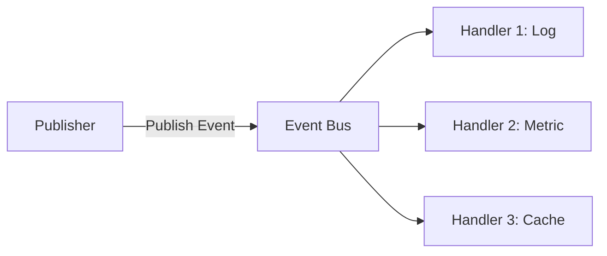

### Request/Response

Used for queries and synchronous operations:

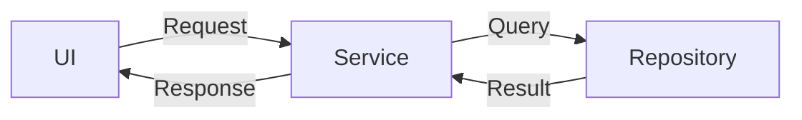

### Publish/Subscribe

Used for event-driven updates:

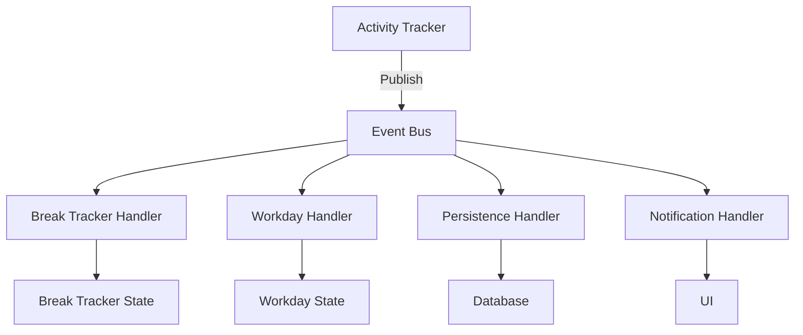

## Data Consistency

### Eventually Consistent

Read models are eventually consistent with events:

1. Event published
2. Handler processes event (async)
3. Read model updated
4. UI refreshed

**Acceptable delay**: < 1 second for UI updates

### Transactional Consistency

Critical operations use transactions:

- Break revocation: Must atomically remove break and recalculate workday
- Time logging to Jira: Must update both local and remote state
- Settings changes: Must be persisted before taking effect

## Error Handling in Data Flow

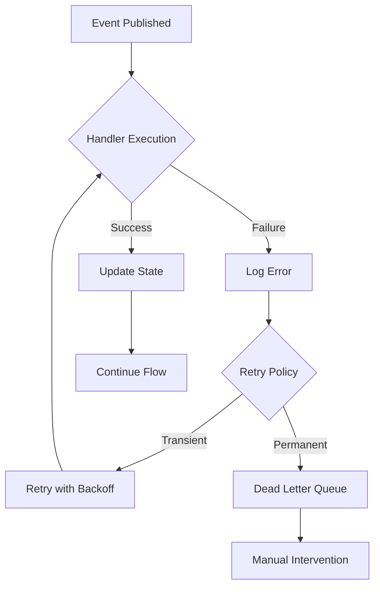

**Error Strategies**:
- **Transient Errors**: Retry with exponential backoff
- **Permanent Errors**: Log and notify user
- **Critical Errors**: Graceful degradation (use cached data)

## Performance Optimizations

### Batching

Multiple events can be batched for processing:

```
Events: [E1, E2, E3, E4, E5]
Batch Size: 3
Batches: [E1, E2, E3], [E4, E5]
```

### Debouncing

Rapid events are debounced to reduce processing:

```
Events: E1, E2, E3, E4 (within 100ms)
Result: Only E4 processed
```

### Caching

Frequently accessed data is cached:

- Current workday: In-memory cache
- Jira issues: 5-minute TTL
- GitLab data: 5-minute TTL
- Settings: In-memory until changed

## Monitoring and Observability

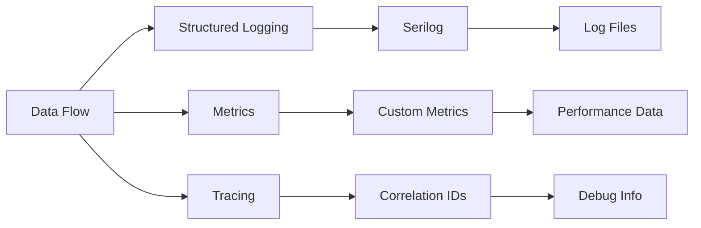

**Logged Information**:
- Event publication and handling
- Job execution times
- API call latencies
- Error stack traces
- User actions

**Correlation**: Each event has a correlation ID for tracing through the system.
