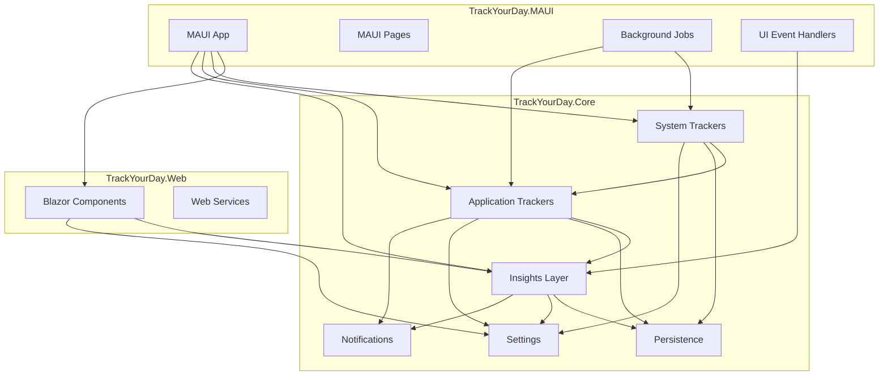
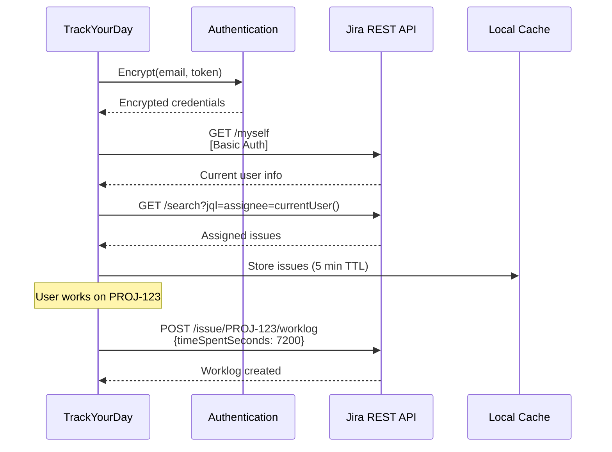
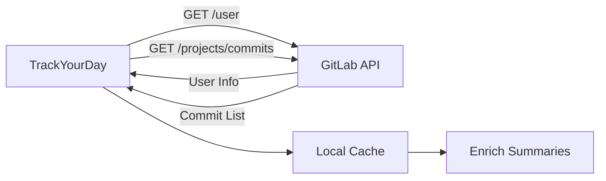
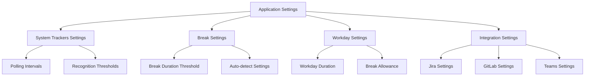

# Dependencies and Integrations

## Overview

This document describes the external dependencies, internal component relationships, and integration points in TrackYourDay.

## External Dependencies

### Core Framework Dependencies

#### .NET 8.0
**Purpose**: Core application framework  
**Usage**: Base framework for all components  
**Version**: 8.0+  
**Justification**: Latest LTS version with improved performance and modern C# features

### NuGet Package Dependencies

#### MediatR (v12.1.1)
**Purpose**: Mediator pattern implementation for CQRS and event handling  
**Usage**: All event publishing and handling throughout the application  
**Why MediatR?**
- Decouples components through event-driven architecture
- Simplifies testing with clear interfaces
- Supports notification pattern for one-to-many events

**Key Usage Points**:
```csharp
// Publishing events
await _publisher.Publish(new PeriodicActivityEndedEvent(activity));

// Handling events
public class BreakTrackerEventHandler : INotificationHandler<ActivityEndedEvent>
{
    public Task Handle(ActivityEndedEvent notification, CancellationToken ct) { }
}
```

#### Microsoft.Data.Sqlite (v8.0.1)
**Purpose**: SQLite database provider  
**Usage**: Local data persistence for activities, breaks, settings  
**Why SQLite?**
- Local-first, no server required
- Simple, lightweight
- Excellent for desktop applications
- Cross-platform support

**Stored Data**:
- Historical activities
- Workday records
- Break logs
- Application settings
- Cached external data (Jira, GitLab)

#### ML.NET (v3.0.0)
**Purpose**: Machine learning framework  
**Packages**:
- `Microsoft.ML` (Core ML framework)
- `Microsoft.ML.TimeSeries` (Time series analysis)
- `Microsoft.ML.TensorFlow` (Deep learning support)
- `Microsoft.ML.FastTree` (Decision tree algorithms)

**Usage**: 
- Activity categorization
- Pattern recognition
- Time prediction
- Anomaly detection

**Models**:
- Text classification for window titles
- Time series forecasting for work patterns
- Clustering for activity grouping

#### Serilog (v3.0.1)
**Purpose**: Structured logging  
**Packages**:
- `Serilog` (Core)
- `Serilog.Extensions.Logging` (Microsoft.Extensions.Logging integration)
- `Serilog.Sinks.Console` (Console output)
- `Serilog.Sinks.Debug` (Debug output)
- `Serilog.Sinks.File` (File output)
- `Serilog.Sinks.Map` (Dynamic sink mapping)

**Log Levels**:
- **Debug**: Activity recognition details
- **Information**: Event publications, job executions
- **Warning**: API failures, retries
- **Error**: Exceptions, critical failures

**Log Structure**:
```json
{
  "Timestamp": "2024-12-06T10:30:45.123Z",
  "Level": "Information",
  "MessageTemplate": "Activity ended: {Activity}",
  "Properties": {
    "Activity": "VSCode - 2h",
    "CorrelationId": "abc-123"
  }
}
```

#### Quartz.NET (v3.7.0)
**Purpose**: Job scheduling and background task execution  
**Packages**:
- `Quartz` (Core scheduler)
- `Quartz.Extensions.DependencyInjection` (DI integration)
- `Quartz.Extensions.Hosting` (IHostedService integration)

**Scheduled Jobs**:
- `ActivityEventTrackerJob`: 10-second interval
- `MsTeamsMeetingsTrackerJob`: 60-second interval
- `NotificationsProcessorJob`: 60-second interval
- `JiraDataSyncJob`: 5-minute interval (configurable)

**Configuration**:
```csharp
services.AddQuartz(q =>
{
    q.UseMicrosoftDependencyInjectionJobFactory();
    
    var jobKey = new JobKey("ActivityTracking");
    q.AddJob<ActivityEventTrackerJob>(opts => opts.WithIdentity(jobKey));
    q.AddTrigger(opts => opts
        .ForJob(jobKey)
        .WithSimpleSchedule(x => x
            .WithIntervalInSeconds(10)
            .RepeatForever()));
});
```

#### MudBlazor (v6.10.0)
**Purpose**: Material Design component library for Blazor  
**Usage**: UI components in MAUI Blazor hybrid application  
**Components Used**:
- Data tables for activity lists
- Cards for metrics display
- Dialogs for user input
- Charts for visualizations
- Forms for settings

#### Newtonsoft.Json (v13.0.3)
**Purpose**: JSON serialization/deserialization  
**Usage**:
- API response parsing (Jira, GitLab)
- Settings persistence
- Data import/export

**Why Newtonsoft.Json?**
- Mature, well-tested
- Flexible configuration
- Wide industry adoption
- Good performance

## Internal Dependencies

### Component Dependency Graph



### Layer Dependencies

**Rule**: Higher layers can depend on lower layers, but not vice versa.

```
┌─────────────────────────────────┐
│      UI Layer (MAUI/Web)        │  ← Highest
├─────────────────────────────────┤
│      Insights Layer             │
├─────────────────────────────────┤
│   Application Trackers Layer    │
├─────────────────────────────────┤
│    System Trackers Layer        │
├─────────────────────────────────┤
│ Cross-Cutting Concerns          │
│ (Persistence, Settings, Notif)  │  ← Lowest
└─────────────────────────────────┘
```

### Dependency Injection

All components are registered in the DI container:

```csharp
// System Trackers
services.AddSingleton<ActivityTracker>();
services.AddSingleton<ISystemStateRecognizingStrategy, FocusedWindowRecognizingStrategy>();

// Application Trackers
services.AddSingleton<BreakTracker>();
services.AddTransient<MsTeamsMeetingTracker>();
services.AddTransient<JiraTracker>();

// Insights
services.AddSingleton<WorkdayReadModelRepository>();
services.AddTransient<ActivitiesAnalyser>();
services.AddTransient<ISummaryStrategy, HybridContextualSummaryStrategy>();

// Persistence
services.AddSingleton<IGenericDataRepository<T>, GenericDataRepository<T>>();
services.AddSingleton<IHistoricalDataRepository<T>, HistoricalDataRepository<T>>();

// Cross-cutting
services.AddSingleton<IClock, SystemClock>();
services.AddSingleton<IEncryptionService, EncryptionService>();
```

## External Integrations

### Jira Integration

**API**: Jira REST API v3  
**Authentication**: Basic Auth (Email + API Token)  
**Base URL**: Configurable (cloud or self-hosted)

**Endpoints Used**:
```
GET  /rest/api/3/myself
GET  /rest/api/3/search?jql=assignee=currentUser()
POST /rest/api/3/issue/{issueKey}/worklog
```

**Data Flow**:


**Error Handling**:
- **401 Unauthorized**: Clear credentials, prompt user to re-authenticate
- **429 Rate Limited**: Backoff and retry
- **500 Server Error**: Use cached data, log error
- **Network Error**: Offline mode, queue for later

**Security**:
- API tokens stored encrypted using Windows DPAPI
- HTTPS required for all API calls
- No credentials in logs or telemetry

### GitLab Integration

**API**: GitLab REST API v4  
**Authentication**: Private Token  
**Base URL**: Configurable (GitLab.com or self-hosted)

**Endpoints Used**:
```
GET /api/v4/user
GET /api/v4/projects/{id}/repository/commits
GET /api/v4/projects/{id}/merge_requests
GET /api/v4/projects/{id}/issues
```

**Data Flow**:


**Tracked Data**:
- Commits with messages, timestamps, authors
- Merge requests created/updated
- Repository activity
- Time estimates and spent time

### MS Teams Integration

**Type**: Process-based detection (no API)  
**How it works**:
1. Enumerate running processes
2. Find processes named "Teams" or "ms-teams"
3. Check window titles for meeting indicators
4. Detect meeting start/end based on window state

**Meeting Detection Patterns**:
```regex
Meeting with.*
Call with.*
.*\| Microsoft Teams
```

**Limitations**:
- No access to calendar data
- Cannot detect scheduled meetings
- Relies on window title patterns
- May miss minimized meetings

**Future Enhancement**: Official Teams API integration

## Platform Dependencies

### Windows-Specific Dependencies

#### Win32 APIs
Used for system-level operations:
- `GetForegroundWindow()`: Get active window
- `GetWindowText()`: Get window title
- `GetLastInputInfo()`: Get last input time
- Process enumeration APIs

**Abstraction Layer**:
```csharp
public interface IProcessService
{
    Process[] GetProcessesByName(string name);
    string GetForegroundWindowTitle();
}

// Windows implementation uses P/Invoke
// Other platforms would have different implementations
```

#### Windows DPAPI
Used for credential encryption:
```csharp
public class EncryptionService : IEncryptionService
{
    public string Encrypt(string plaintext)
    {
        // Uses ProtectedData.Protect() with CurrentUser scope
    }
}
```

**Security Model**: 
- Data encrypted per user
- Cannot be decrypted by other users
- Tied to Windows user profile

## Database Schema

### SQLite Database Structure

```sql
-- Activities table
CREATE TABLE Activities (
    Id INTEGER PRIMARY KEY AUTOINCREMENT,
    StartedAt TEXT NOT NULL,
    EndedAt TEXT,
    ApplicationName TEXT,
    WindowTitle TEXT,
    Duration INTEGER,
    SystemState TEXT
);

-- Breaks table
CREATE TABLE Breaks (
    Id INTEGER PRIMARY KEY AUTOINCREMENT,
    Guid TEXT UNIQUE NOT NULL,
    StartedAt TEXT NOT NULL,
    EndedAt TEXT,
    Reason TEXT,
    Duration INTEGER,
    Revoked INTEGER DEFAULT 0
);

-- Workdays table
CREATE TABLE Workdays (
    Date TEXT PRIMARY KEY,
    TimeOfAllActivities INTEGER,
    TimeOfAllBreaks INTEGER,
    ActiveWorkTime INTEGER,
    Overhours INTEGER
);

-- Settings table (key-value store)
CREATE TABLE Settings (
    Key TEXT PRIMARY KEY,
    Value TEXT NOT NULL,
    UpdatedAt TEXT NOT NULL
);

-- Jira cache
CREATE TABLE JiraIssues (
    IssueKey TEXT PRIMARY KEY,
    Title TEXT,
    IssueType TEXT,
    Priority TEXT,
    Status TEXT,
    CachedAt TEXT NOT NULL
);

-- GitLab cache
CREATE TABLE GitLabCommits (
    CommitSHA TEXT PRIMARY KEY,
    ProjectId INTEGER,
    Message TEXT,
    Author TEXT,
    Timestamp TEXT,
    CachedAt TEXT NOT NULL
);
```

## Configuration Management

### Settings Hierarchy



### Settings Storage

**Format**: JSON in Settings table

**Example**:
```json
{
  "SystemTrackers": {
    "PollingIntervalSeconds": 10,
    "MouseMovementThreshold": 5
  },
  "Breaks": {
    "InactivityThresholdMinutes": 5,
    "MinimumBreakMinutes": 1
  },
  "Workday": {
    "DurationHours": 8,
    "AllowedBreakMinutes": 60
  },
  "Jira": {
    "BaseUrl": "https://company.atlassian.net",
    "Email": "user@company.com",
    "Enabled": true
  }
}
```

## Testing Dependencies

### Test Framework

#### xUnit
**Purpose**: Unit testing framework  
**Usage**: All unit and integration tests

#### Moq (implied by test patterns)
**Purpose**: Mocking framework  
**Usage**: Mock dependencies in unit tests

**Example**:
```csharp
[Fact]
public void BreakTracker_DetectsBreak_WhenInactivityExceedsThreshold()
{
    var mockClock = Mock.Of<IClock>();
    var mockPublisher = Mock.Of<IPublisher>();
    
    var tracker = new BreakTracker(
        mockPublisher, 
        mockClock, 
        TimeSpan.FromMinutes(5), 
        logger);
    
    // Test implementation
}
```

## Dependency Management Strategy

### Version Pinning
- All packages use specific versions
- Updates require testing
- Security patches applied promptly

### Minimal Dependencies
- Avoid unnecessary packages
- Evaluate alternatives before adding
- Regular dependency audits

### Compatibility
- Target .NET 8.0 LTS
- Ensure cross-platform compatibility where possible
- Abstract platform-specific code

## Future Integration Plans

### Planned Integrations
- **Slack**: Message tracking, status monitoring
- **GitHub**: Similar to GitLab integration
- **Outlook Calendar**: Meeting detection
- **Google Calendar**: Cross-platform meeting detection
- **Azure DevOps**: Work item tracking
- **Trello**: Board and card tracking

### Integration Architecture
All integrations follow the same pattern:
1. **Tracker**: Component that polls/monitors the external system
2. **API Client**: HTTP client for the external API
3. **Cache**: Local storage for offline access
4. **Settings Service**: Configuration management
5. **Event Publishing**: Integration with event system

This ensures consistency and maintainability across integrations.
