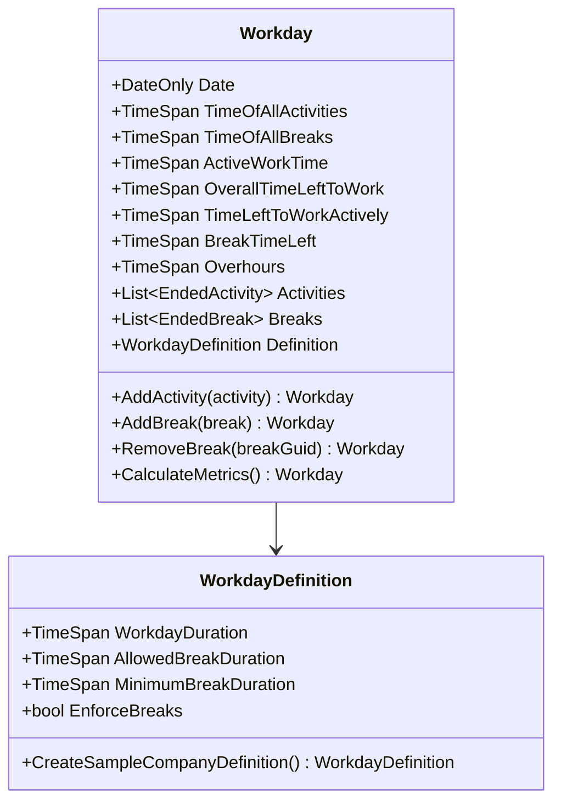
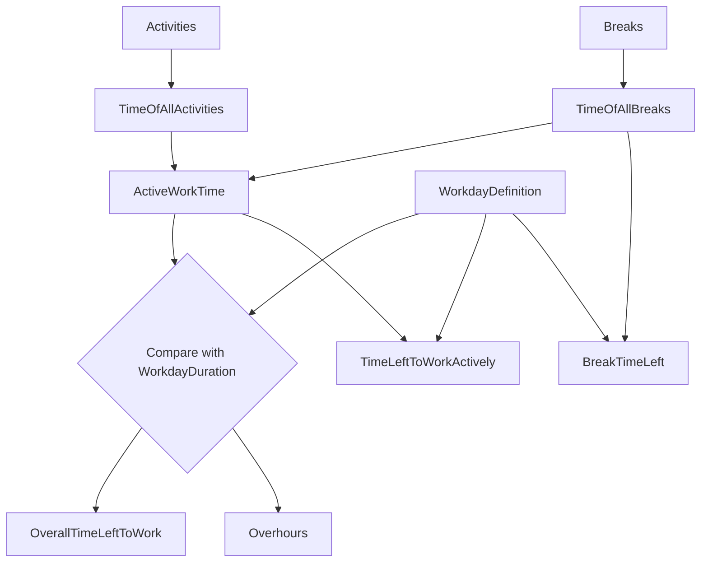
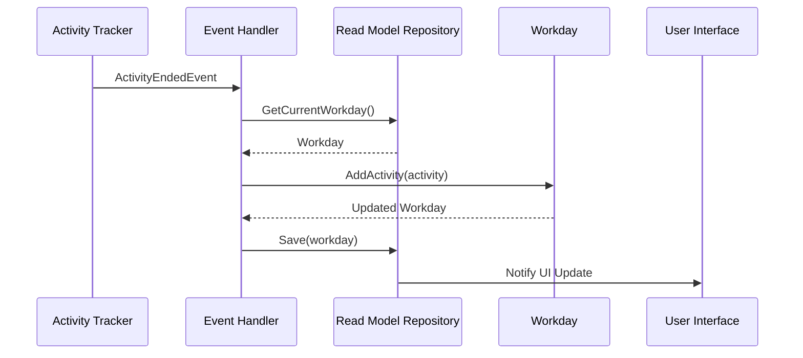
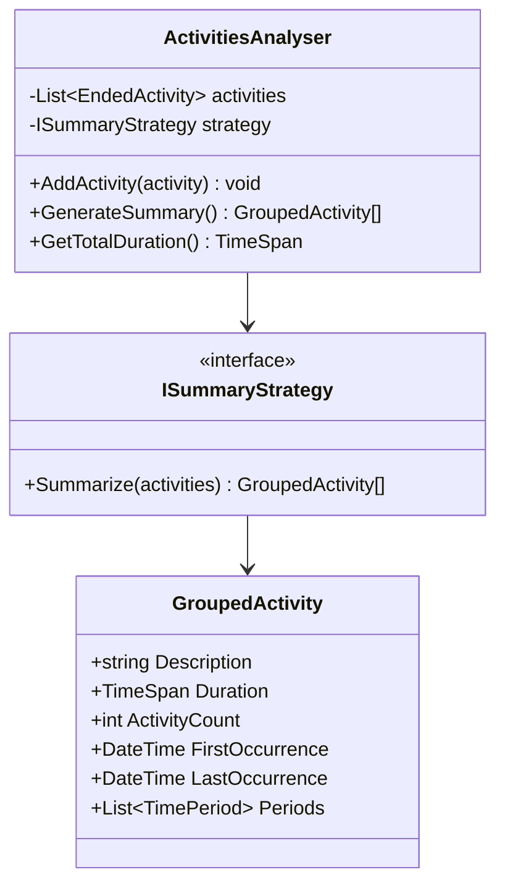
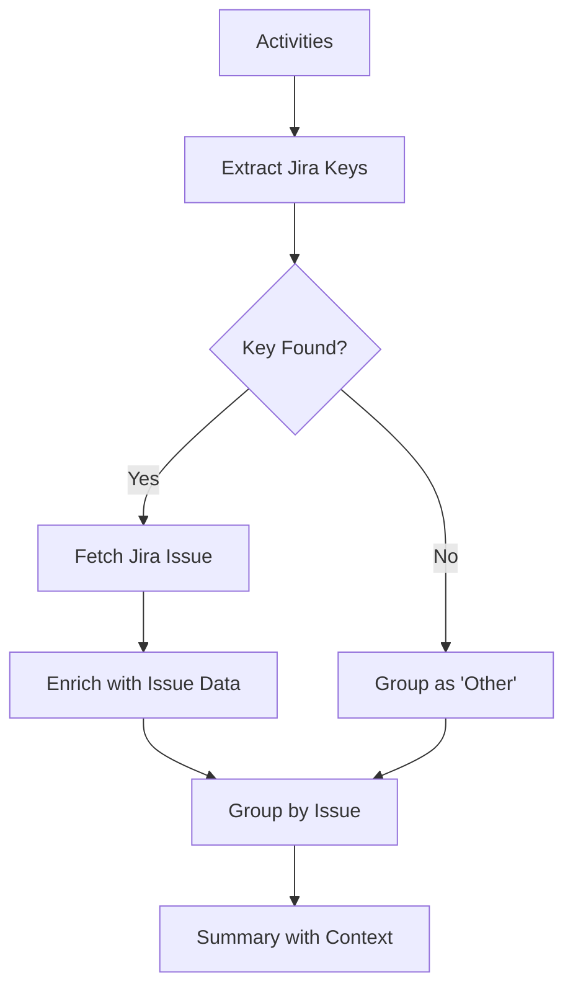
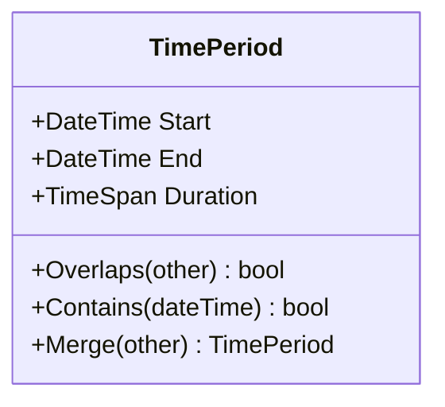
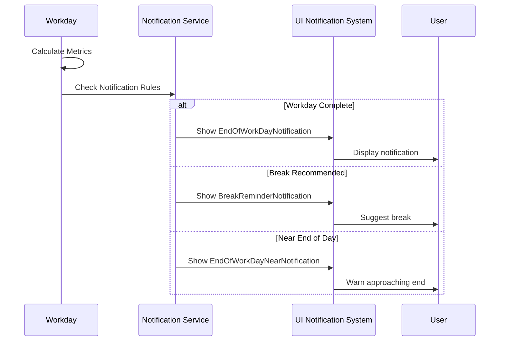

# Insights

## Overview

The Insights layer is the top level of TrackYourDay's architecture. It processes data from System and Application Trackers to provide meaningful analysis, summaries, and workday management features.

## Core Components

### Workday Management

**Location**: `TrackYourDay.Core.Insights.Workdays`

**Responsibility**: Models and manages the concept of a workday, tracking work time, breaks, and overtime.

#### Workday

The `Workday` record represents a single working day with all its metrics and calculations.



**Key Metrics**:

1. **TimeOfAllActivities**: Total time spent in any tracked activity
2. **TimeOfAllBreaks**: Total duration of all breaks
3. **ActiveWorkTime**: Time actively working (activities - breaks)
4. **OverallTimeLeftToWork**: Time remaining to reach workday duration
5. **TimeLeftToWorkActively**: Active work time remaining (accounting for required break time)
6. **BreakTimeLeft**: Remaining allowed break time
7. **Overhours**: Time worked beyond workday duration (can be negative)

**Calculation Flow**:



#### WorkdayDefinition

Defines the rules and expectations for a workday:

- **WorkdayDuration**: Expected total work duration (e.g., 8 hours)
- **AllowedBreakDuration**: Maximum allowed break time (e.g., 60 minutes)
- **MinimumBreakDuration**: Minimum time to count as a break (e.g., 5 minutes)

**Sample Configuration** (8-hour workday):
```csharp
WorkdayDuration = TimeSpan.FromHours(8)
AllowedBreakDuration = TimeSpan.FromMinutes(60)
MinimumBreakDuration = TimeSpan.FromMinutes(5)
```

#### Workday Read Model

The application maintains a read model of the current workday:

**Location**: `WorkdayReadModelRepository`

**Purpose**: 
- Fast queries for current workday state
- Updated via event handlers
- Cached in memory for UI responsiveness

**Event Handlers**:
- `WhenActivityEndedThenUpdateWorkdayReadModel`: Updates workday when activity ends
- `WhenBreakEndedThenUpdateWorkdayReadModelEventHandler`: Updates workday when break ends
- `WhenBreakRevokedThenUpdateWorkdayReadModel`: Recalculates when break is revoked



### Analytics and Summarization

**Location**: `TrackYourDay.Core.Insights.Analytics`

**Responsibility**: Analyzes activities and generates summaries using various strategies.

#### ActivitiesAnalyser

**Purpose**: Aggregates and summarizes activities for reporting and insights.

**Key Methods**:
- `GroupActivitiesByApplication()`: Groups activities by application name
- `GroupActivitiesByDuration()`: Groups by time periods
- `CalculateTotalActiveTime()`: Computes total work time
- `GenerateDailySummary()`: Creates end-of-day report



#### Summary Strategies

Different strategies for grouping and summarizing activities:

##### 1. DurationBasedSummaryStrategy

**Approach**: Groups activities by total time spent.

**Algorithm**:
1. Group activities by application/context
2. Calculate total duration for each group
3. Sort by duration (longest first)
4. Filter out short activities (configurable threshold)

**Use Case**: Understanding where most time is spent.

**Example Output**:
```
- Visual Studio Code: 3h 45m
- Chrome: 2h 15m
- Teams: 1h 30m
- Outlook: 45m
```

##### 2. ContextBasedSummaryStrategy

**Approach**: Groups activities by context (project, task type).

**Algorithm**:
1. Extract context from window titles
2. Use patterns to identify projects/tasks
3. Group by identified context
4. Aggregate durations

**Use Case**: Understanding time per project or task.

**Example Output**:
```
- Project Alpha: 4h 20m
- Code Review: 1h 45m
- Email/Communication: 1h 15m
```

##### 3. HybridContextualSummaryStrategy

**Approach**: Combines duration and context with intelligent merging.

**Algorithm**:
1. Apply context-based grouping
2. Merge similar contexts using fuzzy matching
3. Apply duration thresholds
4. Rank by importance (duration + context)

**Use Case**: Balanced view of work allocation.

**Features**:
- Fuzzy string matching for similar activities
- Configurable similarity threshold
- Smart context extraction from window titles
- Handles multi-tasking scenarios

##### 4. JiraEnrichedSummaryStrategy

**Approach**: Enriches activity summaries with Jira issue data.

**Algorithm**:
1. Scan activity window titles for Jira keys (e.g., PROJ-123)
2. Fetch issue details from Jira cache
3. Group activities by Jira issue
4. Enrich with issue title, type, priority
5. Aggregate durations per issue

**Use Case**: Time tracking for Jira work items.

**Example Output**:
```
- PROJ-123 [Bug] Fix login issue: 2h 30m
- PROJ-124 [Feature] Add export: 3h 15m
- PROJ-125 [Task] Update docs: 1h 20m
- [Other Activities]: 45m
```



##### 5. JiraKeySummaryStrategy

**Approach**: Simple grouping by Jira key without enrichment.

**Use Case**: Quick Jira-based grouping without API calls.

##### 6. TimeBasedSummaryStrategy

**Approach**: Groups activities by time periods (hours, days).

**Use Case**: Understanding work patterns throughout the day.

**Example Output**:
```
09:00-10:00: Emails and planning (1h)
10:00-12:00: Development (2h)
13:00-15:00: Meetings (2h)
15:00-17:00: Code review (2h)
```

##### 7. MLNetSummaryStrategy

**Approach**: Uses machine learning to categorize and predict activity types.

**Features**:
- Trains on historical activity data
- Predicts activity categories
- Improves over time with more data
- Can detect anomalies and patterns

**Algorithm**:
1. Train ML model on labeled historical data
2. Extract features from activities (app name, window title, duration)
3. Predict category for new activities
4. Group by predicted category
5. Calculate confidence scores

**Use Case**: Automatic categorization of activities into work types.

**Model**: Uses ML.NET with text classification and time series analysis.

### TimePeriod

**Purpose**: Represents a time range with start and end times.

**Used for**:
- Breaking down grouped activities into time segments
- Identifying concurrent activities
- Time range queries and filtering



## Workday Components Breakdown

The Workday calculation is decomposed into several components:

### 1. Overall Time Left to Work

```csharp
OverallTimeLeftToWork = WorkdayDuration - TimeOfAllActivities
```

Represents total time remaining before completing the workday (not accounting for breaks).

### 2. Time Already Actively Worked

```csharp
TimeAlreadyActivelyWorked = TimeOfAllActivities - TimeOfAllBreaks
```

Actual productive work time.

### 3. Time Left to Work Actively

```csharp
TimeLeftToWorkActively = WorkdayDuration - AllowedBreakDuration - TimeAlreadyActivelyWorked
```

Productive work time remaining (excluding break allowance).

### 4. Break Time Left

```csharp
BreakTimeLeft = AllowedBreakDuration - TimeOfAllBreaks
```

Remaining allowed break time.

### 5. Overhours

```csharp
Overhours = TimeAlreadyActivelyWorked - (WorkdayDuration - AllowedBreakDuration)
```

Time worked beyond expected active work time (can be positive or negative).

## Notification System

**Location**: `TrackYourDay.Core.Notifications`

**Responsibility**: Manages user notifications based on workday insights.

**Notification Types**:
- `EndOfWorkDayNotification`: Alerts when workday is complete
- `EndOfWorkDayNearNotification`: Warns when approaching end of workday
- `BreakReminderNotification`: Suggests taking a break
- `TipForDayNotification`: Provides productivity tips

**Trigger Conditions**:
- Time-based (scheduled)
- Event-based (break started, activity ended)
- Threshold-based (overhours limit, break time consumed)



## Settings Services

### WorkdaySettingsService

**Responsibility**: Manages workday configuration.

**Methods**:
- `GetWorkdayDefinition()`: Retrieves current workday rules
- `UpdateWorkdayDefinition()`: Updates workday configuration
- `GetDefaultDefinition()`: Returns default 8-hour workday

### IWorkdaySettingsService

Interface for workday settings to enable testing and flexibility.

## Data Persistence

Insights data is persisted through:

- **IHistoricalDataRepository**: Stores historical workdays, activities, and summaries
- **GenericDataRepository**: General-purpose storage for settings and configurations
- **SQLite Database**: Local storage for all data

**Schema**:
- `Workdays`: Daily workday records
- `Activities`: Historical activity log
- `Breaks`: Break records
- `Summaries`: Generated summaries and reports

## Integration with UI

The insights layer provides data to the UI through:

1. **Read Models**: Fast, pre-calculated data for display
2. **Event Notifications**: Real-time updates when data changes
3. **Query Services**: On-demand queries for reports and charts

## Performance Considerations

### Caching
- Current workday cached in memory
- Summaries cached until activities change
- ML models loaded once and reused

### Incremental Updates
- Workday metrics updated incrementally as events occur
- Avoid full recalculation on every activity

### Batch Processing
- Summaries generated in background
- Large queries paginated

## Testing Strategy

Insights components tested with:
- **Time Manipulation**: Control clock for deterministic tests
- **Event Simulation**: Mock activity and break events
- **Calculation Verification**: Assert correct metric calculations
- **Strategy Testing**: Verify each summary strategy output

## Error Handling

- **Missing Data**: Use defaults, don't crash
- **Calculation Errors**: Log and return safe values
- **ML Failures**: Fallback to simpler strategies

## Future Enhancements

- **Weekly/Monthly Summaries**: Aggregate beyond daily
- **Goal Tracking**: Set and track productivity goals
- **Comparative Analysis**: Compare current vs. past performance
- **Predictive Insights**: Predict end time, suggest optimal schedule
- **Team Analytics**: Aggregated insights for teams (privacy-aware)
- **Export Reports**: PDF, Excel export of summaries
- **Advanced ML**: Deep learning for better categorization
- **Custom Categories**: User-defined activity categories
