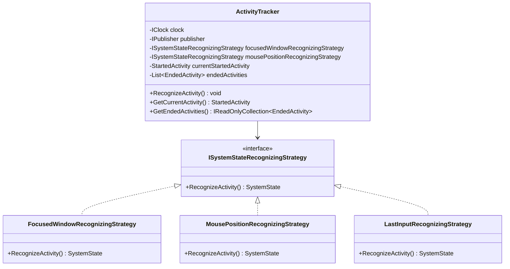
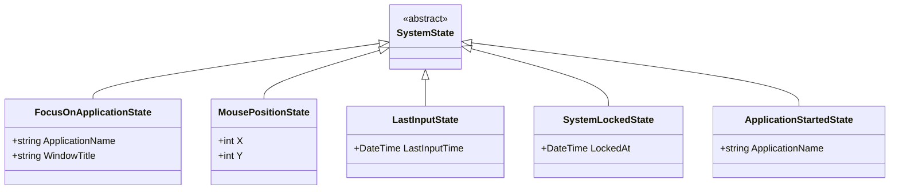
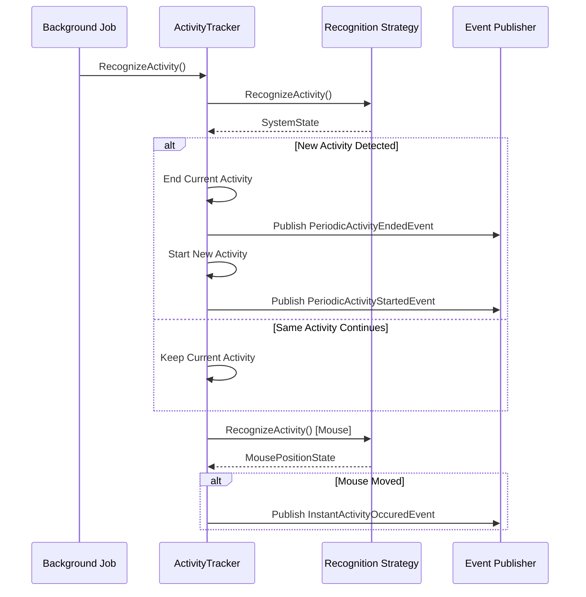

# System Trackers

## Overview

System Trackers form the foundation of TrackYourDay's activity monitoring. They are responsible for detecting low-level system events and translating them into meaningful activity data.

## Core Components

### ActivityTracker

**Location**: `TrackYourDay.Core.SystemTrackers.ActivityTracker`

**Responsibility**: Central coordinator for system-level activity recognition. Monitors system state changes and publishes events when activities start or end.

**Key Features**:
- Tracks currently focused window/application
- Monitors mouse movements
- Detects input events (keyboard/mouse)
- Manages activity state transitions
- Publishes events for activity changes

**Dependencies**:
- `IClock`: Time provider
- `IPublisher`: MediatR event publisher
- `ISystemStateRecognizingStrategy`: Multiple strategies for recognizing different types of activities

### Activity Types

#### StartedActivity
Represents an activity that has begun but not yet ended.
- `StartedAt`: DateTime when activity started
- `SystemState`: The state that triggered this activity

#### EndedActivity
Represents a completed activity with a duration.
- `StartedAt`: DateTime when activity started
- `EndedAt`: DateTime when activity ended
- `SystemState`: The state during this activity
- `Duration`: Calculated time span

#### InstantActivity
Represents a momentary event (e.g., mouse movement) without a duration.
- `OccuredAt`: DateTime when event occurred
- `SystemState`: The state at that moment

### System States

System states represent different types of system events that can be recognized.

### Recognition Strategies

#### FocusedWindowRecognizingStrategy

**Responsibility**: Detects which application window currently has focus.

**How it works**:
- Polls the operating system for the foreground window
- Extracts application name and window title
- Creates `FocusOnApplicationState` with this information

**Use case**: Primary mechanism for tracking what the user is actively working on.

#### MousePositionRecognizingStrategy

**Responsibility**: Tracks mouse cursor position.

**How it works**:
- Queries the current mouse cursor coordinates
- Creates `MousePositionState` with X/Y position

**Use case**: Detects user presence and activity (mouse movement indicates user is active).

#### LastInputRecognizingStrategy

**Responsibility**: Detects the time of the last keyboard or mouse input.

**How it works**:
- Queries the OS for time since last input event
- Creates `LastInputState` with the timestamp

**Use case**: More accurate detection of user inactivity than mouse position alone.

## Activity Recognition Flow

## Events Published

### PeriodicActivityStartedEvent
Published when a new continuous activity begins (e.g., user switches to a different application).

**Properties**:
- `ActivityId`: Unique identifier
- `StartedActivity`: The activity that started

### PeriodicActivityEndedEvent
Published when a continuous activity ends.

**Properties**:
- `ActivityId`: Unique identifier
- `EndedActivity`: The completed activity with duration

### InstantActivityOccuredEvent
Published for momentary events that don't have a duration.

**Properties**:
- `ActivityId`: Unique identifier
- `InstantActivity`: The instant event data

## Settings and Configuration

### ActivitiesSettings

**Location**: `TrackYourDay.Core.SystemTrackers.ActivitiesSettings`

**Purpose**: Configuration for activity tracking behavior.

**Properties**:
- Polling intervals
- Recognition thresholds
- Blacklisted applications

### ActivitiesSettingsService

**Responsibility**: Manages persistence and retrieval of activities settings.

## Integration Points

### With Application Trackers
System tracker events are consumed by application-level trackers:
- **Break Tracker**: Uses activity events to detect inactivity
- **MS Teams Tracker**: Correlates focus events with Teams windows

### With Insights
Activity data feeds into the insights layer:
- **Workday**: Calculates active work time
- **Analytics**: Summarizes time spent in different applications

## Design Considerations

### Polling vs. Event-Based
The system uses polling rather than OS-level hooks because:
- Simpler implementation
- Cross-platform compatibility
- Adequate for the use case (second-level precision)

### Performance
- Polling frequency is configurable
- Minimal CPU usage between polls
- No heavy processing in the recognition loop

### Privacy
- All data stored locally
- No telemetry or external reporting
- User has full control over tracked data

## Testing Strategy

System trackers are tested using:
- **Mocks**: For `IClock` and `IPublisher` to control time and verify events
- **Test Strategies**: Custom `ISystemStateRecognizingStrategy` implementations for predictable behavior
- **State Verification**: Assert correct activity transitions and event publications

## Future Enhancements

- **Adaptive Polling**: Adjust polling frequency based on activity
- **Predictive Recognition**: Use ML to predict application switches
- **Battery Optimization**: Reduce polling when on battery power
- **Additional States**: Track clipboard, file operations, network activity
