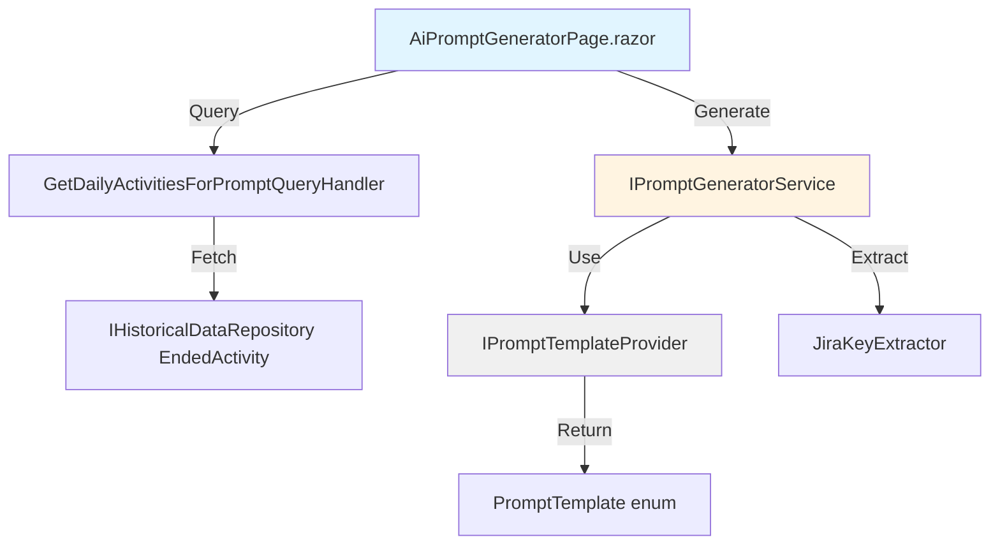
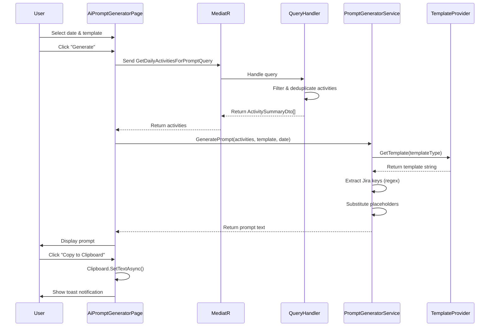

# Architecture: AI Prompt Generator

## Component Diagram



## Sequence Diagram



## Interface Definitions

### IPromptGeneratorService
```csharp
/// <summary>
/// Generates structured prompts for external LLM consumption.
/// </summary>
public interface IPromptGeneratorService
{
    /// <summary>
    /// Creates a prompt from daily activities using the specified template.
    /// </summary>
    /// <param name="activities">Filtered and deduplicated activities.</param>
    /// <param name="template">Prompt template type.</param>
    /// <param name="date">Date for context.</param>
    /// <returns>Plain text prompt ready for LLM input.</returns>
    string GeneratePrompt(
        IReadOnlyList<ActivitySummaryDto> activities,
        PromptTemplate template,
        DateOnly date);
}
```

### IPromptTemplateProvider
```csharp
/// <summary>
/// Provides static prompt templates with placeholder substitution.
/// </summary>
public interface IPromptTemplateProvider
{
    /// <summary>
    /// Retrieves the template string for the specified type.
    /// </summary>
    string GetTemplate(PromptTemplate template);
    
    /// <summary>
    /// Returns all available template types with display names.
    /// </summary>
    IReadOnlyDictionary<PromptTemplate, string> GetAvailableTemplates();
}
```

## MediatR Pipeline

### Query: GetDailyActivitiesForPromptQuery
```csharp
public record GetDailyActivitiesForPromptQuery(DateOnly Date) : IRequest<IReadOnlyList<ActivitySummaryDto>>;

public record ActivitySummaryDto(
    string Title,
    string ApplicationName,
    TimeSpan StartTime,
    TimeSpan Duration);
```

### Handler Responsibilities
1. Query repository for EndedActivity filtered by date
2. Exclude idle periods (<5 min gaps)
3. Deduplicate by Title+ApplicationName
4. Sort chronologically
5. Project to `ActivitySummaryDto`

## Data Transfer Objects

```csharp
public enum PromptTemplate
{
    DetailedSummaryWithTimeAllocation,
    ConciseBulletPointSummary,
    JiraFocusedWorklogTemplate
}
```

## Dependency Injection Registration

```csharp
// In TrackYourDay.Core/ServiceRegistration/ServiceCollections.cs
public static IServiceCollection AddPromptGenerationServices(this IServiceCollection services)
{
    services.AddSingleton<IPromptTemplateProvider, PromptTemplateProvider>();
    services.AddScoped<IPromptGeneratorService, PromptGeneratorService>();
    services.AddScoped<JiraKeyExtractor>();
    
    return services;
}
```

## Prompt Template Structure

### Template 1: Detailed Summary with Time Allocation
```
You are analyzing my work day on {DATE}.

Below is a chronological list of activities with durations:
{ACTIVITY_LIST}

Jira tickets I worked on: {JIRA_KEYS}

Task:
1. Group related activities into 3-9 distinct work items
2. Allocate time to each work item (must sum to total duration)
3. Map work items to Jira tickets where applicable
4. For items without tickets, provide descriptive summaries

Output format:
- [JIRA-123] Description (2h 30m)
- [JIRA-456] Description (1h 15m)
- [No ticket] Description (45m)
```

### Template 2: Concise Bullet-Point Summary
```
Summarize my work on {DATE} in 3-9 bullet points.

Activities:
{ACTIVITY_LIST}

Jira tickets: {JIRA_KEYS}

Requirements:
- Each bullet = one work focus area
- Include time estimate
- Reference Jira keys when relevant
- If no tickets match, describe work without keys
```

### Template 3: Jira-Focused Worklog Template
```
Generate Jira worklog entries for {DATE}.

Activities:
{ACTIVITY_LIST}

Known tickets: {JIRA_KEYS}

Rules:
- Create 3-9 worklog entries
- Match activities to Jira keys when possible
- For unmatched work, create generic "Development" or "Research" entries without keys
- Include start time and duration for each entry

Format:
JIRA-123 | 09:00 | 2h 30m | Description
JIRA-456 | 11:30 | 1h 15m | Description
(No key) | 14:00 | 45m | Description
```

## Performance Considerations
- Query optimization: Use existing date-based specifications
- Regex compilation: Use `[GeneratedRegex]` for Jira key extraction (.NET 7+)
- Activity limit: Cap at 500 events per day (typical day = 50-200)

## Security Considerations
- **PII Filtering:** Exclude window titles matching email/password patterns
- **No Persistence:** Prompts generated on-demand, not stored
- **No External Calls:** All processing local
