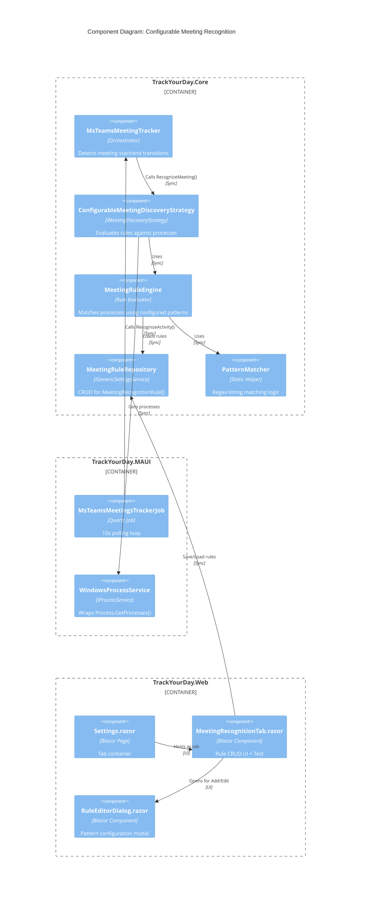
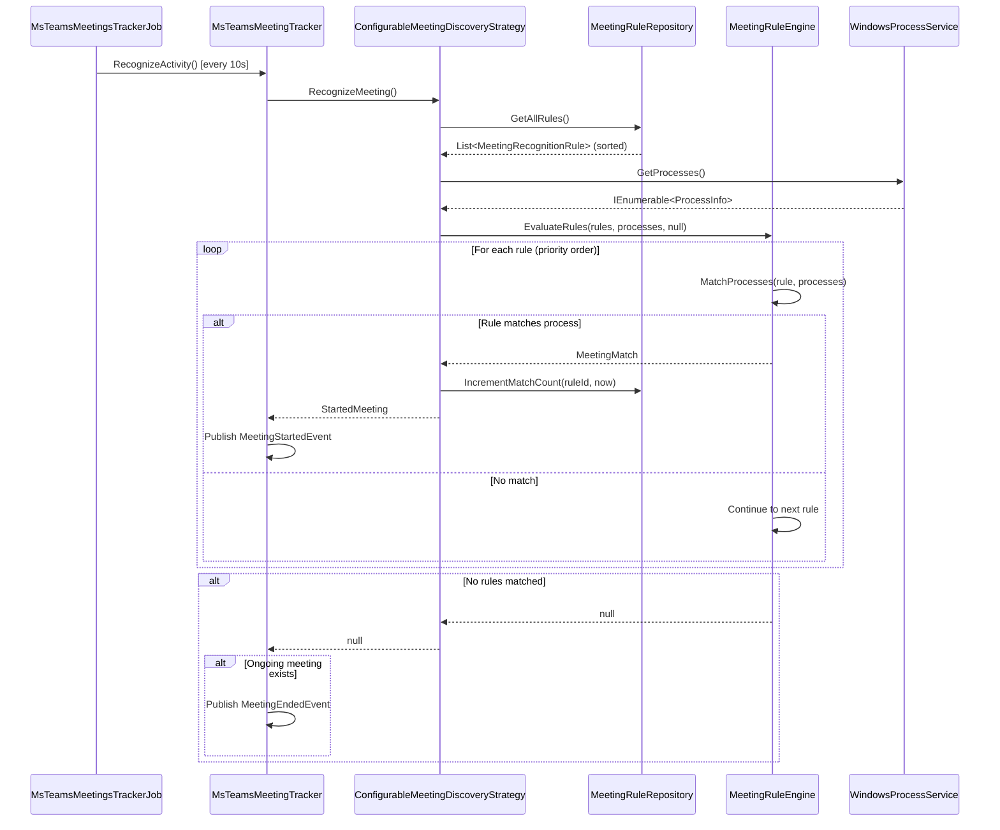

# Architecture: Configurable Meeting Recognition Rules

## Overview
Replaces hardcoded MS Teams meeting detection with user-configurable pattern-based rules stored via `IGenericSettingsService`. Rules evaluate in priority order against running processes using regex/string matching. **Refactoring required:** Change `MsTeamsMeetingTracker` from Singleton to Scoped lifecycle with per-job scope resolution via `IServiceScopeFactory` in Quartz job.

## Architecture Diagram



## Core Interfaces

### Domain Models (TrackYourDay.Core/ApplicationTrackers/MsTeams/Configuration)

```csharp
namespace TrackYourDay.Core.ApplicationTrackers.MsTeams.Configuration;

/// <summary>
/// Defines a single meeting recognition rule with priority ordering.
/// Rules are evaluated in ascending priority order (1 = highest priority).
/// </summary>
public sealed record MeetingRecognitionRule
{
    /// <summary>
    /// Unique identifier for the rule. Generated on creation.
    /// </summary>
    public Guid Id { get; init; }

    /// <summary>
    /// Evaluation priority. Lower values evaluated first (1, 2, 3...).
    /// Must be unique across all rules in the rule set.
    /// </summary>
    public int Priority { get; init; }

    /// <summary>
    /// Determines which process attributes must match for rule to apply.
    /// </summary>
    public MatchingCriteria Criteria { get; init; }

    /// <summary>
    /// Pattern for matching process name (e.g., "ms-teams.exe").
    /// Required if Criteria is ProcessNameOnly or Both.
    /// </summary>
    public PatternDefinition? ProcessNamePattern { get; init; }

    /// <summary>
    /// Pattern for matching window title.
    /// Required if Criteria is WindowTitleOnly or Both.
    /// </summary>
    public PatternDefinition? WindowTitlePattern { get; init; }

    /// <summary>
    /// Patterns that must NOT match. If any exclusion matches, rule fails.
    /// Evaluated after inclusion patterns pass.
    /// </summary>
    public IReadOnlyList<PatternDefinition> Exclusions { get; init; } = Array.Empty<PatternDefinition>();

    /// <summary>
    /// Total number of times this rule has matched a process.
    /// Incremented on each successful match. Persisted across restarts.
    /// </summary>
    public long MatchCount { get; init; }

    /// <summary>
    /// UTC timestamp of last successful match. Null if never matched.
    /// </summary>
    public DateTime? LastMatchedAt { get; init; }

    /// <summary>
    /// Which rule matched the currently ongoing meeting (if any).
    /// Used for AC12 continuity check: meeting continues only if same rule matches.
    /// </summary>
    public Guid? ActiveMeetingRuleId { get; set; }
}

/// <summary>
/// Defines which process attributes must match for a rule to apply.
/// </summary>
public enum MatchingCriteria
{
    /// <summary>
    /// Only process name pattern must match (window title ignored).
    /// </summary>
    ProcessNameOnly = 1,

    /// <summary>
    /// Only window title pattern must match (process name ignored).
    /// </summary>
    WindowTitleOnly = 2,

    /// <summary>
    /// Both process name AND window title patterns must match.
    /// </summary>
    Both = 3
}

/// <summary>
/// Defines a single pattern to match against process name or window title.
/// </summary>
public sealed record PatternDefinition
{
    /// <summary>
    /// The pattern text to match (e.g., "Microsoft Teams", ".*\| Meeting$").
    /// </summary>
    public string Pattern { get; init; } = string.Empty;

    /// <summary>
    /// How the pattern should be matched against target string.
    /// </summary>
    public PatternMatchMode MatchMode { get; init; }

    /// <summary>
    /// Whether pattern matching is case-sensitive.
    /// Default rule uses case-insensitive matching.
    /// </summary>
    public bool CaseSensitive { get; init; }

    /// <summary>
    /// Compiled regex if MatchMode is Regex. Lazy-initialized for performance.
    /// Not serialized—reconstructed from Pattern on deserialization.
    /// </summary>
    [JsonIgnore]
    public Regex? CompiledRegex { get; init; }
}

/// <summary>
/// String matching algorithms supported for pattern matching.
/// </summary>
public enum PatternMatchMode
{
    /// <summary>
    /// Substring match: target.Contains(pattern)
    /// </summary>
    Contains = 1,

    /// <summary>
    /// Prefix match: target.StartsWith(pattern)
    /// </summary>
    StartsWith = 2,

    /// <summary>
    /// Suffix match: target.EndsWith(pattern)
    /// </summary>
    EndsWith = 3,

    /// <summary>
    /// Exact equality: target == pattern
    /// </summary>
    Exact = 4,

    /// <summary>
    /// Regular expression: Regex.IsMatch(target, pattern)
    /// Timeout: 2 seconds to prevent ReDoS.
    /// </summary>
    Regex = 5
}
```

### Rule Evaluation (TrackYourDay.Core/ApplicationTrackers/MsTeams/RuleEngine)

```csharp
namespace TrackYourDay.Core.ApplicationTrackers.MsTeams.RuleEngine;

/// <summary>
/// Evaluates meeting recognition rules against running processes.
/// NOT thread-safe—caller must ensure synchronization if rules mutate during evaluation.
/// </summary>
public interface IMeetingRuleEngine
{
    /// <summary>
    /// Evaluates all rules in priority order against provided processes.
    /// Returns first matching process or null if no matches.
    /// </summary>
    /// <param name="rules">Rules sorted by Priority ascending.</param>
    /// <param name="processes">Candidate processes to evaluate.</param>
    /// <param name="ongoingMeetingRuleId">Rule ID of currently tracked meeting (for continuity check).</param>
    /// <returns>Matched process metadata or null.</returns>
    /// <exception cref="ArgumentNullException">If rules or processes is null.</exception>
    MeetingMatch? EvaluateRules(
        IReadOnlyList<MeetingRecognitionRule> rules,
        IEnumerable<ProcessInfo> processes,
        Guid? ongoingMeetingRuleId);
}

/// <summary>
/// Result of successful rule evaluation.
/// </summary>
public sealed record MeetingMatch
{
    /// <summary>
    /// ID of the rule that matched.
    /// </summary>
    public Guid MatchedRuleId { get; init; }

    /// <summary>
    /// Process name that matched.
    /// </summary>
    public string ProcessName { get; init; } = string.Empty;

    /// <summary>
    /// Window title that matched.
    /// </summary>
    public string WindowTitle { get; init; } = string.Empty;

    /// <summary>
    /// UTC timestamp when match occurred.
    /// </summary>
    public DateTime MatchedAt { get; init; }
}

/// <summary>
/// Process information extracted by IProcessService.
/// Immutable snapshot—does not track process lifecycle.
/// </summary>
public sealed record ProcessInfo(string ProcessName, string MainWindowTitle);
```

### Strategy Refactoring (TrackYourDay.Core/ApplicationTrackers/MsTeams)

```csharp
namespace TrackYourDay.Core.ApplicationTrackers.MsTeams;

/// <summary>
/// Discovers ongoing meetings using configurable pattern-based rules.
/// Replaces ProcessBasedMeetingRecognizingStrategy with dynamic rule resolution.
/// </summary>
public sealed class ConfigurableMeetingDiscoveryStrategy : IMeetingDiscoveryStrategy
{
    private readonly IMeetingRuleEngine _ruleEngine;
    private readonly IMeetingRuleRepository _ruleRepository;
    private readonly IProcessService _processService;
    private readonly IClock _clock;
    private readonly ILogger<ConfigurableMeetingDiscoveryStrategy> _logger;

    /// <summary>
    /// Initializes strategy with dependencies.
    /// </summary>
    /// <param name="ruleEngine">Rule evaluation engine.</param>
    /// <param name="ruleRepository">Rule storage/retrieval.</param>
    /// <param name="processService">Process enumeration.</param>
    /// <param name="clock">Time provider for match timestamps.</param>
    /// <param name="logger">Logging.</param>
    public ConfigurableMeetingDiscoveryStrategy(
        IMeetingRuleEngine ruleEngine,
        IMeetingRuleRepository ruleRepository,
        IProcessService processService,
        IClock clock,
        ILogger<ConfigurableMeetingDiscoveryStrategy> logger)
    {
        _ruleEngine = ruleEngine;
        _ruleRepository = ruleRepository;
        _processService = processService;
        _clock = clock;
        _logger = logger;
    }

    /// <summary>
    /// Loads current rules and evaluates against running processes.
    /// Returns StartedMeeting if match found, null otherwise.
    /// </summary>
    /// <returns>Meeting metadata or null.</returns>
    public StartedMeeting? RecognizeMeeting()
    {
        // Load rules on every call—enables immediate rule application (AC11)
        var rules = _ruleRepository.GetAllRules();
        
        if (rules.Count == 0)
        {
            _logger.LogWarning("No meeting recognition rules configured. Meeting tracking disabled.");
            return null;
        }

        var processes = _processService.GetProcesses();
        var match = _ruleEngine.EvaluateRules(rules, processes, ongoingMeetingRuleId: null);

        if (match != null)
        {
            _ruleRepository.IncrementMatchCount(match.MatchedRuleId, _clock.Now);
            return new StartedMeeting(Guid.NewGuid(), match.MatchedAt, match.WindowTitle);
        }

        return null;
    }
}
```

### Repository (TrackYourDay.Core/ApplicationTrackers/MsTeams/Persistence)

```csharp
namespace TrackYourDay.Core.ApplicationTrackers.MsTeams.Persistence;

/// <summary>
/// Manages persistence of meeting recognition rules using IGenericSettingsService.
/// Rules stored as JSON array under key "MeetingRecognitionRules.v1".
/// Thread-safe if underlying IGenericSettingsService is thread-safe.
/// </summary>
public interface IMeetingRuleRepository
{
    /// <summary>
    /// Retrieves all rules sorted by Priority ascending.
    /// Returns default rule if no rules exist (first-run scenario).
    /// </summary>
    /// <returns>Sorted rule list.</returns>
    IReadOnlyList<MeetingRecognitionRule> GetAllRules();

    /// <summary>
    /// Replaces all rules with provided set. Validates priority uniqueness.
    /// </summary>
    /// <param name="rules">New rule set.</param>
    /// <exception cref="ArgumentException">If priorities are not unique.</exception>
    void SaveRules(IReadOnlyList<MeetingRecognitionRule> rules);

    /// <summary>
    /// Increments match count and updates last matched timestamp for a rule.
    /// </summary>
    /// <param name="ruleId">Target rule ID.</param>
    /// <param name="matchedAt">UTC timestamp of match.</param>
    void IncrementMatchCount(Guid ruleId, DateTime matchedAt);

    /// <summary>
    /// Creates default rule matching legacy ProcessBasedMeetingRecognizingStrategy behavior.
    /// </summary>
    /// <returns>Default rule (priority 1, Polish exclusions).</returns>
    MeetingRecognitionRule CreateDefaultRule();
}
```

## Data Flow

### MediatR Integration
**No MediatR commands/queries needed.** Rules are loaded synchronously in `RecognizeMeeting()` to satisfy AC11 (immediate application). No async/await in evaluation path—blocks background job thread (10s interval acceptable).

### Execution Flow



## Technical Risks

### Critical Blocking Issues
1. **Scoped Lifecycle State Loss** (RESOLVED): Moving `MsTeamsMeetingTracker` to Scoped breaks meeting state persistence between job executions. **Solution**: Extract state to `IMeetingStateCache` Singleton with thread-safe locking. Tracker becomes stateless orchestrator.

2. **ReDoS Attack Surface**: User-supplied regex patterns enable catastrophic backtracking. Pattern `(a+)+b` against 30-character input = 2^30 backtracking paths = **application freeze**. **Mitigation**: 2-second timeout in `Regex` constructor + `IsMatch()`, catch `RegexMatchTimeoutException`, treat timeout as non-match. Log warning but never crash.

3. **JSON Deserialization Corruption**: `IGenericSettingsService` stores opaque JSON. Malformed data (manual DB edit, schema evolution) crashes on `GetSetting<List<MeetingRecognitionRule>>()`. **Mitigation**: Wrap in try-catch, fallback to `CreateDefaultRule()`, log corruption event.

### High-Risk Areas
4. **Match Count Write Amplification**: Every match (10s interval) triggers full JSON serialization of all rules. 10 rules × 500 bytes = 5KB × 6 matches/min = 30KB/min SQLite writes. **Acceptable** for current scale. If >100 rules, batch updates with write-behind cache.

5. **Process Enumeration Permissions**: `Process.GetProcesses()` throws `Win32Exception` if app runs without admin rights (rare on Windows 10+ with standard user). **Mitigation**: Catch exception, disable meeting tracking, show notification: "Meeting tracking requires process access permissions."

6. **Rule Evaluation Cost**: 10 rules × 50 processes × 5ms regex = 2.5s per cycle blocks Quartz job thread. Other jobs (activity tracking, break detection) delayed. **Mitigation**: If profiling shows >500ms, move `EvaluateRules()` to `Task.Run()` with `CancellationToken`.

### Medium-Risk Areas
7. **UI Responsiveness**: Test/Preview button blocks Blazor render thread if iterating 100+ processes. **Mitigation**: `await Task.Run()` in `OnTestClicked()`.

8. **Match Count Overflow**: `long.MaxValue` = 2^63. At 1 match/sec, overflows in 292 billion years. **Accept risk.**

9. **Concurrent Rule Modification During Evaluation**: User saves rules in UI while background job reads from repository. `IGenericSettingsService` implementation unknown—may not be thread-safe. **Mitigation**: Document thread-safety requirement for `IGenericSettingsService` or add `ReaderWriterLockSlim` in `MeetingRuleRepository`.

## Breaking Changes

### For Users
- **Settings UI**: New "Meeting Recognition" tab. Existing Settings tabs may shift position.
- **Default Behavior**: Polish-language exclusions (`"Czat |"`, `"Aktywność |"`) hardcoded in default rule. Non-Polish users see irrelevant patterns but no functional impact (patterns won't match anyway).
- **Immediate Application**: Rules apply without restart. Contradicts user mental model from other settings (Breaks, GitLab, Jira). Consider adding tooltip: "Changes apply immediately (unlike other settings)."

### For Developers (BREAKING API CHANGES)
1. **MsTeamsMeetingTracker Lifecycle**: `AddSingleton<MsTeamsMeetingTracker>()` → `AddScoped<MsTeamsMeetingTracker>()`. Any code resolving tracker from root container breaks. Must use `IServiceScopeFactory`.

2. **MsTeamsMeetingTracker Constructor Signature**: 
   ```csharp
   // OLD (line 16)
   public MsTeamsMeetingTracker(IClock clock, IPublisher publisher, IMeetingDiscoveryStrategy strategy, ILogger logger)
   
   // NEW
   public MsTeamsMeetingTracker(IClock clock, IPublisher publisher, IMeetingDiscoveryStrategy strategy, IMeetingStateCache stateCache, ILogger logger)
   ```
   **Impact**: All instantiation sites must inject `IMeetingStateCache`. Unit tests must mock it.

3. **MsTeamsMeetingTracker State Management**: 
   - `ongoingMeeting` private field → `stateCache.GetOngoingMeeting()` 
   - `endedMeetings` list → remains unchanged (still persisted in tracker instance per scope)
   
   **Impact**: `GetEndedMeetings()` behavior unchanged but may need refactoring if meetings must persist across scopes.

4. **ProcessBasedMeetingRecognizingStrategy Removed**: Delete class after migration. Mark `[Obsolete("Use ConfigurableMeetingDiscoveryStrategy")]` in interim release.

5. **ServiceCollections.cs Lines 50-58**: Complete rewrite of tracker registration logic:
   ```csharp
   // DELETE manual factory registration
   services.AddSingleton<MsTeamsMeetingTracker>(container => { ... });
   
   // ADD new registrations
   services.AddScoped<MsTeamsMeetingTracker>();
   services.AddScoped<IMeetingDiscoveryStrategy, ConfigurableMeetingDiscoveryStrategy>();
   services.AddScoped<IMeetingRuleEngine, MeetingRuleEngine>();
   services.AddSingleton<IMeetingRuleRepository, MeetingRuleRepository>();
   services.AddSingleton<IMeetingStateCache, MeetingStateCache>();
   services.AddSingleton<IProcessService, WindowsProcessService>(); // Move from inline instantiation
   ```

6. **MsTeamsMeetingsTrackerJob Refactoring**: Constructor injection changes:
   ```csharp
   // OLD (line 8, 22)
   private readonly MsTeamsMeetingTracker tracker;
   public MsTeamsMeetingsTrackerJob(MsTeamsMeetingTracker tracker)
   
   // NEW
   private readonly IServiceScopeFactory _scopeFactory;
   public MsTeamsMeetingsTrackerJob(IServiceScopeFactory scopeFactory)
   ```
   **Impact**: Job must create scope per execution. See "Architectural Decisions" section for implementation.

## Performance Considerations

### Hot Paths
1. **Rule Loading**: `GetAllRules()` deserializes JSON on every `RecognizeMeeting()` call (10s interval). With 10 rules ≈ 2KB JSON, deserialization < 1ms. **Acceptable.**

2. **Regex Compilation**: `PatternDefinition.CompiledRegex` should be lazy-init with `RegexOptions.Compiled`. Recompiling on every call destroys performance. **Cache in `PatternDefinition` constructor.**

3. **Process.GetProcesses()**: Native Windows API call. Enumerates 50-200 processes in ~10ms. Cannot optimize further. **Measure and document acceptable threshold.**

### Memory Allocations
- **ProcessInfo**: 100 processes × 64 bytes = 6.4 KB per cycle. GC Gen0 collects. **Negligible.**
- **Regex Compiled Cache**: `RegexOptions.Compiled` generates IL. 10 rules × 3 patterns/rule × ~10KB/pattern = 300KB. **Acceptable for desktop app.**

### Optimization Opportunities
- **Rule Caching**: Load rules once, subscribe to change notifications from `IGenericSettingsService`. Reduces JSON deserialization overhead. **Trade-off**: Breaks AC11 guarantee if service doesn't emit events.
- **Process Filtering**: If all rules match `"ms-teams"`, filter processes before evaluation. **Early optimization—measure first.**
- **Parallel Rule Evaluation**: `Parallel.ForEach` over rules. **Risky**: breaks priority ordering (AC1), increases complexity.

## Implementation Phases

### Phase 0: Preparation - Extract State Management (OOP Specialist)
**MUST BE COMPLETED BEFORE Phase 1**
1. Create `IMeetingStateCache` interface + `MeetingStateCache` implementation in `TrackYourDay.Core/ApplicationTrackers/MsTeams/State`
2. Register as Singleton in `ServiceCollections.cs`
3. Refactor `MsTeamsMeetingTracker`:
   - Inject `IMeetingStateCache` in constructor
   - Replace `ongoingMeeting` field with `stateCache.GetOngoingMeeting()` / `SetOngoingMeeting()`
   - Add `stateCache.GetMatchedRuleId()` / `SetMatchedRuleId()` calls for AC12
4. Update `MsTeamsMeetingsTrackerJob`:
   - Inject `IServiceScopeFactory` instead of `MsTeamsMeetingTracker`
   - Create scope in `Execute()`, resolve tracker per cycle
5. Update ALL unit tests to mock `IMeetingStateCache`
6. **Verify:** All existing tests pass, meeting tracking still works

**Why Phase 0 is critical:** Changing lifecycle without extracting state = meeting state lost every 10 seconds. This phase preserves behavior while enabling scoped lifecycle.

---

### Phase 1: Core Domain (OOP Specialist)
1. Create domain models in `TrackYourDay.Core/ApplicationTrackers/MsTeams/Configuration`:
   - `MeetingRecognitionRule` record
   - `PatternDefinition` record with `CreateRegexPattern()` factory
   - `MatchingCriteria`, `PatternMatchMode` enums
   - `MeetingMatch`, `ProcessInfo` records
2. Implement `MeetingRuleEngine` in `TrackYourDay.Core/ApplicationTrackers/MsTeams/RuleEngine`:
   - `IMeetingRuleEngine` interface
   - `MeetingRuleEngine` class with `EvaluateRules()` logic
   - `PatternMatcher` static helper (or extension methods on `PatternDefinition`)
3. Implement `MeetingRuleRepository` in `TrackYourDay.Core/ApplicationTrackers/MsTeams/Persistence`:
   - `IMeetingRuleRepository` interface
   - `MeetingRuleRepository` class wrapping `IGenericSettingsService`
   - `CreateDefaultRule()` factory method (AC10)
4. Unit tests (≥90% coverage):
   - Pattern matching: all 5 modes × case sensitivity × edge cases (empty string, null, unicode)
   - Regex timeout: verify 2s limit, catch `RegexMatchTimeoutException`
   - Rule priority ordering: verify first match wins (AC1, AC5)
   - Default rule validation: verify exact AC10 specification
   - Match count increment: verify atomic update

---

### Phase 2: Strategy Refactoring (OOP Specialist)
1. Create `ConfigurableMeetingDiscoveryStrategy` in `TrackYourDay.Core/ApplicationTrackers/MsTeams`
2. Update `ServiceCollections.cs`:
   - Change `MsTeamsMeetingTracker` to Scoped
   - Register `IMeetingDiscoveryStrategy` → `ConfigurableMeetingDiscoveryStrategy` (Scoped)
   - Register `IMeetingRuleEngine` → `MeetingRuleEngine` (Scoped)
   - Register `IMeetingRuleRepository` → `MeetingRuleRepository` (Singleton)
   - Move `IProcessService` → `WindowsProcessService` to Singleton (remove inline `new`)
3. Mark `ProcessBasedMeetingRecognizingStrategy` as `[Obsolete]`
4. Integration tests:
   - Mock `IProcessService` to return test processes
   - Verify rule evaluation against mock data
   - Test AC12: meeting continuity when same rule matches different title
   - Test AC12: meeting ends when different rule matches
   - Verify immediate rule application (AC11): save rules, next cycle loads new rules

---

### Phase 3: UI Implementation (Frontend Developer)
1. Create `MeetingRecognitionTab.razor` in `TrackYourDay.Web/Pages/Settings/Tabs`:
   - Rule list DataGrid with priority, criteria badges, match stats
   - Drag-drop reordering (or up/down buttons)
   - Add/Edit/Delete buttons
   - Test/Preview section with results panel
2. Create `RuleEditorDialog.razor` in `TrackYourDay.Web/Components`:
   - Matching criteria dropdown (ProcessNameOnly/WindowTitleOnly/Both)
   - Process name pattern fields (conditional on criteria)
   - Window title pattern fields (conditional on criteria)
   - Exclusions list with Add/Remove
   - Pattern mode dropdowns (Contains/Starts/Ends/Exact/Regex)
   - Case sensitivity checkboxes
   - Regex validation on save (AC9)
3. Integrate into `Settings.razor`:
   - Add "Meeting Recognition" tab after existing tabs
   - Wire up save to `IMeetingRuleRepository.SaveRules()`
4. Implement Test/Preview:
   - Button calls `IProcessService.GetProcesses()` via injected service
   - Filter to "ms-teams" processes
   - Display in DataGrid: Process Name, Window Title, Matched By Rule
   - Highlight rules with 0 matches (AC8)
   - Run in `Task.Run()` to avoid UI blocking
5. Match count statistics:
   - Poll `IMeetingRuleRepository.GetAllRules()` every 10s to refresh stats (optional)
   - Display LastMatchedAt as relative time ("2 minutes ago")

---

### Phase 4: Validation & Hardening
1. **Regex validation** (Frontend + Backend):
   - Frontend: Try `new Regex(pattern)` in try-catch on input blur
   - Backend: `PatternDefinition.CreateRegexPattern()` validates on save
   - Show inline error: "Invalid regex: {exception.Message}"
2. **Priority conflict resolution**:
   - Backend: `SaveRules()` validates unique priorities, throws `ArgumentException`
   - Frontend: Auto-renumber on drag-drop (1, 2, 3, ...)
3. **Error handling**:
   - JSON corruption: `MeetingRuleRepository` catches deserialization exception, returns default rule, logs error
   - Process permission: `ConfigurableMeetingDiscoveryStrategy` catches `Win32Exception`, logs error, returns null
   - ReDoS: `PatternDefinition.Matches()` catches `RegexMatchTimeoutException`, logs warning, returns false
4. **Empty pattern validation**:
   - Frontend: Disable Save button if pattern empty
   - Backend: `PatternDefinition` constructor throws `ArgumentException` if `string.IsNullOrWhiteSpace(Pattern)`
5. **Default rule protection**:
   - Frontend: Disable Delete button if only 1 rule exists
   - Show confirmation dialog: "Deleting this rule will disable meeting tracking. Continue?"
6. **End-to-end testing**:
   - Scenario: User adds rule → saves → within 10s, rule applies to running process
   - Scenario: User creates catastrophic regex → save fails with validation error
   - Scenario: User deletes all rules → default rule recreated on next app start
   - Scenario: Ongoing meeting title changes → meeting continues if same rule matches (AC12)

---

### Phase 5: Performance Validation (All Roles)
1. **Profiling**:
   - Run with 10 rules, 100 processes
   - Measure `EvaluateRules()` execution time (target: <200ms)
   - Measure JSON deserialization time (target: <5ms)
   - Measure `IncrementMatchCount()` save time (target: <10ms)
2. **Stress testing**:
   - 50 rules with complex regex patterns
   - 200+ running processes
   - Verify no UI freeze, no missed job executions
3. **ReDoS validation**:
   - Create rule with `(a+)+b` pattern
   - Open Teams window with title "aaaaaaaaaaaaaaaaaaaaaaaaaX" (30 chars)
   - Verify: Evaluation times out after 2s, app remains responsive, warning logged
4. **If profiling reveals >500ms evaluation time**:
   - Move `EvaluateRules()` to `Task.Run()` in `ConfigurableMeetingDiscoveryStrategy`
   - Add `CancellationToken` with 5s timeout
   - Test job cancellation on app shutdown
5. Match count statistics display

### Phase 4: Validation & Polish
1. Regex validation on save
2. Priority conflict resolution
3. Error handling for JSON corruption
4. Match count persistence
5. End-to-end testing

---

## Architectural Decisions

### 1. Scoped Lifecycle for MsTeamsMeetingTracker (APPROVED)

**Decision:** Refactor from Singleton to Scoped.

**Implementation:**
```csharp
// ServiceCollections.cs - REMOVE Singleton registration
// services.AddSingleton<MsTeamsMeetingTracker>(...); // DELETE THIS

// Add Scoped registration instead
services.AddScoped<MsTeamsMeetingTracker>();
services.AddScoped<IMeetingDiscoveryStrategy, ConfigurableMeetingDiscoveryStrategy>();
services.AddScoped<IMeetingRuleEngine, MeetingRuleEngine>();
services.AddSingleton<IMeetingRuleRepository, MeetingRuleRepository>(); // Singleton OK - wraps IGenericSettingsService

// MsTeamsMeetingsTrackerJob.cs - Inject IServiceScopeFactory
public class MsTeamsMeetingsTrackerJob : IJob
{
    private readonly IServiceScopeFactory _scopeFactory;

    public MsTeamsMeetingsTrackerJob(IServiceScopeFactory scopeFactory)
    {
        _scopeFactory = scopeFactory;
    }

    public async Task Execute(IJobExecutionContext context)
    {
        using var scope = _scopeFactory.CreateScope();
        var tracker = scope.ServiceProvider.GetRequiredService<MsTeamsMeetingTracker>();
        tracker.RecognizeActivity(); // Rules loaded fresh per cycle
    }
}
```

**Trade-offs:**
- ✅ **Pro:** Fresh strategy resolution per cycle enables immediate rule application (AC11)
- ✅ **Pro:** Testability improves—no shared state between test runs
- ❌ **Con:** `MsTeamsMeetingTracker.ongoingMeeting` field cannot persist across scopes—**BREAKS MEETING TRACKING**

**CRITICAL PROBLEM:** Current `MsTeamsMeetingTracker` stores `ongoingMeeting` as instance field. Scoped lifecycle means new instance per job execution = meeting state lost every 10 seconds.

**REQUIRED REFACTORING:**
Move meeting state to Singleton service:

```csharp
namespace TrackYourDay.Core.ApplicationTrackers.MsTeams.State;

/// <summary>
/// Thread-safe cache for ongoing meeting state.
/// Singleton lifecycle—survives job scope disposal.
/// </summary>
public interface IMeetingStateCache
{
    /// <summary>
    /// Gets the currently ongoing meeting, or null if no meeting active.
    /// Thread-safe.
    /// </summary>
    StartedMeeting? GetOngoingMeeting();

    /// <summary>
    /// Sets the ongoing meeting. Overwrites previous value.
    /// Thread-safe.
    /// </summary>
    void SetOngoingMeeting(StartedMeeting? meeting);

    /// <summary>
    /// Gets the rule ID that matched the current ongoing meeting.
    /// Used for AC12 continuity check.
    /// Thread-safe.
    /// </summary>
    Guid? GetMatchedRuleId();

    /// <summary>
    /// Sets the rule ID for the ongoing meeting.
    /// Thread-safe.
    /// </summary>
    void SetMatchedRuleId(Guid? ruleId);

    /// <summary>
    /// Atomically clears both meeting and rule ID.
    /// Thread-safe.
    /// </summary>
    void ClearMeetingState();
}

public sealed class MeetingStateCache : IMeetingStateCache
{
    private readonly object _lock = new();
    private StartedMeeting? _ongoingMeeting;
    private Guid? _matchedRuleId;

    public StartedMeeting? GetOngoingMeeting()
    {
        lock (_lock) return _ongoingMeeting;
    }

    public void SetOngoingMeeting(StartedMeeting? meeting)
    {
        lock (_lock) _ongoingMeeting = meeting;
    }

    public Guid? GetMatchedRuleId()
    {
        lock (_lock) return _matchedRuleId;
    }

    public void SetMatchedRuleId(Guid? ruleId)
    {
        lock (_lock) _matchedRuleId = ruleId;
    }

    public void ClearMeetingState()
    {
        lock (_lock)
        {
            _ongoingMeeting = null;
            _matchedRuleId = null;
        }
    }
}

// Registration
services.AddSingleton<IMeetingStateCache, MeetingStateCache>();

// MsTeamsMeetingTracker constructor now injects IMeetingStateCache
public MsTeamsMeetingTracker(
    IClock clock, 
    IPublisher publisher, 
    IMeetingDiscoveryStrategy strategy,
    IMeetingStateCache stateCache, // NEW
    ILogger<MsTeamsMeetingTracker> logger)
{
    // Replace this.ongoingMeeting field access with stateCache.GetOngoingMeeting()
}
```

**Why not make tracker Singleton?**
- Singleton tracker with Scoped strategy = **impossible** (DI container rejects)
- Singleton tracker with strategy factory pattern = **ServiceLocator anti-pattern**
- Scoped tracker with Singleton state cache = **clean separation of concerns**

---

### 2. In-Memory Thread-Safe Cache for Rule Tracking (APPROVED)

**Decision:** Store ongoing meeting's matched rule ID in `IMeetingStateCache` (Singleton), not in `StartedMeeting` domain object.

**Rationale:**
- `StartedMeeting` is a domain value object—should not leak infrastructure concerns (rule IDs)
- Rule matching is application-level concern, not domain concept
- Keeps `EndedMeeting` persistence unchanged (AC13)

**Implementation:** See `IMeetingStateCache` interface above.

**Thread Safety:** `lock` statement sufficient—Quartz job runs single-threaded on 10s interval. UI modifications use different code path (save to repository only).

---

### 3. Match Count Storage Strategy: Embedded (APPROVED)

**Question:** Should match counts be stored inside `MeetingRecognitionRule` or as separate key-value pairs?

**Option A: Embedded (RECOMMENDED)**
```csharp
// Single JSON blob in IGenericSettingsService
{
  "MeetingRecognitionRules.v1": [
    { "Id": "...", "Priority": 1, "MatchCount": 42, "LastMatchedAt": "2026-01-06T19:00:00Z", ... },
    { "Id": "...", "Priority": 2, "MatchCount": 7, "LastMatchedAt": "2026-01-05T12:30:00Z", ... }
  ]
}
```
- ✅ **Pro:** Single source of truth—no desync between rules and stats
- ✅ **Pro:** Atomic save—both rule config and stats updated together
- ❌ **Con:** Every match (every 10s) triggers full JSON serialization of all rules

**Performance Cost:**
- 10 rules × 500 bytes/rule = 5KB JSON
- Serialize + write to SQLite ≈ 5ms
- Acceptable for 10-second polling interval

**Option B: Separate Key-Value Pairs (REJECTED)**
```csharp
// Multiple keys in IGenericSettingsService
{
  "MeetingRecognitionRules.v1": [...],
  "MeetingRuleStats.{ruleId1}": { "MatchCount": 42, "LastMatchedAt": "..." },
  "MeetingRuleStats.{ruleId2}": { "MatchCount": 7, "LastMatchedAt": "..." }
}
```
- ✅ **Pro:** Incremental updates—only touched rule's stats are saved
- ❌ **Con:** Synchronization complexity—deleting rule must delete stats key
- ❌ **Con:** Orphaned stats keys accumulate (garbage collection needed)
- ❌ **Con:** Two database round-trips to get complete view

**Decision:** Use **Embedded (Option A)**. Performance cost negligible, complexity reduced.

**Optimization:** If profiling reveals serialization bottleneck (>50ms), introduce write-behind cache with batching:
```csharp
// Increment in-memory counter, flush to IGenericSettingsService every 60 seconds
private readonly ConcurrentDictionary<Guid, long> _matchCountDeltas = new();
private Timer _flushTimer;
```
**Do NOT pre-optimize.** Measure first.

---

### 4. ReDoS (Regular Expression Denial of Service) Explained

**What is ReDoS?**
Catastrophic backtracking in regex engines where evaluation time grows exponentially with input length.

**Attack Vector:**
User configures pattern:
```regex
(a+)+b
```
Then window title is:
```
"aaaaaaaaaaaaaaaaaaaaaaaaaX"  // 24 'a' characters, no 'b'
```

**What Happens:**
1. Regex engine tries matching `(a+)+` 
2. For 24 characters, explores 2^24 = **16,777,216 possible backtracking paths**
3. Each backtrack retries inner `a+` with different capture groups
4. Evaluation time: **seconds to minutes** for 30+ characters
5. **Application freezes**—UI unresponsive, background jobs stalled

**Real-World Example:**
- **Stack Overflow outage (2016):** Regex `\s+$` against 20KB string with trailing spaces caused 30-second hang
- **npm registry outage (2019):** Regex in semver parser caused infinite loop

**Why It's Dangerous Here:**
- Users control regex patterns (AC3: "Regular expression" mode)
- Window titles can be **arbitrary length** (Teams meeting with 200-character agenda)
- No user expertise validation—"helpful" user copies regex from Stack Overflow without understanding

**Mitigation Strategy:**

```csharp
public sealed record PatternDefinition
{
    private const int RegexTimeoutSeconds = 2;

    public Regex? CompiledRegex { get; init; }

    public static PatternDefinition CreateRegexPattern(string pattern, bool caseSensitive)
    {
        var options = RegexOptions.Compiled;
        if (!caseSensitive) options |= RegexOptions.IgnoreCase;

        try
        {
            var timeout = TimeSpan.FromSeconds(RegexTimeoutSeconds);
            var regex = new Regex(pattern, options, timeout); // CRITICAL: Timeout parameter
            return new PatternDefinition 
            { 
                Pattern = pattern, 
                MatchMode = PatternMatchMode.Regex,
                CaseSensitive = caseSensitive,
                CompiledRegex = regex 
            };
        }
        catch (RegexMatchTimeoutException ex)
        {
            // Regex took >2s to evaluate—pattern too complex
            throw new ArgumentException($"Regex pattern timed out: {pattern}", ex);
        }
        catch (ArgumentException ex)
        {
            // Syntax error in regex
            throw new ArgumentException($"Invalid regex pattern: {pattern}", ex);
        }
    }

    public bool Matches(string input)
    {
        if (MatchMode != PatternMatchMode.Regex || CompiledRegex is null)
        {
            // String matching—no ReDoS risk
            return MatchMode switch
            {
                PatternMatchMode.Contains => input.Contains(Pattern, GetComparison()),
                PatternMatchMode.StartsWith => input.StartsWith(Pattern, GetComparison()),
                PatternMatchMode.EndsWith => input.EndsWith(Pattern, GetComparison()),
                PatternMatchMode.Exact => input.Equals(Pattern, GetComparison()),
                _ => false
            };
        }

        try
        {
            return CompiledRegex.IsMatch(input); // Timeout enforced by Regex constructor
        }
        catch (RegexMatchTimeoutException ex)
        {
            // Log and fail gracefully—do NOT crash tracker
            _logger.LogWarning(ex, "Regex timeout while matching pattern {Pattern} against input length {Length}", 
                Pattern, input.Length);
            return false; // Treat timeout as non-match
        }
    }

    private StringComparison GetComparison() => 
        CaseSensitive ? StringComparison.Ordinal : StringComparison.OrdinalIgnoreCase;
}
```

**Defense Layers:**
1. **Timeout in constructor:** 2-second limit when compiling regex (catches infinite loops during save)
2. **Timeout in IsMatch:** 2-second limit during evaluation (catches runtime explosions)
3. **Catch + log:** Never crash tracker—log warning, treat as non-match
4. **UI validation:** Warn user if pattern contains suspicious constructs (`+`, `+`, nested quantifiers)

**DO NOT:**
- Parse regex AST to detect dangerous patterns (brittle, incomplete)
- Limit regex complexity score (impossible to define accurately)
- Pre-test regex against known bad inputs (no comprehensive test suite exists)

**Accept Risk:**
Sophisticated attacker can still craft 1.9-second regex and DoS the app. **This is acceptable**—desktop app, single user, no remote exploit vector. User shooting themselves in the foot is not a security boundary.

---

## Remaining Open Questions

3. **Default Rule Deletion**: Can user delete default rule? Spec says "default rule auto-created" on first run but silent on deletion. Recommend: Block deletion if only rule, show warning.

5. **Regex Timeout Value**: 2 seconds confirmed (based on .NET defaults).

6. **Case Sensitivity Default**: Default rule uses case-insensitive. UI checkbox default: **unchecked** (matches spec's AC10 "case-insensitive").

7. **Empty Pattern Validation**: **Block save**. Empty pattern always fails to match—no valid use case. Show error: "Pattern cannot be empty."

8. **Test/Preview Scope**: Filter to processes containing "ms-teams" in process name before displaying (matches spec AC8 "all currently running MS Teams processes").

---

## Summary: Critical Architecture Points

### Key Decisions Made
1. ✅ **Scoped Lifecycle** - `MsTeamsMeetingTracker` changes from Singleton to Scoped
2. ✅ **State Extraction** - Meeting state moved to `IMeetingStateCache` Singleton (thread-safe)
3. ✅ **Embedded Match Counts** - Stats stored inside `MeetingRecognitionRule` JSON (5ms overhead acceptable)
4. ✅ **ReDoS Protection** - 2-second timeout on regex evaluation, catch exceptions gracefully
5. ✅ **Rule ID Tracking** - Stored in `IMeetingStateCache`, not in `StartedMeeting` domain object

### What Can Go Wrong (High Risk)
- **Forgotten Phase 0**: Implementing Phases 1-3 without extracting state = meetings end every 10 seconds
- **Missing timeout parameter**: `new Regex(pattern)` without timeout = ReDoS vulnerability
- **Lock-free implementation**: `IMeetingStateCache` without locks = race conditions, duplicate meeting events
- **UI blocking**: Test/Preview without `Task.Run()` = frozen UI with 200+ processes
- **Empty rule validation skipped**: User creates rule with no patterns = never matches, silent failure

### What Must Be Tested
- **Phase 0 verification**: Start app, start meeting, wait 30 seconds, verify meeting still tracked
- **ReDoS mitigation**: Create rule `(a+)+b`, open Teams with 30 'a' characters in title, verify app responsive
- **AC12 continuity**: Meeting ongoing, window title changes but same rule matches, verify meeting continues
- **Concurrent modification**: UI saves rules while background job evaluates, verify no exceptions
- **JSON corruption recovery**: Manually corrupt settings JSON, restart app, verify default rule loaded

### Performance Budgets
- Rule evaluation: **<200ms** per cycle (10 rules, 50 processes)
- JSON deserialization: **<5ms** per load
- Match count save: **<10ms** per increment
- UI Test/Preview: **<1s** response time (100 processes)

### Breaking Changes Summary
- `MsTeamsMeetingTracker`: Singleton → Scoped (DI registration change)
- Constructor signature: +`IMeetingStateCache` parameter (all call sites break)
- `MsTeamsMeetingsTrackerJob`: Inject `IServiceScopeFactory`, create scope per execution
- `ProcessBasedMeetingRecognizingStrategy`: Mark `[Obsolete]`, delete after migration

### Technical Debt Introduced
- **Match count write amplification**: Every 10s, 5KB JSON rewritten. If >100 rules, batch updates.
- **No rule complexity limit**: User can create 1000 rules. UI may lag, evaluation may timeout.
- **Lock granularity**: Single lock in `MeetingStateCache`. If contention occurs, switch to `ReaderWriterLockSlim`.
- **`endedMeetings` list leak**: `MsTeamsMeetingTracker.endedMeetings` accumulates forever. Add cap or move to repository.

### Non-Negotiables (Do NOT Skip)
1. Phase 0 MUST complete before Phase 1
2. Regex timeout MUST be in both constructor and `IsMatch()`
3. `IMeetingStateCache` MUST use locks (no lock-free patterns)
4. Empty pattern validation MUST block save
5. Unit tests MUST mock `IMeetingStateCache` (avoid Singleton dependencies in tests)
