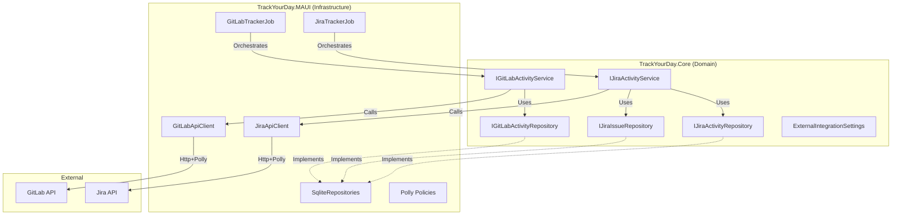

# Architecture: External Activity Storage & Resilience

## Overview
This architecture introduces a robust persistence layer for external activities (GitLab, Jira) to enable long-term analysis and historical replay. It transitions from a "fetch-and-forget" model to an "event-sourced" approach for activities and a "state-snapshot" approach for Jira issues. Additionally, it implements resilience patterns (Circuit Breaker) and configurable throttling to respect external API limits.

## Architecture Diagram



## Core Interfaces

### Repositories
Located in `TrackYourDay.Core.ApplicationTrackers.Persistence` (new namespace).

```csharp
/// <summary>
/// Persists GitLab activities as an append-only log.
/// </summary>
public interface IGitLabActivityRepository
{
    /// <summary>
    /// Appends a new activity if it doesn't already exist.
    /// </summary>
    /// <param name="activity">The activity to store.</param>
    /// <returns>True if added, false if duplicate.</returns>
    Task<bool> TryAppendAsync(GitLabActivity activity, CancellationToken cancellationToken);

    /// <summary>
    /// Retrieves activities within a date range.
    /// </summary>
    Task<IReadOnlyCollection<GitLabActivity>> GetActivitiesAsync(DateOnly fromDate, DateOnly toDate, CancellationToken cancellationToken);
}

/// <summary>
/// Persists Jira activities as an append-only log.
/// </summary>
public interface IJiraActivityRepository
{
    Task<bool> TryAppendAsync(JiraActivity activity, CancellationToken cancellationToken);
    Task<IReadOnlyCollection<JiraActivity>> GetActivitiesAsync(DateOnly fromDate, DateOnly toDate, CancellationToken cancellationToken);
}

/// <summary>
/// Manages the current state of assigned Jira issues.
/// </summary>
public interface IJiraIssueRepository
{
    /// <summary>
    /// Replaces the current set of assigned issues with the fresh fetch.
    /// Implementation should handle differential updates or atomic replacement.
    /// </summary>
    Task UpdateCurrentStateAsync(IEnumerable<JiraIssue> currentIssues, CancellationToken cancellationToken);

    /// <summary>
    /// Gets all currently assigned issues.
    /// </summary>
    Task<IReadOnlyCollection<JiraIssue>> GetCurrentIssuesAsync(CancellationToken cancellationToken);
}
```

### Settings
Located in `TrackYourDay.Core.Settings`.

```csharp
public class ExternalIntegrationSettings
{
    public IntegrationSettings GitLab { get; set; } = new();
    public IntegrationSettings Jira { get; set; } = new();
}

public class IntegrationSettings
{
    public bool Enabled { get; set; }
    /// <summary>
    /// Interval between fetches in minutes.
    /// </summary>
    public int FetchIntervalMinutes { get; set; } = 15;
    
    /// <summary>
    /// Consecutive failure count before breaking circuit.
    /// </summary>
    public int CircuitBreakerThreshold { get; set; } = 5;
    
    /// <summary>
    /// Duration to wait before testing the circuit again.
    /// </summary>
    public TimeSpan CircuitBreakerDuration { get; set; } = TimeSpan.FromMinutes(5);
}
```

## Data Flow & Components

### 1. Resilience (Polly)
- **Location:** `TrackYourDay.MAUI.ServiceRegistration`
- **Implementation:** 
  - Register named `HttpClient` instances for GitLab and Jira.
  - Apply `HttpPolicyExtensions.HandleTransientHttpError()` combined with a Circuit Breaker policy.
  - Inject `IHttpClientFactory` into `*RestApiClient` classes (refactor required).

### 2. Persistence (SQLite)
- **Location:** `TrackYourDay.MAUI.Infrastructure.Persistence` (Recommend creating this folder).
- **Strategy:** 
  - **Activities:** Use dedicated tables (`GitLabActivities`, `JiraActivities`) with `(Guid, OccuranceDate, DataJson)` schema. Use `INSERT OR IGNORE` based on Guid to handle duplicates efficiently.
  - **Current State:** Use `JiraIssues` table. For `UpdateCurrentStateAsync`, use a transaction to:
    1. Mark all as "potentially removed".
    2. Upsert fetched issues (clear "potentially removed" flag).
    3. Delete remaining "potentially removed" issues.
  - **Avoid:** Do NOT use `GenericDataRepository` for these specialized needs as it lacks the necessary atomic guarantees and specific querying capabilities.

### 3. Background Jobs
- **Location:** `TrackYourDay.MAUI.BackgroundJobs`
- **Change:**
  - Create `GitLabFetchJob` and `JiraFetchJob` (using Quartz).
  - Configure triggers based on `ExternalIntegrationSettings.FetchIntervalMinutes`.
  - Logic:
    1. Check `Settings.Enabled`.
    2. Call `Service.FetchActivities()`.
    3. Call `Repository.TryAppendAsync()`.
    4. Publish `ActivityDiscoveredEvent` (only for *new* items).

## Technical Risks & Debt

- **SQLite Dependency in Core:** `TrackYourDay.Core` currently references `Microsoft.Data.Sqlite`. This is a violation of Clean Architecture. 
  - *Mitigation:* For this feature, we will STRICTLY implement repositories in `TrackYourDay.MAUI` and only expose interfaces in `Core`. We will flag the existing `SqliteGenericSettingsRepository` as technical debt to be moved later.
- **GenericDataRepository Misuse:** The existing `GenericDataRepository` stores data as JSON blobs in a single table. This scales poorly. New features must use structured tables where querying is required (e.g., `JiraIssues`).
- **HttpClient Factory:** Current `*RestApiClient` implementations might be instantiating `HttpClient` directly or using a singleton. This must change to `IHttpClientFactory` to support Polly injection.

## Breaking Changes

- **RestApiClient Signatures:** Constructors for `GitLabRestApiClient` and `JiraRestApiClient` will need to accept `HttpClient` (or `IHttpClientFactory`) instead of managing their own, to support Polly injection.
- **Settings Migration:** New settings keys will be introduced. `GenericSettingsService` should handle defaults gracefully.

## Performance Considerations

- **JSON Serialization:** Storing activities as JSON is acceptable for "Append-Only Logs" that are primarily read sequentially.
- **Indexing:** Ensure `Guid` and `OccuranceDate` columns are indexed in SQLite.
- **Batching:** `UpdateCurrentStateAsync` for Jira should use a transaction to prevent UI flicker or inconsistent reads during updates.
