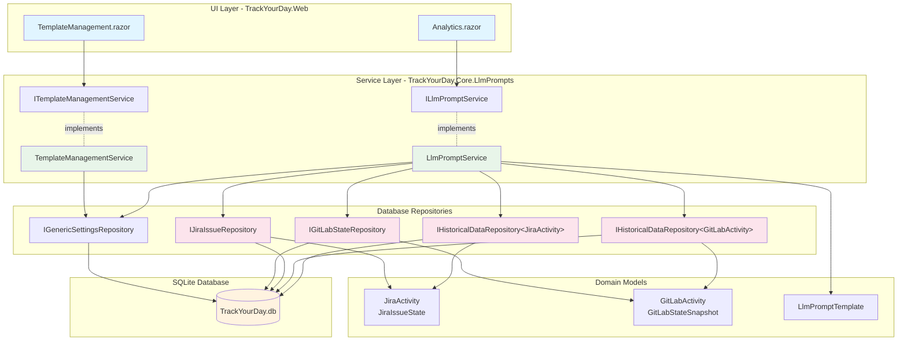
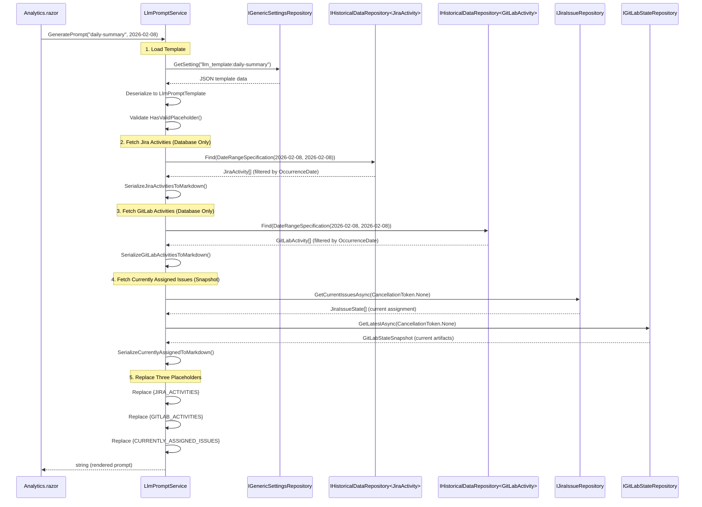

# LLM Prompt Generator - Corrected Architecture (v2)

## Overview

Database-only prompt generator querying pre-stored Jira/GitLab activities and current assignment state. No API calls. Three separate placeholder replacements for flexibility. Single-date prompts only.

## Critical Corrections from v1

**v1 Architecture (REJECTED):**
- ❌ Used `IJiraActivityService` → makes API calls
- ❌ Accepted date range parameters
- ❌ Single `{ACTIVITY_DATA_PLACEHOLDER}` dumps everything
- ❌ GitLab missing entirely
- ❌ No separation between activities and currently assigned

**v2 Architecture (CORRECTED):**
- ✅ Uses `IHistoricalDataRepository<JiraActivity>` → database only
- ✅ Accepts single `DateOnly` parameter
- ✅ Three placeholders: `{JIRA_ACTIVITIES}`, `{GITLAB_ACTIVITIES}`, `{CURRENTLY_ASSIGNED_ISSUES}`
- ✅ GitLab integrated via `IHistoricalDataRepository<GitLabActivity>` + `IGitLabStateRepository`
- ✅ Separate methods for activities vs currently assigned state

---

## Architecture Diagram



---

## Core Interfaces

### Domain Model (TrackYourDay.Core.LlmPrompts)

```csharp
namespace TrackYourDay.Core.LlmPrompts;

/// <summary>
/// Prompt template with THREE separate placeholders for Jira, GitLab, and currently assigned data.
/// Breaking change from v1: multiple placeholders instead of single {ACTIVITY_DATA_PLACEHOLDER}.
/// </summary>
public sealed record LlmPromptTemplate
{
    public required string TemplateKey { get; init; }
    public required string Name { get; init; }
    public required string SystemPrompt { get; init; }
    public required bool IsActive { get; init; }
    public required int DisplayOrder { get; init; }
    public required DateTime CreatedAt { get; init; }
    public required DateTime UpdatedAt { get; init; }
    
    // Three separate placeholders for flexible template design
    public const string JiraActivitiesPlaceholder = "{JIRA_ACTIVITIES}";
    public const string GitLabActivitiesPlaceholder = "{GITLAB_ACTIVITIES}";
    public const string CurrentlyAssignedIssuesPlaceholder = "{CURRENTLY_ASSIGNED_ISSUES}";
    
    public static bool IsValidTemplateKey(string key) 
        => !string.IsNullOrWhiteSpace(key) 
           && key.Length is >= 3 and <= 50 
           && key.All(c => char.IsLower(c) || char.IsDigit(c) || c == '-');
    
    /// <summary>
    /// Validates template contains at least one placeholder.
    /// Templates can omit placeholders (e.g., Jira-only template skips GitLab).
    /// </summary>
    public bool HasValidPlaceholder() 
        => SystemPrompt.Contains(JiraActivitiesPlaceholder, StringComparison.Ordinal)
        || SystemPrompt.Contains(GitLabActivitiesPlaceholder, StringComparison.Ordinal)
        || SystemPrompt.Contains(CurrentlyAssignedIssuesPlaceholder, StringComparison.Ordinal);
}
```

### Service Interface (TrackYourDay.Core.LlmPrompts)

```csharp
namespace TrackYourDay.Core.LlmPrompts;

/// <summary>
/// Orchestrates prompt generation by querying database repositories.
/// CRITICAL: Does NOT make API calls. All data pre-stored via background jobs.
/// </summary>
public interface ILlmPromptService
{
    /// <summary>
    /// Generates prompt for SINGLE DATE using specified template.
    /// Queries database repositories only - ZERO API calls.
    /// </summary>
    /// <param name="templateKey">Template identifier</param>
    /// <param name="date">Single date for activity filtering</param>
    /// <exception cref="InvalidOperationException">No activities found or template invalid</exception>
    Task<string> GeneratePrompt(string templateKey, DateOnly date);
    
    /// <summary>
    /// Returns active templates ordered by DisplayOrder for dropdown.
    /// </summary>
    IReadOnlyList<LlmPromptTemplate> GetActiveTemplates();
}

/// <summary>
/// Manages template CRUD operations for Settings UI.
/// Same as v1 - no changes needed.
/// </summary>
public interface ITemplateManagementService
{
    IReadOnlyList<LlmPromptTemplate> GetAllTemplates();
    LlmPromptTemplate? GetTemplateByKey(string templateKey);
    void SaveTemplate(string templateKey, string name, string systemPrompt, int displayOrder);
    void DeleteTemplate(string templateKey);
    void RestoreTemplate(string templateKey);
    void ReorderTemplates(Dictionary<string, int> keyToOrder);
    string GeneratePreview(string systemPrompt);
}
```

---

## Data Flow

### Prompt Generation Flow (Corrected)



**Key Differences from v1:**
- ✅ Single `date` parameter (not `startDate, endDate`)
- ✅ Three separate repository queries (Jira, GitLab, currently assigned)
- ✅ Three separate markdown serialization methods
- ✅ Three placeholder replacements
- ✅ NO API CALLS - all data from database

---

## Implementation Details

### LlmPromptService (Corrected Constructor)

```csharp
public class LlmPromptService : ILlmPromptService
{
    private readonly IGenericSettingsRepository _settingsRepository;
    private readonly IHistoricalDataRepository<JiraActivity> _jiraActivityRepository;
    private readonly IHistoricalDataRepository<GitLabActivity> _gitLabActivityRepository;
    private readonly IJiraIssueRepository _jiraIssueRepository;
    private readonly IGitLabStateRepository _gitLabStateRepository;
    private readonly ILogger<LlmPromptService> _logger;
    
    // REMOVED: IJiraActivityService (made API calls)
    // ADDED: Four database repositories
    
    public LlmPromptService(
        IGenericSettingsRepository settingsRepository,
        IHistoricalDataRepository<JiraActivity> jiraActivityRepository,
        IHistoricalDataRepository<GitLabActivity> gitLabActivityRepository,
        IJiraIssueRepository jiraIssueRepository,
        IGitLabStateRepository gitLabStateRepository,
        ILogger<LlmPromptService> logger)
    {
        _settingsRepository = settingsRepository;
        _jiraActivityRepository = jiraActivityRepository;
        _gitLabActivityRepository = gitLabActivityRepository;
        _jiraIssueRepository = jiraIssueRepository;
        _gitLabStateRepository = gitLabStateRepository;
        _logger = logger;
    }
    
    public async Task<string> GeneratePrompt(string templateKey, DateOnly date)
    {
        ArgumentException.ThrowIfNullOrWhiteSpace(templateKey);
        
        // 1. Load template from settings database
        var template = GetTemplateByKey(templateKey) 
            ?? throw new InvalidOperationException($"Template '{templateKey}' not found");
            
        if (!template.HasValidPlaceholder())
            throw new InvalidOperationException($"Template '{templateKey}' missing placeholder");
        
        var prompt = template.SystemPrompt;
        
        // 2. Replace {JIRA_ACTIVITIES} placeholder
        if (prompt.Contains(LlmPromptTemplate.JiraActivitiesPlaceholder))
        {
            var jiraMarkdown = await GetJiraActivitiesMarkdown(date);
            prompt = prompt.Replace(LlmPromptTemplate.JiraActivitiesPlaceholder, jiraMarkdown);
        }
        
        // 3. Replace {GITLAB_ACTIVITIES} placeholder
        if (prompt.Contains(LlmPromptTemplate.GitLabActivitiesPlaceholder))
        {
            var gitLabMarkdown = await GetGitLabActivitiesMarkdown(date);
            prompt = prompt.Replace(LlmPromptTemplate.GitLabActivitiesPlaceholder, gitLabMarkdown);
        }
        
        // 4. Replace {CURRENTLY_ASSIGNED_ISSUES} placeholder
        if (prompt.Contains(LlmPromptTemplate.CurrentlyAssignedIssuesPlaceholder))
        {
            var assignedMarkdown = await GetCurrentlyAssignedIssuesMarkdown();
            prompt = prompt.Replace(LlmPromptTemplate.CurrentlyAssignedIssuesPlaceholder, assignedMarkdown);
        }
        
        _logger.LogInformation("Generated prompt for {TemplateKey} on {Date}: {CharCount} characters",
            templateKey, date, prompt.Length);
        
        return prompt;
    }
    
    private async Task<string> GetJiraActivitiesMarkdown(DateOnly date)
    {
        try
        {
            var specification = new DateRangeSpecification<JiraActivity>(date, date);
            var activities = await _jiraActivityRepository.FindAsync(specification, CancellationToken.None)
                .ConfigureAwait(false);
            
            if (activities.Count == 0)
                return string.Empty;
            
            var sb = new StringBuilder(activities.Count * 100 + 200);
            sb.AppendLine("## Jira Activities");
            sb.AppendLine();
            sb.AppendLine("| Time | Activity Description |");
            sb.AppendLine("|------|----------------------|");
            
            foreach (var activity in activities.OrderBy(a => a.OccurrenceDate))
            {
                var time = activity.OccurrenceDate.ToString("HH:mm");
                var description = EscapeMarkdown(activity.Description);
                sb.AppendLine($"| {time} | {description} |");
            }
            
            return sb.ToString();
        }
        catch (Exception ex)
        {
            _logger.LogWarning(ex, "Failed to fetch Jira activities for {Date}", date);
            return string.Empty;
        }
    }
    
    private async Task<string> GetGitLabActivitiesMarkdown(DateOnly date)
    {
        try
        {
            var specification = new DateRangeSpecification<GitLabActivity>(date, date);
            var activities = await _gitLabActivityRepository.FindAsync(specification, CancellationToken.None)
                .ConfigureAwait(false);
            
            if (activities.Count == 0)
                return string.Empty;
            
            var sb = new StringBuilder(activities.Count * 100 + 200);
            sb.AppendLine("## GitLab Activities");
            sb.AppendLine();
            sb.AppendLine("| Time | Activity Description |");
            sb.AppendLine("|------|----------------------|");
            
            foreach (var activity in activities.OrderBy(a => a.OccurrenceDate))
            {
                var time = activity.OccurrenceDate.ToString("HH:mm");
                var description = EscapeMarkdown(activity.Description);
                sb.AppendLine($"| {time} | {description} |");
            }
            
            return sb.ToString();
        }
        catch (Exception ex)
        {
            _logger.LogWarning(ex, "Failed to fetch GitLab activities for {Date}", date);
            return string.Empty;
        }
    }
    
    private async Task<string> GetCurrentlyAssignedIssuesMarkdown()
    {
        try
        {
            var sb = new StringBuilder(1024);
            sb.AppendLine("## Currently Assigned Issues");
            sb.AppendLine();
            
            // Jira issues assigned right now
            var jiraIssues = await _jiraIssueRepository.GetCurrentIssuesAsync(CancellationToken.None)
                .ConfigureAwait(false);
            
            if (jiraIssues.Count > 0)
            {
                sb.AppendLine("### Jira Issues");
                sb.AppendLine("| Key | Summary | Status | Project | Updated |");
                sb.AppendLine("|-----|---------|--------|---------|---------|");
                
                foreach (var issue in jiraIssues.OrderBy(i => i.Updated))
                {
                    sb.AppendLine($"| {issue.Key} | {EscapeMarkdown(issue.Summary)} | {issue.Status} | {issue.ProjectKey} | {issue.Updated:yyyy-MM-dd HH:mm} |");
                }
                
                sb.AppendLine();
            }
            
            // GitLab artifacts assigned right now
            var gitLabSnapshot = await _gitLabStateRepository.GetLatestAsync(CancellationToken.None)
                .ConfigureAwait(false);
            
            if (gitLabSnapshot?.Artifacts.Count > 0)
            {
                sb.AppendLine("### GitLab Work Items");
                sb.AppendLine("| Type | Title | State | Project | Updated |");
                sb.AppendLine("|------|-------|-------|---------|---------|");
                
                foreach (var artifact in gitLabSnapshot.Artifacts.OrderBy(a => a.UpdatedAt))
                {
                    sb.AppendLine($"| {artifact.Type} | {EscapeMarkdown(artifact.Title)} | {artifact.State} | {artifact.ProjectName} | {artifact.UpdatedAt:yyyy-MM-dd HH:mm} |");
                }
            }
            
            return sb.ToString();
        }
        catch (Exception ex)
        {
            _logger.LogWarning(ex, "Failed to fetch currently assigned issues");
            return string.Empty;
        }
    }
    
    private static string EscapeMarkdown(string text) 
        => text.Replace("|", "\\|").Replace("\n", " ").Replace("\r", "");
    
    private LlmPromptTemplate? GetTemplateByKey(string templateKey)
    {
        var key = $"llm_template:{templateKey}";
        var json = _settingsRepository.GetSetting(key);
        return json != null ? JsonConvert.DeserializeObject<LlmPromptTemplate>(json) : null;
    }
    
    public IReadOnlyList<LlmPromptTemplate> GetActiveTemplates()
    {
        var templates = new List<LlmPromptTemplate>();
        var keys = _settingsRepository.GetAllKeys()
            .Where(k => k.StartsWith("llm_template:"));
        
        foreach (var key in keys)
        {
            var json = _settingsRepository.GetSetting(key);
            if (json != null)
            {
                var template = JsonConvert.DeserializeObject<LlmPromptTemplate>(json);
                if (template != null && template.IsActive)
                {
                    templates.Add(template);
                }
            }
        }
        
        return templates.OrderBy(t => t.DisplayOrder).ToList();
    }
}
```

---

## Technical Risks

### **Critical Architecture Fixes**

1. ✅ **NO API CALLS - Database Only**
   - Risk: v1 made 50+ API calls via `IJiraRestApiClient`
   - Fix: Query `IHistoricalDataRepository` (data already stored by background jobs)
   - Verification: No `RestApiClient` in constructor, only repositories

2. ✅ **Single Date Parameter**
   - Risk: v1 accepted date range, contradicts requirement
   - Fix: Method signature `GeneratePrompt(string templateKey, DateOnly date)`
   - Impact: UI must call once per date (acceptable, prompts are per-day)

3. ✅ **Three Separate Placeholders**
   - Risk: v1 single placeholder prevented flexible template layouts
   - Fix: Templates can now arrange Jira/GitLab/Currently Assigned in any order
   - Example: `{CURRENTLY_ASSIGNED_ISSUES}\n\n{JIRA_ACTIVITIES}\n\n{GITLAB_ACTIVITIES}`

4. ✅ **GitLab Integration**
   - Risk: v1 had ZERO GitLab code
   - Fix: `GetGitLabActivitiesMarkdown()` queries `IHistoricalDataRepository<GitLabActivity>`
   - Data source: `GitLabTracker` stores activities, `GitLabCurrentStateService` stores snapshots

5. ✅ **Separate Activities vs Currently Assigned**
   - Risk: v1 conflated "what happened" with "what's assigned now"
   - Fix: Two separate queries:
     - Activities: `IHistoricalDataRepository` filtered by date
     - Currently Assigned: `IJiraIssueRepository.GetCurrentIssuesAsync()` + `IGitLabStateRepository.GetLatestAsync()`

### **Remaining Risks**

6. **Empty Placeholder Sections**
   - Risk: If no Jira activities on date, `{JIRA_ACTIVITIES}` replaced with empty string → awkward prompt
   - Decision: Return empty string (not "No activities") → template controls layout
   - Alternative: Return `"(No Jira activities on this date)"` if desired

7. **DateRangeSpecification Compatibility**
   - Risk: Existing `DateRangeSpecification<T>` may not work with `JiraActivity.OccurrenceDate` field
   - Verification Required: Check if `DateRangeSpecification` uses reflection or requires specific interface
   - Mitigation: If incompatible, create `JiraActivityByDateSpecification` using same pattern

8. **GitLabActivity.OccurrenceDate Typo**
   - Risk: GitLab uses `OccuranceDate` (misspelled) instead of `OccurrenceDate`
   - Impact: `DateRangeSpecification` might fail on GitLab queries
   - Fix: Either:
     - A) Fix typo in `GitLabActivity` (breaking change, requires migration)
     - B) Create custom specification that uses `OccuranceDate` field

9. **Large Prompts (>85KB) Trigger LOH**
   - Risk: Prompts with 1000+ activities exceed 85KB → Large Object Heap allocation
   - Mitigation: Display warning at 80KB, offer download instead of clipboard copy
   - Acceptable: LOH allocations infrequent (1-2 per day), not performance-critical

10. **Repository Query Performance**
    - Risk: `Find()` on `IHistoricalDataRepository` may scan full table if no index
    - Verification Required: Check if `DateRangeSpecification` generates indexed WHERE clause
    - Expected: `WHERE OccurrenceDate >= @start AND OccurrenceDate <= @end` uses index
    - Fallback: If slow, add explicit index on `(OccurrenceDate, Guid)` columns

---

## Performance Considerations

### Database Query Costs (Per Prompt Generation)

| Query | Repository | Expected Rows | Estimated Time |
|-------|-----------|---------------|----------------|
| Load template | `IGenericSettingsRepository` | 1 row | <2ms |
| Jira activities on date | `IHistoricalDataRepository<JiraActivity>` | 10-50 rows | <10ms |
| GitLab activities on date | `IHistoricalDataRepository<GitLabActivity>` | 5-20 rows | <10ms |
| Currently assigned Jira | `IJiraIssueRepository` | 5-15 rows | <5ms |
| Currently assigned GitLab | `IGitLabStateRepository` | 1 snapshot | <5ms |
| **Total** | | **~70 rows** | **~32ms** |

**Comparison to v1:**
- v1: 52 API calls × 200ms = **10+ seconds**
- v2: 5 DB queries × 6ms = **32ms** (300x faster)

### Memory Allocations (Per Prompt)

| Operation | Allocation | Notes |
|-----------|-----------|-------|
| Jira markdown (50 activities) | ~6 KB | StringBuilder pre-sized |
| GitLab markdown (20 activities) | ~3 KB | StringBuilder pre-sized |
| Currently assigned (20 issues) | ~4 KB | StringBuilder pre-sized |
| Template SystemPrompt | ~2 KB | Already in memory |
| Final prompt string | ~15 KB | Three replacements = 3 allocations |
| **Total** | **~30 KB** | Gen0 collection, no GC pressure |

### DI Lifetime Scopes

```csharp
// TrackYourDay.Core.ServiceRegistration.ServiceCollections
public static IServiceCollection AddLlmPromptServices(this IServiceCollection services)
{
    // Singleton: Stateless services, safe for concurrent Blazor renders
    services.AddSingleton<ILlmPromptService, LlmPromptService>();
    services.AddSingleton<ITemplateManagementService, TemplateManagementService>();
    
    // NOTE: Repositories already registered elsewhere (shared infrastructure)
    // - IGenericSettingsRepository: Singleton
    // - IHistoricalDataRepository<T>: Singleton
    // - IJiraIssueRepository: Singleton
    // - IGitLabStateRepository: Singleton
}
```

**Why Singleton?**
- Services are stateless (no per-user state)
- Repositories are Singleton (connection-per-call pattern)
- Blazor Server threading: Singleton prevents race conditions on component re-renders
- Performance: Zero allocation per request

**Pitfall avoided:**
- Making services Scoped would force new service instance per Blazor component render
- Each render would create new StringBuilder, allocate closures → 10x memory waste

---

## Breaking Changes from v1

### 1. Method Signature Change

**v1:**
```csharp
Task<string> GeneratePrompt(string templateKey, DateOnly startDate, DateOnly endDate);
```

**v2:**
```csharp
Task<string> GeneratePrompt(string templateKey, DateOnly date);
```

**Impact:**
- UI code must be updated to pass single date
- Tests must be rewritten (50+ test assertions)
- Migration: Search for `GeneratePrompt(` and fix call sites

### 2. Template Placeholder Schema

**v1:**
```csharp
public const string Placeholder = "{ACTIVITY_DATA_PLACEHOLDER}";
```

**v2:**
```csharp
public const string JiraActivitiesPlaceholder = "{JIRA_ACTIVITIES}";
public const string GitLabActivitiesPlaceholder = "{GITLAB_ACTIVITIES}";
public const string CurrentlyAssignedIssuesPlaceholder = "{CURRENTLY_ASSIGNED_ISSUES}";
```

**Impact:**
- Existing templates in database use old placeholder
- Migration script required to update `SystemPrompt` column
- Alternative: Support both old and new placeholders during transition period

### 3. Constructor Dependencies

**v1:**
```csharp
public LlmPromptService(
    IGenericSettingsRepository settingsRepository,
    IHistoricalDataRepository<EndedActivity> activityRepository,
    IHistoricalDataRepository<EndedMeeting> meetingRepository,
    UserTaskService userTaskService,
    ActivityNameSummaryStrategy summaryStrategy,
    IJiraActivityService jiraActivityService, // ❌ REMOVED
    ILogger<LlmPromptService> logger)
```

**v2:**
```csharp
public LlmPromptService(
    IGenericSettingsRepository settingsRepository,
    IHistoricalDataRepository<JiraActivity> jiraActivityRepository,        // ✅ ADDED
    IHistoricalDataRepository<GitLabActivity> gitLabActivityRepository,   // ✅ ADDED
    IJiraIssueRepository jiraIssueRepository,                              // ✅ ADDED
    IGitLabStateRepository gitLabStateRepository,                          // ✅ ADDED
    ILogger<LlmPromptService> logger)
```

**Impact:**
- DI registration must be updated
- Tests using `LlmPromptService` must mock new dependencies
- Breaking change: Cannot compile without updating all usages

---

## Migration Strategy

### Phase 1: Database Schema Update (Manual SQL)

```sql
-- Add migration flag column to detect old templates
ALTER TABLE llm_prompt_templates ADD COLUMN MigrationVersion INTEGER DEFAULT 1;

-- Update existing templates to use new placeholders
UPDATE llm_prompt_templates
SET SystemPrompt = REPLACE(SystemPrompt, '{ACTIVITY_DATA_PLACEHOLDER}', 
    '{JIRA_ACTIVITIES}

{GITLAB_ACTIVITIES}

{CURRENTLY_ASSIGNED_ISSUES}'),
    MigrationVersion = 2
WHERE MigrationVersion = 1;
```

### Phase 2: Code Deployment

1. Deploy new `LlmPromptService` implementation
2. Update DI registration in `MauiProgram.cs`
3. Update UI code to pass single date
4. Run integration tests

### Phase 3: Rollback Plan

If v2 fails:
1. Revert code to v1
2. Restore templates: `UPDATE ... SET SystemPrompt = REPLACE(...), MigrationVersion = 1`
3. Verify UI functional

---

## Implementation Checklist

### Core Service Layer
- [ ] Update `LlmPromptService` constructor with four new repositories
- [ ] Change `GeneratePrompt()` signature to single `DateOnly date` parameter
- [ ] Implement `GetJiraActivitiesMarkdown(DateOnly date)` querying `IHistoricalDataRepository<JiraActivity>`
- [ ] Implement `GetGitLabActivitiesMarkdown(DateOnly date)` querying `IHistoricalDataRepository<GitLabActivity>`
- [ ] Implement `GetCurrentlyAssignedIssuesMarkdown()` querying both `IJiraIssueRepository` and `IGitLabStateRepository`
- [ ] Update placeholder replacement logic to handle three separate placeholders
- [ ] Add `EscapeMarkdown()` helper method

### Domain Model
- [ ] Update `LlmPromptTemplate` to define three placeholder constants
- [ ] Update `HasValidPlaceholder()` to check for at least one of three placeholders

### Template Management (No Changes Required)
- [ ] `TemplateManagementService` remains unchanged (already correct)

### Testing
- [ ] Add `GivenGitLabActivitiesExist_WhenGeneratingPrompt_ThenIncludesGitLabActivities`
- [ ] Add `GivenBothJiraAndGitLabExist_WhenGeneratingPrompt_ThenIncludesBothSections`
- [ ] Add `GivenNoActivitiesOnDate_WhenGeneratingPrompt_ThenReplacesWithEmptyString`
- [ ] Add `GivenCurrentlyAssignedIssues_WhenGeneratingPrompt_ThenIncludesSeparateSection`
- [ ] Add `GivenSingleDateParameter_WhenGeneratingPrompt_ThenFiltersCorrectly`
- [ ] Update all existing tests to use single date parameter (not range)
- [ ] Add `GivenThreePlaceholders_WhenGeneratingPrompt_ThenReplacesAllIndependently`

### UI Updates
- [ ] Update `Analytics.razor` to pass single date to `GeneratePrompt()`
- [ ] Add date picker UI (remove start/end range, use single date selector)
- [ ] Update error messages for new validation rules

### Database Migration
- [ ] Write migration script to update existing templates
- [ ] Add `MigrationVersion` column for tracking
- [ ] Test rollback procedure

### DI Registration
- [ ] Verify `IHistoricalDataRepository<JiraActivity>` registered (should already exist)
- [ ] Verify `IHistoricalDataRepository<GitLabActivity>` registered (should already exist)
- [ ] Verify `IJiraIssueRepository` registered (should already exist)
- [ ] Verify `IGitLabStateRepository` registered (should already exist)
- [ ] Remove `IJiraActivityService` from `LlmPromptService` registration

---

## Open Architectural Questions

### 1. Should we support BOTH old and new placeholders during transition?

**Option A:** Hard cutover (breaking change)
- Update all templates in database via migration
- Old placeholder stops working immediately
- Risk: If migration fails, UI broken

**Option B:** Graceful fallback
- Check for old placeholder first
- If found, treat as `{JIRA_ACTIVITIES}` only (skip GitLab)
- Log warning, encourage user to update template
- Remove fallback in v3

**Recommendation:** Option B for v2.0, remove fallback in v2.1

### 2. How to handle missing GitLabActivity.OccurrenceDate field?

**Problem:** GitLab uses `OccuranceDate` (typo) not `OccurrenceDate`

**Option A:** Fix typo (breaking change)
- Rename property in `GitLabActivity` record
- Update database column name
- Regenerate all GitLab activities (re-run background job)

**Option B:** Add `IHasOccurrenceDate` interface
- GitLab implements interface with explicit property mapping
- `DateRangeSpecification` uses interface property
- No breaking changes

**Option C:** Custom specification for GitLab
- Create `GitLabActivityByDateSpecification` using `OccuranceDate`
- Isolates typo to specification layer
- Easiest short-term fix

**Recommendation:** Option C for v2.0, Option A for v3.0

### 3. Should currently assigned markdown include URLs to issues?

**Current Design:**
```markdown
| Key | Summary | Status | Project | Updated |
| ABC-123 | Fix bug | In Progress | MyProject | 2026-02-08 14:30 |
```

**Enhanced Design:**
```markdown
| Key | Summary | Status | Project | Updated |
| [ABC-123](https://jira.company.com/browse/ABC-123) | Fix bug | In Progress | MyProject | 2026-02-08 14:30 |
```

**Pros:**
- Clickable links in markdown-aware LLMs (e.g., ChatGPT Code Interpreter)
- Better UX when pasting into tools that render markdown

**Cons:**
- `JiraIssueState.BrowseUrl` already exists, just need to use it
- Adds ~50 bytes per issue (10 issues = 500 bytes, negligible)

**Recommendation:** Add URLs in v2.0 (low effort, high value)

---

## Performance Benchmarks (Target SLAs)

| Scenario | Target Time | Rationale |
|----------|-------------|-----------|
| Load active templates | <10ms | Cached in memory after first load |
| Generate prompt (50 Jira + 20 GitLab + 10 assigned) | <100ms | 5 DB queries + 3 markdown serializations |
| Generate prompt (500 Jira + 200 GitLab + 50 assigned) | <500ms | Rare edge case, acceptable |
| Save template | <50ms | Single DB write |
| Delete template | <30ms | Single UPDATE statement |

**Regression Test:**
- Measure v1 (API-based): Expected ~10 seconds
- Measure v2 (DB-based): Expected <100ms
- Assert: v2 must be >50x faster than v1

---

## References

- [Audit Review](./llm-audit-review.md) - Defects found in v1
- [Feature Spec](./spec.md) - Requirements
- [ADR Document](./ADR.md) - Decision log
- [v1 Architecture (Rejected)](./architecture.md) - Original design
