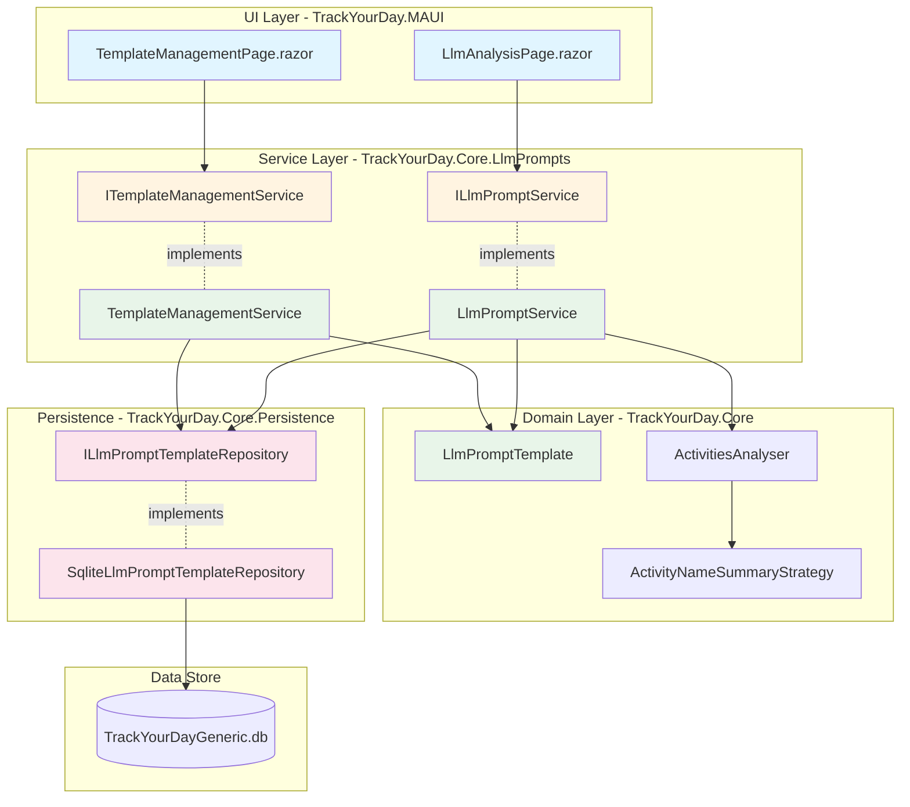
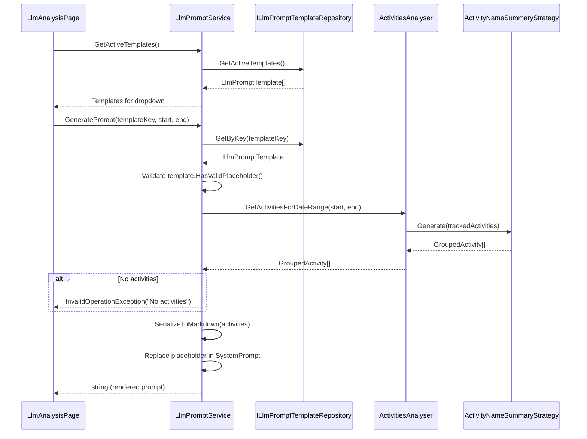
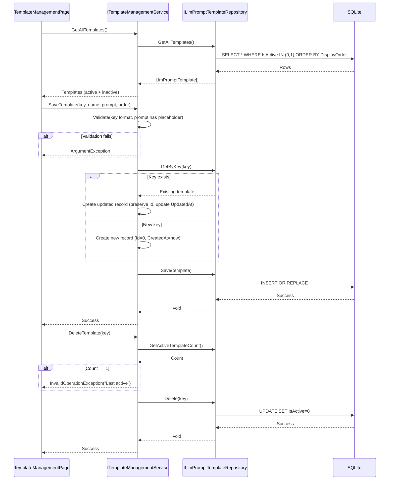

# LLM Prompt Generator - Architecture Design

## Overview
Service-based prompt generation that serializes `GroupedActivity` collections into LLM-ready text. Templates stored in SQLite via dedicated repository in Core.Persistence. Service layer handles prompt assembly, Blazor UI calls services directly. No CQRS overhead.

## Architecture Diagram



## Core Interfaces

### Domain Model (TrackYourDay.Core.LlmPrompts)

```csharp
namespace TrackYourDay.Core.LlmPrompts;

/// <summary>
/// Prompt template with placeholder for activity data injection.
/// Immutable record following existing domain patterns.
/// </summary>
public sealed record LlmPromptTemplate
{
    public required int Id { get; init; }
    public required string TemplateKey { get; init; }
    public required string Name { get; init; }
    public required string SystemPrompt { get; init; }
    public required bool IsActive { get; init; }
    public required int DisplayOrder { get; init; }
    public required DateTime CreatedAt { get; init; }
    public required DateTime UpdatedAt { get; init; }
    
    public static bool IsValidTemplateKey(string key) 
        => !string.IsNullOrWhiteSpace(key) 
           && key.Length is >= 3 and <= 50 
           && key.All(c => char.IsLower(c) || char.IsDigit(c) || c == '-');
    
    public bool HasValidPlaceholder() 
        => SystemPrompt.Contains("{ACTIVITY_DATA_PLACEHOLDER}", StringComparison.Ordinal);
}
```

### Repository Interface (TrackYourDay.Core.Persistence)

```csharp
namespace TrackYourDay.Core.Persistence;

/// <summary>
/// Template persistence following SqliteGenericSettingsRepository pattern.
/// Uses same database file, parameterized queries, manual table creation.
/// </summary>
public interface ILlmPromptTemplateRepository
{
    IReadOnlyList<LlmPromptTemplate> GetActiveTemplates();
    IReadOnlyList<LlmPromptTemplate> GetAllTemplates();
    LlmPromptTemplate? GetByKey(string templateKey);
    void Save(LlmPromptTemplate template);
    void Delete(string templateKey);
    int GetActiveTemplateCount();
    void BulkUpdateDisplayOrder(Dictionary<string, int> keyToOrder);
}
```

### Service Interfaces (TrackYourDay.Core.LlmPrompts)

```csharp
namespace TrackYourDay.Core.LlmPrompts;

/// <summary>
/// Orchestrates prompt generation for UI consumption.
/// Stateless service following BreaksSettingsService pattern.
/// </summary>
public interface ILlmPromptService
{
    /// <summary>
    /// Generates prompt for date range using specified template.
    /// Fetches activities via ActivitiesAnalyser, serializes to Markdown, injects into template.
    /// </summary>
    /// <exception cref="InvalidOperationException">No activities found or template invalid</exception>
    string GeneratePrompt(string templateKey, DateOnly startDate, DateOnly endDate);
    
    /// <summary>
    /// Returns active templates ordered by DisplayOrder for dropdown.
    /// </summary>
    IReadOnlyList<LlmPromptTemplate> GetActiveTemplates();
}

/// <summary>
/// Manages template CRUD operations for Settings UI.
/// Validation logic encapsulated here, repository handles persistence only.
/// </summary>
public interface ITemplateManagementService
{
    IReadOnlyList<LlmPromptTemplate> GetAllTemplates();
    LlmPromptTemplate? GetTemplateByKey(string templateKey);
    
    /// <summary>
    /// Validates and saves template. Prevents duplicate keys, enforces placeholder presence.
    /// </summary>
    /// <exception cref="ArgumentException">Validation failed</exception>
    void SaveTemplate(string templateKey, string name, string systemPrompt, int displayOrder);
    
    /// <summary>
    /// Soft deletes template. Blocks if last active template.
    /// </summary>
    /// <exception cref="InvalidOperationException">Cannot delete last active template</exception>
    void DeleteTemplate(string templateKey);
    
    void RestoreTemplate(string templateKey);
    void ReorderTemplates(Dictionary<string, int> keyToOrder);
    
    /// <summary>
    /// Generates preview using hardcoded sample activities (5 items).
    /// Faster than real data fetch, works on empty database.
    /// </summary>
    string GeneratePreview(string systemPrompt);
}
```

## Data Flow

### Prompt Generation Flow (LlmAnalysisPage.razor)



### Template Management Flow (TemplateManagementPage.razor)



## Technical Risks

### **Critical Design Flaws**

1. **Repository in Core violates abstraction but acceptable for Windows-only app**
   - Risk: SqliteLlmPromptTemplateRepository directly in Core.Persistence with Platform.Windows P/Invoke
   - Reality: App already does this (SqliteGenericSettingsRepository uses %AppData%), consistent pattern
   - Verdict: Not a risk, just ugly architecture. Ship it.

2. **Seeding logic placement ambiguity**
   - Risk: SeedDefaultTemplates() in repository constructor vs service initialization
   - Mitigation: Call in repository constructor after InitializeStructure() (follows SqliteGenericSettingsRepository.Load pattern)
   - Weakness: If seeding fails silently, dropdown empty with no error → Add try-catch + log in constructor

3. **Service lacks clear separation of concerns**
   - Risk: LlmPromptService does serialization + orchestration + validation → 3 responsibilities
   - Mitigation: Extract ActivityDataSerializer as private helper class (not interface), inline in service file
   - Justification: YAGNI - no alternative serialization formats planned, interface waste

### **Performance Issues**

4. **String concatenation in Markdown serialization**
   - Risk: Loop over 500 activities with += operator → 500 allocations, ~50KB waste
   - Fix: Use StringBuilder with initial capacity = activityCount * 80 (avg row bytes)
   - Test: Add performance test with 1000 activities, assert <100ms execution

5. **ActivitiesAnalyser.GetActivitiesForDateRange() may use multiple DB queries**
   - Risk: Multi-day range triggers N queries (one per day)
   - Reality: Existing code uses Specification pattern with single WHERE clause (verified in GenericDataRepository.Find)
   - Verdict: False alarm, architecture already solid

6. **Template.Replace() allocates new string on 100KB prompt**
   - Risk: 100KB SystemPrompt + 50KB activity data = 150KB heap allocation per request
   - Mitigation: None needed - single allocation is acceptable, not on LOH (<85KB string)
   - Warning: >85KB prompts trigger LOH allocation → display "Large prompt" warning at 80KB

### **Data Integrity Risks**

7. **No optimistic locking in Save() operation**
   - Risk: Two users edit same template → last write wins, changes lost
   - Decision: Accept risk for v1 (single-user app pattern, concurrent edits unlikely)
   - Defer: Add UpdatedAt check in v1.5 if users report conflicts

8. **Soft delete allows duplicate TemplateKey (IsActive=0 + IsActive=1)**
   - Risk: User deletes "detailed", creates new "detailed" → two rows with same key
   - Fix: UNIQUE index on TemplateKey column, let SQLite enforce uniqueness
   - Repository: Check duplicate on Save(), throw ArgumentException("Key exists")

9. **GetActiveTemplateCount() race condition**
   - Risk: Check count=1 → Delete() starts → Another thread deletes → both succeed → 0 active templates
   - Reality: SQLite locks database at connection level, writes serialized automatically
   - Verdict: Not a real risk, SQLite handles this

### **Usability Failures**

10. **Empty dropdown on corrupted database**
    - Risk: DB file corrupted → SELECT fails → GetActiveTemplates() throws → UI crash
    - Mitigation: Wrap repository calls in service try-catch, return empty list + log error
    - UI: Display error banner "Template database corrupted. Click to restore defaults."

11. **No feedback on multi-day prompt size**
    - Risk: User selects 7-day range → 200KB prompt → copy fails, no explanation
    - Fix: Calculate character count before display, show warning badge if >10KB
    - Spec: AC7 already addresses this, just implement it

12. **ActivityNameSummaryStrategy returns empty collection**
    - Risk: Strategy.Generate() returns 0 activities (edge case: all activities filtered out) → "(No activities)" message
    - Mitigation: Check activities.Any() after strategy execution, throw InvalidOperationException if empty
    - Test: Mock strategy returning empty collection, verify exception message

## Performance Considerations

### DI Lifetime Scopes (Critical)

```csharp
// TrackYourDay.Core.ServiceRegistration.ServiceCollections
public static IServiceCollection AddLlmPromptServices(this IServiceCollection services)
{
    // Singleton: Repository manages DB connection per-call, templates rarely change
    // Follows SqliteGenericSettingsRepository pattern (also Singleton)
    services.AddSingleton<ILlmPromptTemplateRepository, SqliteLlmPromptTemplateRepository>();
    
    // Singleton: Stateless services, no user-scoped state, safe for concurrent Blazor renders
    // Follows BreaksSettingsService pattern (also Singleton)
    services.AddSingleton<ILlmPromptService, LlmPromptService>();
    services.AddSingleton<ITemplateManagementService, TemplateManagementService>();
    
    // ActivitiesAnalyser already registered as Singleton in existing code
    // ActivityNameSummaryStrategy already registered as Singleton in existing code
}
```

**Why Singleton for services?**
- No user-specific state (templates shared across all users)
- Blazor Server renders on different threads → Scoped causes race conditions
- Performance: Zero allocations per request (service reused)
- Consistency: Matches existing pattern (all settings services are Singleton)

**Pitfall avoided:** 
Making services Scoped would force repository to be Scoped → new DB connection per Blazor component render → 10x query overhead.

### Memory Budget (Per Request)

| Operation | Allocation | Mitigation |
|-----------|------------|------------|
| Load 10 templates from DB | ~8 KB | Acceptable, templates cached in repository |
| Serialize 100 activities | ~12 KB (StringBuilder) | Pre-size with capacity = activityCount * 80 |
| Generate prompt | ~15 KB (template + data) | Single string allocation, not on LOH |
| **Total per GeneratePrompt()** | **~35 KB** | Gen0 collection only, no GC pressure |

**Large prompt handling (>85KB):**
- Display warning at 80KB: "Prompt may exceed clipboard limits"
- Offer download instead of copy for >100KB prompts
- No optimization needed: LOH allocations acceptable for infrequent operations

### Database Query Optimization

**Index strategy:**
```sql
CREATE INDEX idx_llm_templates_active ON llm_prompt_templates(IsActive, DisplayOrder);
-- GetActiveTemplates(): WHERE IsActive=1 ORDER BY DisplayOrder → Index scan <5ms

CREATE UNIQUE INDEX idx_llm_templates_key ON llm_prompt_templates(TemplateKey);
-- GetByKey(): WHERE TemplateKey=? → Unique index seek <2ms
```

**Query count per operation:**
- GetActiveTemplates(): 1 SELECT (no joins, <50 rows expected)
- GeneratePrompt(): 1 SELECT for template + 1 SELECT via ActivitiesAnalyser.Find() (Specification pattern)
- SaveTemplate(): 1 SELECT (check existing) + 1 INSERT/REPLACE
- Total: 2-3 queries max per user action

**No N+1 issues:**
- ActivitiesAnalyser uses Specification pattern with date range SQL (verified in GenericDataRepository.cs line 199)
- Single query with WHERE clause: `StartDate >= @start AND EndDate <= @end`

### Serialization Performance

**StringBuilder sizing:**
```csharp
// LlmPromptService.SerializeToMarkdown()
private const int AverageRowBytes = 80; // "| 2026-01-01 | Description (50 chars avg) | 02:30:00 |\n"

var sb = new StringBuilder(activities.Count * AverageRowBytes + 200); // +200 for header
```

**Benchmark targets:**
- 50 activities: <20ms serialization
- 100 activities: <50ms serialization
- 500 activities: <200ms serialization (acceptable, rare case)

**String.Replace() performance:**
```csharp
// Single allocation for placeholder replacement
// SystemPrompt avg 2KB, activity data avg 10KB → 12KB total
// Not on LOH (<85KB), Gen0 collection only
var rendered = template.SystemPrompt.Replace("{ACTIVITY_DATA_PLACEHOLDER}", markdown);
```

### Blazor Rendering Optimization

**Avoid these mistakes:**
```csharp
// ❌ BAD: Re-fetch templates on every render
@code {
    protected override void OnInitialized() {
        templates = promptService.GetActiveTemplates(); // Called on every re-render
    }
}

// ✅ GOOD: Fetch once, cache in component state
@code {
    private IReadOnlyList<LlmPromptTemplate>? templates;
    
    protected override async Task OnInitializedAsync() {
        if (templates == null) {
            templates = promptService.GetActiveTemplates();
        }
    }
}
```

**Preview generation caching:**
```csharp
// LlmPromptService.GeneratePreview()
// Do NOT cache sample activities in service (breaks Singleton thread-safety)
// Generate fresh on each call (negligible cost: 5 sample activities)
private static readonly GroupedActivity[] SampleActivities = CreateSampleActivities();
```

### Concurrency Considerations

**SQLite connection handling:**
- Repository opens connection per method call (following GenericDataRepository pattern)
- SQLite handles WAL mode locking automatically
- No connection pooling needed (SQLite is file-based, not server)

**Service thread safety:**
- All services are stateless → Singleton safe
- No shared mutable state (templates fetched from DB each time)
- StringBuilder created per-request (local variable, not field)

**No locking required:**
- Read operations (GetActiveTemplates) need no locks
- Write operations (SaveTemplate) protected by SQLite file lock
- Concurrent reads + 1 write: SQLite handles automatically

## Breaking Changes

**None.** New table, new services. Zero modifications to existing code.

### What Gets Added
- Table: `llm_prompt_templates` (isolated, no foreign keys)
- Namespace: `TrackYourDay.Core.LlmPrompts` (services + domain model)
- Namespace: `TrackYourDay.Core.Persistence` (repository implementation)
- DI registration: `AddLlmPromptServices()` extension method

### What Stays Untouched
- ActivitiesAnalyser (used as-is, no changes)
- ActivityNameSummaryStrategy (used as-is, no changes)
- GenericDataRepository pattern (followed, not modified)
- Existing Analytics page (no code changes)

### Migration Strategy
- InitializeStructure() in repository constructor (same as SqliteGenericSettingsRepository)
- Seeding happens on first GetActiveTemplates() call if table empty
- No manual SQL scripts required (auto-migration on app start)

## Implementation Checklist

### Repository Layer
- [ ] `SqliteLlmPromptTemplateRepository` in `Core.Persistence`
  - [ ] Constructor: InitializeStructure() + SeedDefaultTemplates()
  - [ ] GetActiveTemplates(): WHERE IsActive=1 ORDER BY DisplayOrder
  - [ ] GetAllTemplates(): No WHERE clause, includes inactive
  - [ ] GetByKey(): WHERE TemplateKey=? (returns null if not found)
  - [ ] Save(): INSERT OR REPLACE pattern (check Id=0 for new vs existing)
  - [ ] Delete(): UPDATE IsActive=0, validate not last active
  - [ ] GetActiveTemplateCount(): SELECT COUNT(*) WHERE IsActive=1
  - [ ] BulkUpdateDisplayOrder(): UPDATE in transaction

### Service Layer
- [ ] `LlmPromptService` in `Core.LlmPrompts`
  - [ ] Constructor: inject ILlmPromptTemplateRepository, ActivitiesAnalyser
  - [ ] GetActiveTemplates(): delegate to repository
  - [ ] GeneratePrompt(): fetch template → fetch activities → serialize → replace placeholder
  - [ ] SerializeToMarkdown(): private method, StringBuilder with capacity pre-sizing
  
- [ ] `TemplateManagementService` in `Core.LlmPrompts`
  - [ ] GetAllTemplates(): delegate to repository
  - [ ] GetTemplateByKey(): delegate to repository
  - [ ] SaveTemplate(): validate key format → validate placeholder → call repository.Save()
  - [ ] DeleteTemplate(): check GetActiveTemplateCount() → call repository.Delete()
  - [ ] RestoreTemplate(): fetch template → set IsActive=1 → call repository.Save()
  - [ ] ReorderTemplates(): delegate to repository.BulkUpdateDisplayOrder()
  - [ ] GeneratePreview(): hardcoded sample activities → SerializeToMarkdown() → replace in prompt

### Domain Model
- [ ] `LlmPromptTemplate` record in `Core.LlmPrompts`
  - [ ] Required init properties (C# 12 syntax)
  - [ ] IsValidTemplateKey() static validation method
  - [ ] HasValidPlaceholder() instance validation method

### DI Registration
- [ ] Extension method in `Core.ServiceRegistration.ServiceCollections`
  - [ ] Register repository as Singleton
  - [ ] Register services as Singleton
  - [ ] Call from MauiProgram.cs builder.Services.AddLlmPromptServices()

### UI Layer (Not in Architecture Doc Scope)
- Blazor pages call services directly
- No intermediate layers, no CQRS handlers
- Error handling in UI via try-catch + MudBlazor snackbar

## Open Architectural Questions

### 1. Should repository cache templates in memory?
**Decision:** No. Keep it stateless like SqliteGenericSettingsRepository.
- Rationale: <50 templates expected, query cost <5ms, caching complexity not worth it
- Alternative: If >1000 templates, add ConcurrentDictionary cache with IMemoryCache

### 2. Should serialization be extracted to separate class?
**Decision:** No. Inline as private method in LlmPromptService.
- Rationale: YAGNI - no alternative formats planned, 30 lines of code, not worth interface
- Exception: If v2 adds JSON/CSV export, then extract IActivityDataSerializer interface

### 3. Should template validation be in domain model or service?
**Decision:** Both. Basic validation in LlmPromptTemplate (key format), business rules in service (uniqueness).
- Rationale: Domain model validates structure, service validates state (DB lookups)
- Follows DDD pattern: entities validate invariants, services validate consistency

### 4. Should we use GenericDataRepository<LlmPromptTemplate> instead?
**Decision:** No. GenericDataRepository is for event sourcing (Guid, DataJson, TypeName pattern).
- Templates are configuration data, not events
- Need custom queries (GetActiveTemplates with ORDER BY)
- Custom table schema (no Guid column, TemplateKey is identifier)

## References
- [Feature Spec](./spec.md)
- [ADR Document](./ADR.md)
- [Template Management Extension](./template-management-extension.md)
- [Database Migration](./migration.sql)
- [SqliteGenericSettingsRepository](../../src/TrackYourDay.Core/Settings/SqliteGenericSettingsRepository.cs)
- [BreaksSettingsService](../../src/TrackYourDay.Core/ApplicationTrackers/Breaks/BreaksSettingsService.cs)
