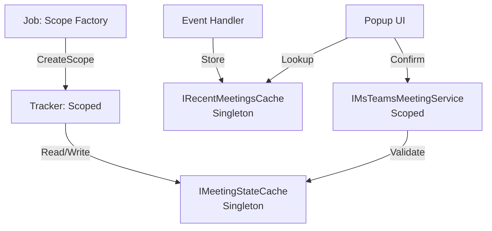
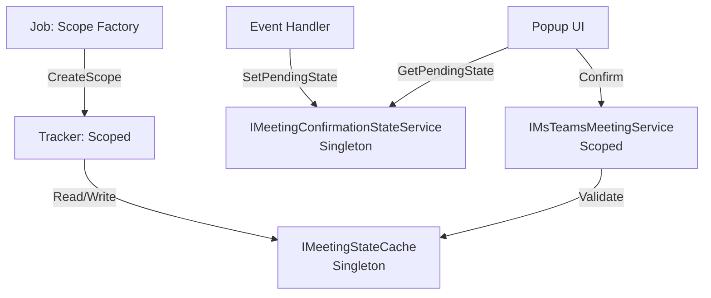
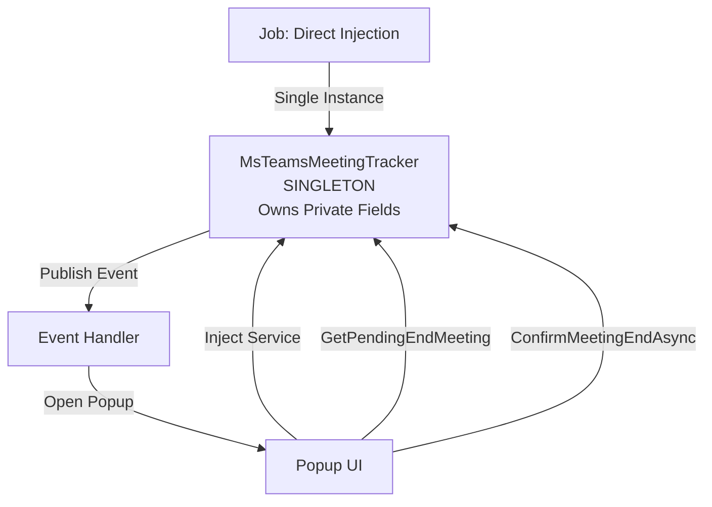

# Architecture Comparison: Meeting Confirmation Simplification

## Executive Summary

**User's Question:** "Can the flow be simplified by operating on described events?"

**Answer:** YES, but the real problem is deeper—`MsTeamsMeetingTracker` should be a **Singleton**, not Scoped. Making this change eliminates ALL caches.

---

## Three Architectures Compared

### Architecture A: Current Production (Scoped + 2 Caches)



**Components:**
- `MsTeamsMeetingTracker`: Scoped (recreated every 10s)
- `IMeetingStateCache`: Singleton (external state storage)
- `IRecentMeetingsCache`: Singleton (UI bridge cache)
- Job uses `IServiceScopeFactory.CreateScope()`

**Problems:**
1. Tracker needs state, but Scoped lifetime loses state after each job
2. Workaround: Extract state to external Singleton cache
3. Event carries data, handler caches it, popup looks it up (pointless round-trip)
4. Two caches with overlapping responsibilities

---

### Architecture B: Event-Driven + State Service (Intermediate)



**Components:**
- `MsTeamsMeetingTracker`: Scoped (still recreated)
- `IMeetingStateCache`: Singleton (tracker state)
- `IMeetingConfirmationStateService`: Singleton (replaces `IRecentMeetingsCache`)
- Job still uses scope factory

**Improvements:**
- ✅ Removed `IRecentMeetingsCache` (redundant)
- ✅ Renamed to clarify purpose (state bridge, not cache)
- ✅ Event data flows directly (no cache lookup indirection)

**Remaining Problems:**
- ❌ Still two Singleton caches (`IMeetingStateCache` + `IMeetingConfirmationStateService`)
- ❌ Tracker is Scoped but needs state (architectural mismatch)
- ❌ Scope factory overhead every 10 seconds

---

### Architecture C: Singleton Tracker (RECOMMENDED)



**Components:**
- `MsTeamsMeetingTracker`: **Singleton** (owns all state)
- ~~`IMeetingStateCache`~~: **DELETED** (replaced by private fields)
- ~~`IMeetingConfirmationStateService`~~: **DELETED** (popup injects tracker directly)
- Job injects tracker directly (no scope factory)

**Benefits:**
- ✅ **Zero external caches** (tracker owns state via private fields)
- ✅ **No scope factory** (direct Singleton injection)
- ✅ **Simplified data flow** (event → popup reads from tracker)
- ✅ **Correct lifetime semantics** (Singleton matches domain: one tracker per app)

---

## Side-by-Side Comparison

| Aspect | Architecture A (Current) | Architecture B (Event-Driven) | Architecture C (Singleton) |
|--------|--------------------------|-------------------------------|---------------------------|
| **Tracker Lifetime** | Scoped | Scoped | **Singleton** ✅ |
| **External Caches** | 2 (State + Recent) | 2 (State + Confirmation) | **0** ✅ |
| **Job Pattern** | Scope factory | Scope factory | **Direct injection** ✅ |
| **State Ownership** | External cache | External cache | **Tracker private fields** ✅ |
| **Event Data Flow** | Event→Cache→Lookup | Event→StateService→Popup | **Event→Popup reads tracker** ✅ |
| **Scope Creation Overhead** | 500ns per poll | 500ns per poll | **0ns** ✅ |
| **Complexity** | High (2 abstractions) | Medium (2 abstractions) | **Low (1 component)** ✅ |
| **Thread Safety** | External cache locks | External cache locks | **Tracker locks** ✅ |
| **Testability** | Mock 2 caches | Mock 2 caches | **Mock 1 tracker** ✅ |

---

## Decision Matrix

### Why Scoped Tracker is Wrong

```csharp
// Current (BROKEN PATTERN):
public class MsTeamsMeetingsTrackerJob : IJob
{
    public Task Execute()
    {
        using var scope = _scopeFactory.CreateScope();
        var tracker = scope.ServiceProvider.GetRequiredService<MsTeamsMeetingTracker>();
        
        tracker.RecognizeActivity(); // ← Tracker has state (_ongoingMeeting, etc.)
        
        // ❌ PROBLEM: Scope disposed here—tracker state LOST
        // ❌ Next poll cycle gets NEW tracker instance with EMPTY state
        // ❌ Cannot detect meeting continuity (same meeting vs new meeting)
    }
}

// Workaround: Extract state to Singleton cache
public class MsTeamsMeetingTracker
{
    private readonly IMeetingStateCache _stateCache; // ← External state storage
    
    public void RecognizeActivity()
    {
        var ongoing = _stateCache.GetOngoingMeeting(); // ← Retrieve state from cache
        // ... detect transitions ...
        _stateCache.SetOngoingMeeting(newMeeting); // ← Store state in cache
    }
}
```

**Root Cause:** Tracker is Scoped but needs persistent state. This is a **lifetime mismatch**.

### Why Singleton Tracker is Correct

```csharp
// Singleton Tracker (CORRECT PATTERN):
public class MsTeamsMeetingsTrackerJob : IJob
{
    private readonly MsTeamsMeetingTracker _tracker; // ← Singleton injected

    public Task Execute()
    {
        _tracker.RecognizeActivity(); // ← Same instance every poll
        // ✅ Tracker state persists (private fields)
        // ✅ Can detect meeting continuity
    }
}

public sealed class MsTeamsMeetingTracker : IMsTeamsMeetingService
{
    private readonly object _lock = new();
    private StartedMeeting? _ongoingMeeting; // ← State owned by tracker
    private PendingEndMeeting? _pendingEndMeeting;
    private readonly List<EndedMeeting> _endedMeetings = new();
    
    public void RecognizeActivity()
    {
        lock (_lock)
        {
            var ongoing = _ongoingMeeting; // ← Direct field access
            // ... detect transitions ...
            _ongoingMeeting = newMeeting; // ← Update field
        }
    }
}
```

**Why This is Correct:**

1. **Domain semantics match lifetime**: There is ONE meeting tracker per application instance
2. **State ownership is clear**: Tracker owns its state via private fields
3. **No external dependencies**: Tracker is self-contained (except infrastructure: IPublisher, IClock)
4. **Thread safety is internal**: Tracker handles locking, not external cache

---

## Migration Path

### Phase 1: Change Tracker Lifetime (Breaking Change)

```diff
// ServiceCollections.cs
- services.AddScoped<MsTeamsMeetingTracker>();
- services.AddScoped<IMsTeamsMeetingService>(sp => sp.GetRequiredService<MsTeamsMeetingTracker>());
+ services.AddSingleton<MsTeamsMeetingTracker>();
+ services.AddSingleton<IMsTeamsMeetingService>(sp => sp.GetRequiredService<MsTeamsMeetingTracker>());
```

```diff
// MsTeamsMeetingsTrackerJob.cs
- private readonly IServiceScopeFactory _scopeFactory;
+ private readonly MsTeamsMeetingTracker _tracker;

- public MsTeamsMeetingsTrackerJob(IServiceScopeFactory scopeFactory)
+ public MsTeamsMeetingsTrackerJob(MsTeamsMeetingTracker tracker)
{
-     _scopeFactory = scopeFactory;
+     _tracker = tracker;
}

public Task Execute()
{
-     using var scope = _scopeFactory.CreateScope();
-     var tracker = scope.ServiceProvider.GetRequiredService<MsTeamsMeetingTracker>();
-     tracker.RecognizeActivity();
+     _tracker.RecognizeActivity();
    return Task.CompletedTask;
}
```

### Phase 2: Move State from Cache to Tracker

```diff
// MsTeamsMeetingTracker.cs
public sealed class MsTeamsMeetingTracker : IMsTeamsMeetingService
{
    private readonly IClock _clock;
    private readonly IPublisher _publisher;
    private readonly IMeetingDiscoveryStrategy _meetingDiscoveryStrategy;
-   private readonly IMeetingStateCache _stateCache;
+   private readonly object _lock = new();
+   private StartedMeeting? _ongoingMeeting;
+   private PendingEndMeeting? _pendingEndMeeting;
+   private DateTime? _pendingEndSetAt;
+   private Guid? _matchedRuleId;
+   private readonly List<EndedMeeting> _endedMeetings = new();

    public void RecognizeActivity()
    {
-       var ongoing = _stateCache.GetOngoingMeeting();
+       lock (_lock)
+       {
+           var ongoing = _ongoingMeeting;
            // ... rest of logic ...
-           _stateCache.SetOngoingMeeting(newMeeting);
+           _ongoingMeeting = newMeeting;
+       }
    }
}
```

### Phase 3: Delete External Caches

```diff
// ServiceCollections.cs
- services.AddSingleton<IMeetingStateCache, MeetingStateCache>();
- services.AddSingleton<IMeetingConfirmationStateService, MeetingConfirmationStateService>();
```

```bash
# Delete files
rm TrackYourDay.Core/ApplicationTrackers/MsTeams/State/IMeetingStateCache.cs
rm TrackYourDay.Core/ApplicationTrackers/MsTeams/State/MeetingStateCache.cs
rm TrackYourDay.Web/Services/IMeetingConfirmationStateService.cs
rm TrackYourDay.Web/Services/MeetingConfirmationStateService.cs
```

### Phase 4: Update UI to Read from Tracker Directly

```diff
// MeetingEndConfirmation.razor
- @inject IMeetingConfirmationStateService stateService
+ @inject IMsTeamsMeetingService meetingService

protected override void OnInitialized()
{
-   pendingMeeting = stateService.GetPendingState(meetingGuid);
+   pendingMeeting = meetingService.GetPendingEndMeeting();
+   if (pendingMeeting?.Meeting.Guid != meetingGuid)
+   {
+       pendingMeeting = null; // Stale popup
+   }
}
```

---

## Risk Analysis

### Architecture A (Current) Risks

- ⚠️ **High Complexity**: Two caches with overlapping responsibilities
- ⚠️ **Performance Overhead**: Scope creation every 10 seconds (500ns)
- ⚠️ **Confusing Data Flow**: Event carries data → handler caches → popup looks up

### Architecture B (Event-Driven) Risks

- ⚠️ **Still Complex**: Two Singleton caches required
- ⚠️ **Lifetime Mismatch**: Tracker is Scoped but needs state
- ⚠️ **Performance Overhead**: Scope creation still needed

### Architecture C (Singleton Tracker) Risks

- ⚠️ **MediatR IPublisher Lifetime**: IPublisher is Scoped by default—injecting into Singleton may fail
  - **Mitigation**: Inject `IServiceProvider`, resolve `IPublisher` on-demand
  - **OR** verify MediatR allows Singleton publisher (may work in practice)
  
- ⚠️ **Memory Leak in `_endedMeetings`**: List grows unbounded
  - **Mitigation**: Implement sliding window (keep last 100 meetings)
  - **OR** clear after retrieval by insights layer

- ⚠️ **Thread Safety Bugs**: Manual locking required (error-prone)
  - **Mitigation**: Lock on ALL mutations to shared fields
  - **Mitigation**: Add integration tests for concurrent access

---

## Recommendation

**Implement Architecture C: Singleton Tracker**

### Why?

1. **Eliminates 2 unnecessary abstractions** (`IMeetingStateCache`, `IMeetingConfirmationStateService`)
2. **Matches domain semantics** (one tracker per app = Singleton)
3. **Simplifies data flow** (no cache lookups)
4. **Improves performance** (no scope creation overhead)
5. **Easier to test** (mock one component instead of two)

### Implementation Priority

1. **Phase 1** (Low Risk): Change tracker lifetime to Singleton, update job injection
2. **Phase 2** (Medium Risk): Move state from `IMeetingStateCache` to private fields
3. **Phase 3** (Low Risk): Delete cache abstractions
4. **Phase 4** (Low Risk): Update UI to read from tracker directly

### Validation Steps

- [ ] Verify MediatR `IPublisher` works in Singleton (or implement service locator pattern)
- [ ] Verify `IMeetingDiscoveryStrategy` can be Singleton (check dependencies)
- [ ] Add integration test: Multiple `RecognizeActivity()` calls preserve state
- [ ] Add integration test: Concurrent popup + job execution (thread safety)
- [ ] Load test: Run for 24 hours, verify no memory leaks

---

## Conclusion

**Your Question:** "Can the flow be simplified by operating on described events?"

**Answer:** YES—Architecture B simplifies event flow by eliminating `IRecentMeetingsCache`. **BUT** the deeper issue is that `MsTeamsMeetingTracker` should never have been Scoped. Architecture C (Singleton Tracker) is the architecturally correct solution that eliminates ALL caches.

**Files Created:**
1. `architecture.md` - Original event-driven simplification (Architecture B)
2. `architecture-singleton-tracker.md` - Singleton tracker design (Architecture C)
3. `architecture-comparison.md` - This document

**Recommended Implementation:** Architecture C (Singleton Tracker)
