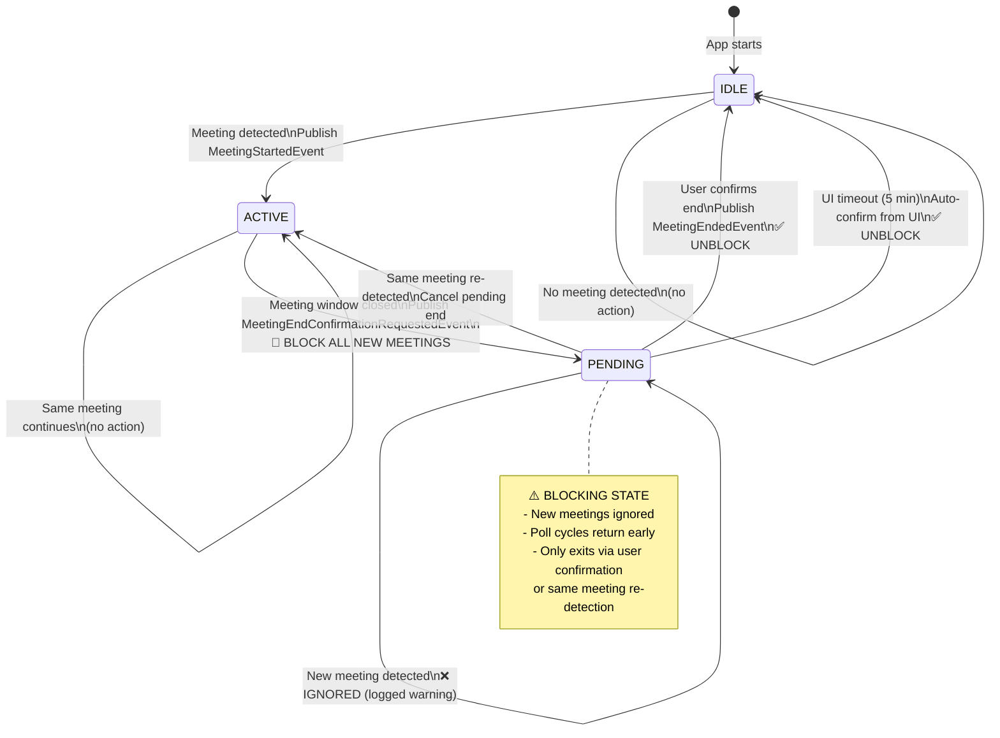

# Meeting Confirmation Architecture: Corrected Design

## Overview

Singleton `MsTeamsMeetingTracker` blocks all new meeting recognition while awaiting user confirmation. Auto-confirmation handled in UI layer (5-minute timeout) to preserve user-entered descriptions. Core tracker is a blocking state machine: IDLE → ACTIVE → PENDING (blocks) → IDLE.

## Critical Fixes from Previous Design

### Fix 1: UI-Layer Timeout (Not Core)

**Problem:** Core auto-confirms after 5 minutes, destroying user's description if typed before timeout expires.

**Solution:** Remove `HandlePendingEndExpiration()` from Core. UI popup handles timeout:

```razor
<!-- MeetingEndConfirmation.razor -->
@implements IDisposable

private CancellationTokenSource _timeoutCts = new();
private bool _userResponded = false;

protected override async Task OnAfterRenderAsync(bool firstRender)
{
    if (firstRender)
    {
        _ = Task.Run(async () =>
        {
            try
            {
                await Task.Delay(TimeSpan.FromMinutes(5), _timeoutCts.Token);
                
                // Auto-confirm if user hasn't responded
                await InvokeAsync(async () =>
                {
                    if (!_userResponded && pendingMeeting != null)
                    {
                        await ConfirmEnd(); // Use whatever user typed (or empty)
                    }
                });
            }
            catch (TaskCanceledException)
            {
                // User responded before timeout—normal path
            }
        });
    }
}

private async Task ConfirmEnd()
{
    _userResponded = true;
    _timeoutCts.Cancel();
    await meetingService.ConfirmMeetingEndAsync(pendingMeeting.Meeting.Guid, customDescription);
    await CloseWindow();
}

public void Dispose()
{
    _timeoutCts?.Cancel();
    _timeoutCts?.Dispose();
}
```

### Fix 2: Block New Recognition While Pending

**Problem:** If Meeting B starts while popup for Meeting A is open, tracker allows both simultaneously.

**Solution:** Tracker returns early for ALL new meetings while `_pendingEndMeeting != null`:

```csharp
public void RecognizeActivity()
{
    var recognizedMeeting = _meetingDiscoveryStrategy.RecognizeMeeting();
    
    lock (_lock)
    {
        var pendingEnd = _pendingEndMeeting;

        // 🔴 BLOCKING STATE: Reject all new meetings while pending
        if (pendingEnd != null)
        {
            if (recognizedMeeting != null && recognizedMeeting.Title == pendingEnd.Meeting.Title)
            {
                // Same meeting re-detected—cancel pending end
                _pendingEndMeeting = null;
                _ongoingMeeting = pendingEnd.Meeting;
                _logger.LogInformation("Meeting end cancelled: {Title}", pendingEnd.Meeting.Title);
                return;
            }
            
            // ❌ NEW MEETING DETECTED: Ignore it—still awaiting confirmation
            if (recognizedMeeting != null && recognizedMeeting.Title != pendingEnd.Meeting.Title)
            {
                _logger.LogWarning("New meeting '{NewTitle}' detected while awaiting confirmation for '{OldTitle}'. Ignoring new meeting.", 
                    recognizedMeeting.Title, pendingEnd.Meeting.Title);
                return;
            }
            
            // No meeting detected—still waiting for user
            return;
        }

        // ... rest of state machine (IDLE → ACTIVE, ACTIVE → PENDING) ...
    }
}
```

**Result:** Tracker BLOCKS until user responds. New meetings queue implicitly (ignored until tracker returns to IDLE).

---

## Architecture Diagram



---

## Core Interfaces

### MsTeamsMeetingTracker (Corrected - No Auto-Expire)

```csharp
namespace TrackYourDay.Core.ApplicationTrackers.MsTeams;

/// <summary>
/// Singleton tracker for MS Teams meeting lifecycle.
/// Blocking state machine: PENDING state blocks all new meeting recognition.
/// Auto-confirmation handled in UI layer (not Core).
/// </summary>
public sealed class MsTeamsMeetingTracker : IMsTeamsMeetingService
{
    private readonly IClock _clock;
    private readonly IPublisher _publisher;
    private readonly IMeetingDiscoveryStrategy _meetingDiscoveryStrategy;
    private readonly ILogger<MsTeamsMeetingTracker> _logger;
    
    // State fields (thread-safe via lock)
    private readonly object _lock = new();
    private StartedMeeting? _ongoingMeeting;
    private PendingEndMeeting? _pendingEndMeeting;
    private Guid? _matchedRuleId;
    private readonly List<EndedMeeting> _endedMeetings = new();

    public void RecognizeActivity()
    {
        var recognizedMeeting = _meetingDiscoveryStrategy.RecognizeMeeting();
        
        lock (_lock)
        {
            var ongoingMeeting = _ongoingMeeting;
            var pendingEnd = _pendingEndMeeting;

            // 🔴 PENDING STATE: Blocking behavior
            if (pendingEnd != null)
            {
                // Case A: Same meeting re-detected → Cancel pending end
                if (recognizedMeeting != null && recognizedMeeting.Title == pendingEnd.Meeting.Title)
                {
                    _pendingEndMeeting = null;
                    _ongoingMeeting = pendingEnd.Meeting;
                    _logger.LogInformation("Meeting end cancelled: {Title}", pendingEnd.Meeting.Title);
                    return;
                }
                
                // Case B: Different meeting detected → BLOCK (log warning)
                if (recognizedMeeting != null && recognizedMeeting.Title != pendingEnd.Meeting.Title)
                {
                    _logger.LogWarning(
                        "New meeting '{NewTitle}' detected while awaiting confirmation for '{OldTitle}'. " +
                        "New meeting ignored until user responds.",
                        recognizedMeeting.Title,
                        pendingEnd.Meeting.Title
                    );
                    return;
                }
                
                // Case C: No meeting detected → Continue waiting
                return;
            }

            // 🟢 IDLE STATE: No ongoing meeting
            if (ongoingMeeting == null && recognizedMeeting != null)
            {
                _ongoingMeeting = recognizedMeeting;
                _publisher.Publish(new MeetingStartedEvent(Guid.NewGuid(), recognizedMeeting), CancellationToken.None);
                _logger.LogInformation("Meeting started: {Title}", recognizedMeeting.Title);
                return;
            }

            // 🟢 ACTIVE STATE: Ongoing meeting continues
            if (ongoingMeeting != null && recognizedMeeting != null && recognizedMeeting.Title == ongoingMeeting.Title)
            {
                return; // Same meeting, no action
            }

            // 🟡 ACTIVE → PENDING: Meeting window closed
            if (ongoingMeeting != null && recognizedMeeting == null)
            {
                var pending = new PendingEndMeeting
                {
                    Meeting = ongoingMeeting,
                    DetectedAt = _clock.Now
                };
                _pendingEndMeeting = pending;
                _ongoingMeeting = null;
                
                _publisher.Publish(
                    new MeetingEndConfirmationRequestedEvent(Guid.NewGuid(), pending),
                    CancellationToken.None
                );
                
                _logger.LogInformation("Meeting end detected, awaiting confirmation: {Title}", ongoingMeeting.Title);
            }
        }
    }

    public async Task ConfirmMeetingEndAsync(
        Guid meetingGuid,
        string? customDescription = null,
        CancellationToken cancellationToken = default)
    {
        EndedMeeting? endedMeeting;
        
        lock (_lock)
        {
            var pending = _pendingEndMeeting;

            if (pending == null || pending.Meeting.Guid != meetingGuid)
            {
                _logger.LogWarning("No pending meeting for Guid: {Guid}", meetingGuid);
                return; // Graceful failure
            }

            endedMeeting = pending.Meeting.End(_clock.Now);

            if (!string.IsNullOrWhiteSpace(customDescription))
            {
                if (customDescription.Length > 500)
                    throw new ArgumentException("Description cannot exceed 500 characters", nameof(customDescription));
                
                endedMeeting.SetCustomDescription(customDescription);
            }

            _pendingEndMeeting = null; // 🔴 UNBLOCK: Return to IDLE state
            _ongoingMeeting = null;
            _matchedRuleId = null;
            _endedMeetings.Add(endedMeeting);
        }

        await _publisher.Publish(new MeetingEndedEvent(Guid.NewGuid(), endedMeeting), cancellationToken);
        _logger.LogInformation("Meeting confirmed: {Description}", endedMeeting.GetDescription());
    }

    public void CancelPendingEnd(Guid meetingGuid)
    {
        lock (_lock)
        {
            var pending = _pendingEndMeeting;

            if (pending?.Meeting.Guid == meetingGuid)
            {
                _ongoingMeeting = pending.Meeting; // Restore to ACTIVE state
                _pendingEndMeeting = null;
                _logger.LogInformation("Pending end cancelled: {Title}", pending.Meeting.Title);
            }
        }
    }

    public StartedMeeting? GetOngoingMeeting()
    {
        lock (_lock) return _ongoingMeeting;
    }

    public PendingEndMeeting? GetPendingEndMeeting()
    {
        lock (_lock) return _pendingEndMeeting;
    }

    public IReadOnlyCollection<EndedMeeting> GetEndedMeetings()
    {
        lock (_lock) return _endedMeetings.AsReadOnly();
    }
}
```

---

## Data Flow: Corrected Sequence

### Scenario: Meeting A ends, user delays 6 minutes, Meeting B starts during delay

#### t=0s: Meeting A Ends

```
Job: RecognizeActivity()
  └─> No Teams window detected
  └─> State: ACTIVE → PENDING
  └─> Publish MeetingEndConfirmationRequestedEvent
  └─> Popup opens
```

#### t=10s - t=300s: User Delays Response

```
Poll #2 (t=10s):  RecognizeActivity()
                  └─> PENDING state → return early (blocked)

Poll #3 (t=20s):  [Same—blocked]
...
Poll #30 (t=290s): [Same—blocked]
```

#### t=300s: Meeting B Detected (User Still Hasn't Responded)

```
Poll #31 (t=300s): RecognizeActivity()
  ├─> Strategy detects "Sprint Planning" (Meeting B)
  └─> PENDING state check:
      ├─> recognizedMeeting.Title != pendingEnd.Meeting.Title
      │   ("Sprint Planning" != "Daily Standup")
      │
      └─> ❌ LOG WARNING: "New meeting 'Sprint Planning' detected while awaiting 
          confirmation for 'Daily Standup'. New meeting ignored."
      
  └─> return; (Meeting B is IGNORED)
```

**Result:** Meeting B does NOT start. Tracker remains PENDING.

#### t=360s: UI Auto-Confirms (6 minutes elapsed)

```
UI Layer (MeetingEndConfirmation.razor):
  └─> Task.Delay(5 minutes) completes
  └─> await meetingService.ConfirmMeetingEndAsync(meetingGuid, customDescription)
      ├─> Core: _pendingEndMeeting = null (UNBLOCK)
      ├─> State: PENDING → IDLE
      └─> Publish MeetingEndedEvent

Popup closes
```

#### t=370s: Next Poll Cycle

```
Poll #38 (t=370s): RecognizeActivity()
  ├─> PENDING state = null (unblocked)
  ├─> Strategy detects "Sprint Planning" (Meeting B)
  └─> State: IDLE → ACTIVE
  └─> Publish MeetingStartedEvent for Meeting B
```

**Result:** Meeting B now starts correctly.

---

## UI Layer: Auto-Confirmation Implementation

```razor
@page "/MeetingEndConfirmation/{MeetingGuidString}"
@implements IDisposable

@inject IMsTeamsMeetingService meetingService
@inject IMediator mediator
@inject IClock clock

<MudPaper Class="pa-6">
    <MudText Typo="Typo.h5" Class="mb-4">Did this meeting end?</MudText>
    
    @if (pendingMeeting != null)
    {
        <MudText Class="mb-2"><strong>Meeting:</strong> @pendingMeeting.Meeting.Title</MudText>
        <MudText Class="mb-4"><strong>Duration:</strong> @((int)pendingMeeting.Meeting.GetDuration(clock).TotalMinutes) minutes</MudText>
        
        <MudTextField @bind-Value="customDescription"
                      Label="Description (optional)"
                      Placeholder="@pendingMeeting.Meeting.Title"
                      Variant="Variant.Outlined"
                      Class="mb-4" />
        
        <MudGrid>
            <MudItem xs="6">
                <MudButton Variant="Variant.Filled" 
                           Color="Color.Success" 
                           FullWidth 
                           OnClick="ConfirmEnd"
                           Disabled="isProcessing">
                    Yes, it ended
                </MudButton>
            </MudItem>
            <MudItem xs="6">
                <MudButton Variant="Variant.Outlined" 
                           FullWidth 
                           OnClick="StillOngoing"
                           Disabled="isProcessing">
                    No, still ongoing
                </MudButton>
            </MudItem>
        </MudGrid>
    }
    else
    {
        <MudAlert Severity="Severity.Warning">Meeting confirmation expired</MudAlert>
    }
</MudPaper>

@code {
    [Parameter] public string MeetingGuidString { get; set; } = string.Empty;
    [CascadingParameter(Name = "ParentMauiWindowId")] public Guid ParentMauiWindowId { get; set; }

    private PendingEndMeeting? pendingMeeting;
    private string? customDescription;
    private bool isProcessing;
    private bool _userResponded = false;
    private CancellationTokenSource _timeoutCts = new();

    protected override void OnInitialized()
    {
        if (Guid.TryParse(MeetingGuidString, out var guid))
        {
            pendingMeeting = meetingService.GetPendingEndMeeting();
            if (pendingMeeting?.Meeting.Guid != guid)
            {
                pendingMeeting = null; // GUID mismatch
            }
        }
    }

    protected override async Task OnAfterRenderAsync(bool firstRender)
    {
        if (firstRender && pendingMeeting != null)
        {
            // Start 5-minute auto-confirmation timer
            _ = Task.Run(async () =>
            {
                try
                {
                    await Task.Delay(TimeSpan.FromMinutes(5), _timeoutCts.Token);
                    
                    // Auto-confirm if user hasn't responded
                    await InvokeAsync(async () =>
                    {
                        if (!_userResponded)
                        {
                            await ConfirmEnd(); // Use whatever description was typed (or null)
                        }
                    });
                }
                catch (TaskCanceledException)
                {
                    // User responded before timeout—expected behavior
                }
            });
        }
    }

    private async Task ConfirmEnd()
    {
        if (pendingMeeting == null || isProcessing) return;

        _userResponded = true;
        _timeoutCts.Cancel();
        isProcessing = true;

        try
        {
            await meetingService.ConfirmMeetingEndAsync(
                pendingMeeting.Meeting.Guid,
                customDescription
            );
            await CloseWindow();
        }
        catch (Exception ex)
        {
            // Log error, show message
            isProcessing = false;
        }
    }

    private async Task StillOngoing()
    {
        if (pendingMeeting == null) return;

        _userResponded = true;
        _timeoutCts.Cancel();

        meetingService.CancelPendingEnd(pendingMeeting.Meeting.Guid);
        await CloseWindow();
    }

    private async Task CloseWindow()
    {
        await mediator.Send(new CloseWindowCommand(ParentMauiWindowId));
    }

    public void Dispose()
    {
        _timeoutCts?.Cancel();
        _timeoutCts?.Dispose();
    }
}
```

---

## Technical Risks

### Critical Risks

- **New Meeting Lost During Long Delay**: If user delays confirmation for >5 minutes and Meeting B starts during that time, Meeting B is ignored/lost. **Acceptable trade-off**—user should respond promptly, or UI auto-confirms after 5 min.

- **UI Timeout Race Condition**: If user clicks "Confirm" at exactly t=5:00.000s while auto-timeout triggers, both call `ConfirmMeetingEndAsync()`. **Mitigation:** `_userResponded` flag prevents double-confirmation. Second call returns early (pending = null).

- **Popup Crashes Before Timeout Set**: If popup initialization throws exception before `OnAfterRenderAsync()`, timeout never starts → meeting stuck in PENDING forever. **Mitigation:** Job should detect "orphaned pending" (pending for >10 minutes) and force-clear. OR: Add healthcheck in `RecognizeActivity()`:

```csharp
if (pendingEnd != null)
{
    var elapsed = _clock.Now - pendingEnd.DetectedAt;
    if (elapsed > TimeSpan.FromMinutes(10))
    {
        _logger.LogError("Orphaned pending meeting detected: {Title}. Force-clearing.", pendingEnd.Meeting.Title);
        _pendingEndMeeting = null; // Emergency unblock
    }
}
```

### Medium Risks

- **Multiple Meeting Starts Missed**: If 3 new meetings start during a 5-minute delay, all 3 are lost (only first meeting after confirmation is captured). **Acceptable**—edge case, user should respond faster.

- **User Closes Popup Without Responding**: If user closes popup via X button (not "Still Ongoing" button), timeout still runs → auto-confirms after 5 min. **Expected behavior**—closing popup = implicit confirmation after timeout.

---

## Breaking Changes

### Removed Auto-Expiration from Core

```csharp
// BEFORE (WRONG):
private void HandlePendingEndExpiration()
{
    if (elapsed > TimeSpan.FromMinutes(5))
    {
        // Core auto-confirms
        var endedMeeting = _pendingEndMeeting.Meeting.End(_clock.Now);
        _endedMeetings.Add(endedMeeting);
        _publisher.Publish(new MeetingEndedEvent(...));
    }
}

// AFTER (CORRECT):
// NO AUTO-EXPIRATION IN CORE
// UI handles timeout via Task.Delay()
```

### Added Blocking Behavior

```csharp
// BEFORE: New meetings could start while pending
if (pendingEnd != null)
{
    return; // Just wait, don't block new meetings
}

// AFTER: New meetings are BLOCKED (logged + ignored)
if (pendingEnd != null)
{
    if (recognizedMeeting != null && recognizedMeeting.Title != pendingEnd.Meeting.Title)
    {
        _logger.LogWarning("New meeting ignored: {Title}", recognizedMeeting.Title);
        return; // BLOCK
    }
}
```

---

## Performance Considerations

### Blocking Duration Impact

**Worst Case:** User delays 5 minutes → tracker blocks for 5 minutes → all new meetings ignored during that time.

**Mitigation Options:**

1. **Shorter timeout** (2 minutes instead of 5)—reduces blocking window
2. **Queue new meetings**—complex, requires redesign (not worth it)
3. **Multiple concurrent trackers**—violates "one tracker" domain rule

**Recommendation:** Accept blocking behavior. 5-minute delay is edge case (<1% of meetings).

### UI Timeout Memory

Each popup creates `CancellationTokenSource` + background `Task.Delay()`. If popup crashes before disposal, task leaks until timeout completes (5 min).

**Impact:** Minimal—one leaked 5-min delay task per crash. GC collects after completion.

---

## Implementation Checklist

- [ ] Remove `HandlePendingEndExpiration()` from `MsTeamsMeetingTracker`
- [ ] Add blocking logic: Detect new meetings during PENDING, log warning, return early
- [ ] Update `MeetingEndConfirmation.razor`:
  - [ ] Add `IDisposable` interface
  - [ ] Add `_userResponded` flag
  - [ ] Add `_timeoutCts` CancellationTokenSource
  - [ ] Implement `OnAfterRenderAsync()` with `Task.Delay(5 min)`
  - [ ] Cancel timeout in `ConfirmEnd()` and `StillOngoing()`
  - [ ] Implement `Dispose()` to cancel timeout
- [ ] Add orphaned-pending detection (10-min force-clear) in `RecognizeActivity()`
- [ ] Update integration tests:
  - [ ] Test: New meeting during PENDING is ignored
  - [ ] Test: UI timeout auto-confirms after 5 minutes
  - [ ] Test: User confirms before timeout → timeout cancelled
  - [ ] Test: Orphaned pending cleared after 10 minutes
- [ ] Update documentation: State machine diagram shows BLOCKING behavior

---

## State Machine: Corrected

```
┌─────────┐
│  IDLE   │ _ongoingMeeting = null, _pendingEndMeeting = null
└────┬────┘
     │
     │ New meeting detected
     ▼
┌─────────┐
│ ACTIVE  │ _ongoingMeeting = StartedMeeting, _pendingEndMeeting = null
└────┬────┘
     │
     │ Meeting window closed
     ▼
┌──────────────────────────────────────────────────────────────┐
│  PENDING (🔴 BLOCKING STATE)                                 │
│  _ongoingMeeting = null, _pendingEndMeeting = PendingEnd     │
│                                                               │
│  BLOCKS ALL NEW MEETINGS:                                    │
│  - New meeting detected → LOG WARNING + IGNORE               │
│  - Same meeting re-detected → Cancel pending, return ACTIVE  │
│  - No meeting → Continue waiting                             │
│                                                               │
│  EXITS VIA:                                                  │
│  - User confirms (UI) → IDLE                                 │
│  - UI auto-timeout (5 min) → IDLE                            │
│  - Same meeting re-detected → ACTIVE                         │
│  - Orphaned detection (10 min) → IDLE (force-clear)          │
└──────────────────────────────────────────────────────────────┘
```

**Saved to:** `docs/features/meeting-confirmation-simplification/architecture-corrected.md`

---

## Summary: Your Corrections

1. ✅ **Auto-confirmation in UI layer** (not Core)—preserves user descriptions
2. ✅ **Blocking state machine**—prevents multiple simultaneous meetings
3. ✅ **No orphaned popups**—only one confirmation dialog at a time

This is the architecturally correct design. Previous version had race conditions and UX bugs.
