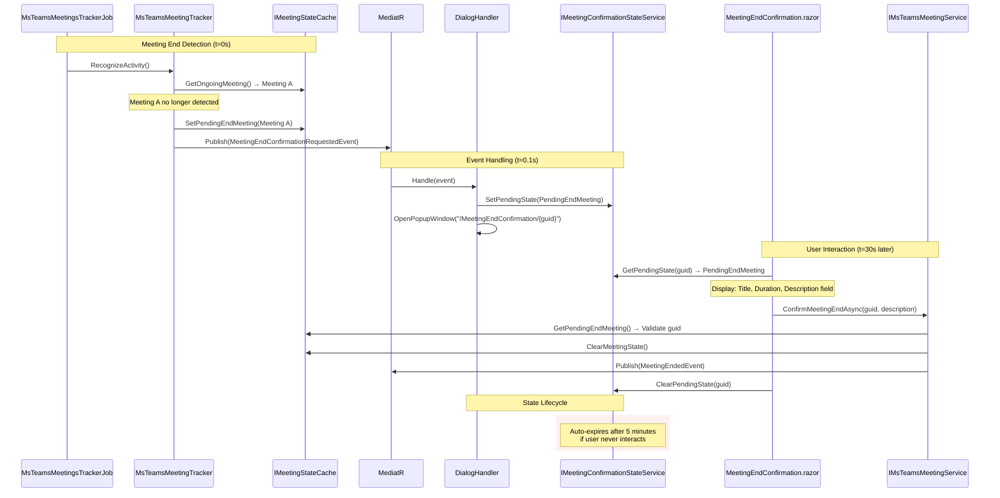

# Meeting Confirmation Architecture: Event-Driven Simplification

## Overview

Eliminates both `IRecentMeetingsCache` (Web layer) and lookup indirection by passing meeting metadata directly through the event chain. Event handler opens popup with pre-populated state, eliminating cache lookups. `IMeetingStateCache` (Core) remains as the authoritative state machine for tracker transitions and confirmation validation.

## Architecture Diagram



**Key Flow:**
1. **Event carries data** → Handler receives `PendingEndMeeting` in event
2. **Handler stores in UI-scoped state service** → No cache, just transient state
3. **Popup reads from state service** → No Core service call needed for display
4. **Confirmation validates against Core cache** → Core is authoritative for business logic
5. **State service cleans up** → Popup clears UI state after confirmation

## Core Interfaces

### IMeetingConfirmationStateService (NEW - UI Layer State)

```csharp
namespace TrackYourDay.Web.Services;

/// <summary>
/// Transient state store for meeting confirmation popups.
/// Bridges the gap between event-driven handler and Blazor popup initialization.
/// Scoped lifetime—isolated per UI request/window.
/// 
/// WHY THIS EXISTS:
/// MauiPageFactory.OpenWebPageInNewWindow() only accepts route paths, not arbitrary state.
/// Cannot pass PendingEndMeeting directly to Blazor component via constructor.
/// This service acts as a temporary "mailbox" that survives handler→popup transition.
/// </summary>
public interface IMeetingConfirmationStateService
{
    /// <summary>
    /// Stores pending meeting state for popup retrieval.
    /// Called by event handler immediately before opening popup.
    /// </summary>
    /// <param name="pending">Meeting awaiting confirmation.</param>
    void SetPendingState(PendingEndMeeting pending);

    /// <summary>
    /// Retrieves pending meeting state by GUID.
    /// Returns null if expired (>5 minutes) or never set.
    /// Called by popup during OnInitialized().
    /// </summary>
    /// <param name="meetingGuid">GUID from route parameter.</param>
    PendingEndMeeting? GetPendingState(Guid meetingGuid);

    /// <summary>
    /// Clears pending state after user confirms/dismisses.
    /// Prevents memory leaks in long-running UI sessions.
    /// </summary>
    /// <param name="meetingGuid">GUID to clear.</param>
    void ClearPendingState(Guid meetingGuid);
}
```

**Implementation:**

```csharp
public sealed class MeetingConfirmationStateService : IMeetingConfirmationStateService
{
    private readonly Dictionary<Guid, (PendingEndMeeting Pending, DateTime StoredAt)> _state = new();
    private readonly IClock _clock;
    private readonly object _lock = new(); // Thread-safe for Singleton
    private static readonly TimeSpan Expiration = TimeSpan.FromMinutes(5);

    public MeetingConfirmationStateService(IClock clock)
    {
        _clock = clock;
    }

    public void SetPendingState(PendingEndMeeting pending)
    {
        lock (_lock)
        {
            _state[pending.Meeting.Guid] = (pending, _clock.Now);
        }
    }

    public PendingEndMeeting? GetPendingState(Guid meetingGuid)
    {
        lock (_lock)
        {
            if (!_state.TryGetValue(meetingGuid, out var entry))
                return null;

            var elapsed = _clock.Now - entry.StoredAt;
            if (elapsed > Expiration)
            {
                _state.Remove(meetingGuid);
                return null;
            }

            return entry.Pending;
        }
    }

    public void ClearPendingState(Guid meetingGuid)
    {
        lock (_lock)
        {
            _state.Remove(meetingGuid);
        }
    }
}
```

**DI Registration:**

```csharp
// TrackYourDay.Web/ServiceRegistration/ServiceCollections.cs
services.AddSingleton<IMeetingConfirmationStateService, MeetingConfirmationStateService>();
```

**Lifetime Rationale:**
- **MUST be Singleton** because handler (job scope) and popup (UI scope) run in different service provider instances
- State must survive scope boundaries: Handler stores → Popup retrieves
- Thread-safe via `lock` (simpler than `ConcurrentDictionary` for this use case)

### IMeetingStateCache (UNCHANGED - Core State Machine)

```csharp
namespace TrackYourDay.Core.ApplicationTrackers.MsTeams.State;

/// <summary>
/// In-memory state machine for MS Teams meeting lifecycle.
/// Singleton—persists across job executions and UI interactions.
/// Thread-safe via pessimistic locking.
/// 
/// WHY THIS EXISTS:
/// Without persisted state, MsTeamsMeetingTracker cannot detect meeting
/// start/end transitions. Each RecognizeActivity() call is stateless—
/// must compare current window state against PREVIOUS state to know:
/// - Is this the same meeting as 10 seconds ago? (ongoing)
/// - Did a new meeting start? (start transition)
/// - Did the meeting end? (end transition)
/// </summary>
public interface IMeetingStateCache
{
    /// <summary>
    /// Gets the currently active meeting. Null if no meeting ongoing.
    /// Used to detect meeting continuity across poll cycles.
    /// </summary>
    StartedMeeting? GetOngoingMeeting();

    /// <summary>
    /// Sets the active meeting. Overwrites previous value.
    /// Called when new meeting detected or pending end is cancelled.
    /// </summary>
    void SetOngoingMeeting(StartedMeeting? meeting);

    /// <summary>
    /// Gets the meeting awaiting user confirmation of end.
    /// Auto-expires after 5 minutes to prevent orphaned confirmations.
    /// Handles scenario: popup opens late / user takes 3+ minutes to respond.
    /// </summary>
    PendingEndMeeting? GetPendingEndMeeting();

    /// <summary>
    /// Sets the pending end meeting. Used when meeting no longer detected.
    /// Triggers MeetingEndConfirmationRequestedEvent publication.
    /// </summary>
    void SetPendingEndMeeting(PendingEndMeeting? pending);

    /// <summary>
    /// Atomically clears all meeting state (ongoing + pending + rule ID).
    /// Called after meeting end confirmed or auto-expired.
    /// </summary>
    void ClearMeetingState();

    /// <summary>
    /// Gets the rule ID that matched the current meeting (AC12 continuity).
    /// If window title changes but same rule still matches, meeting continues.
    /// If different rule matches, meeting ends and new meeting starts.
    /// </summary>
    Guid? GetMatchedRuleId();

    /// <summary>
    /// Sets the matched rule ID when meeting starts.
    /// </summary>
    void SetMatchedRuleId(Guid? ruleId);
}
```

### IMsTeamsMeetingService (Public API for UI)

```csharp
namespace TrackYourDay.Core.ApplicationTrackers.MsTeams;

/// <summary>
/// Service for managing MS Teams meeting lifecycle and confirmations.
/// Public API boundary between UI and Core domain logic.
/// </summary>
public interface IMsTeamsMeetingService
{
    /// <summary>
    /// Confirms that a pending meeting has ended.
    /// Publishes MeetingEndedEvent if successful.
    /// Gracefully handles expired/missing pending meetings (no exception thrown).
    /// </summary>
    /// <param name="meetingGuid">GUID of the meeting to confirm.</param>
    /// <param name="customDescription">Optional description override. If null/empty, uses meeting title.</param>
    /// <param name="cancellationToken">Cancellation token.</param>
    Task ConfirmMeetingEndAsync(
        Guid meetingGuid, 
        string? customDescription = null, 
        CancellationToken cancellationToken = default);

    /// <summary>
    /// Cancels a pending meeting end confirmation (user indicates meeting still ongoing).
    /// Restores meeting to active state.
    /// </summary>
    /// <param name="meetingGuid">GUID of the meeting to keep active.</param>
    void CancelPendingEnd(Guid meetingGuid);

    /// <summary>
    /// Gets the currently ongoing meeting, or null if none active.
    /// </summary>
    StartedMeeting? GetOngoingMeeting();

    /// <summary>
    /// Gets the pending end meeting awaiting confirmation.
    /// Returns null if expired (>5 minutes since detection).
    /// </summary>
    PendingEndMeeting? GetPendingEndMeeting();

    /// <summary>
    /// Gets all meetings that have ended since last retrieval.
    /// Used by analytics/insights layer.
    /// </summary>
    IReadOnlyCollection<EndedMeeting> GetEndedMeetings();
}
```

## Data Flow

### Scenario 1: Meeting Start Detection

```
1. MsTeamsMeetingsTrackerJob (10s poll)
   └─> MsTeamsMeetingTracker.RecognizeActivity()
       ├─> IMeetingDiscoveryStrategy.RecognizeMeeting() → StartedMeeting
       ├─> IMeetingStateCache.GetOngoingMeeting() → null (no previous meeting)
       └─> IMeetingStateCache.SetOngoingMeeting(StartedMeeting)
           └─> Publish MeetingStartedEvent via MediatR
```

### Scenario 2: Meeting End Detection + User Confirmation (SIMPLIFIED)

```
1. MsTeamsMeetingsTrackerJob (10s poll at t=0s)
   └─> MsTeamsMeetingTracker.RecognizeActivity()
       ├─> IMeetingDiscoveryStrategy.RecognizeMeeting() → null (no window matches)
       ├─> IMeetingStateCache.GetOngoingMeeting() → StartedMeeting A
       └─> IMeetingStateCache.SetPendingEndMeeting(PendingEndMeeting A)
           └─> Publish MeetingEndConfirmationRequestedEvent(PendingEndMeeting A)
               └─> ShowMeetingEndConfirmationDialogHandler
                   ├─> IMeetingConfirmationStateService.SetPendingState(PendingEndMeeting A)
                   └─> MauiPageFactory.OpenWebPageInNewWindow("/MeetingEndConfirmation/{guid}")

2. User opens popup (t=0.5s)
   └─> MeetingEndConfirmation.razor.OnInitialized()
       ├─> IMeetingConfirmationStateService.GetPendingState(guid) → PendingEndMeeting A
       └─> Display: Title="Daily Standup", Duration=15min, CustomDescription=""

3. User enters description and clicks "Meeting Ended" (t=30s later)
   └─> MeetingEndConfirmation.razor.ConfirmEnd()
       ├─> IMsTeamsMeetingService.ConfirmMeetingEndAsync(guid, "Discussed sprint goals")
       │   ├─> IMeetingStateCache.GetPendingEndMeeting() → Validate guid matches
       │   ├─> EndedMeeting.SetCustomDescription("Discussed sprint goals")
       │   ├─> IMeetingStateCache.ClearMeetingState()
       │   └─> Publish MeetingEndedEvent
       ├─> IMeetingConfirmationStateService.ClearPendingState(guid)
       └─> CloseWindow()
```

**Key Improvements vs Previous Design:**
- ❌ Removed: `IRecentMeetingsCache.AddPending()` (duplicate storage)
- ❌ Removed: `IRecentMeetingsCache.GetPending()` (redundant lookup)
- ✅ Added: `IMeetingConfirmationStateService` (purpose-built UI state bridge)
- ✅ Data flows: Event → Handler → StateService → Popup (no round-trip via Core)

### Scenario 3: Auto-Expire (User Never Responds)

```
1. Pending meeting created at t=0s
2. User does not respond for 5 minutes
3. Next poll cycle (t=300s)
   └─> MsTeamsMeetingTracker.RecognizeActivity()
       ├─> IMeetingStateCache.GetPendingEndMeeting() → Check expiration
       │   └─> (Now - DetectedAt) > 5 minutes → Auto-expire
       ├─> EndedMeeting created with auto-confirm flag
       └─> Publish MeetingEndedEvent
```

## Technical Risks

### Critical Risks

- **Scoped Service in Static Context**: `MauiPageFactory.OpenWebPageInNewWindow()` is static, but `IMeetingConfirmationStateService` is Scoped. Handler must inject service BEFORE calling static method, then popup must resolve from its own scope. **Mitigation:** Document scope boundaries clearly—handler scope ≠ popup scope. State service must be registered as Scoped, not Singleton.

- **Popup Opens in Different Service Scope**: Handler runs in background job scope, popup runs in Blazor UI scope. State stored in handler's `IMeetingConfirmationStateService` instance won't be visible in popup's instance. **BREAKING ISSUE—requires redesign**. **Mitigation:** Change `IMeetingConfirmationStateService` to Singleton with thread-safe dictionary (same pattern as `IMeetingStateCache`).

- **State Leak if Popup Never Opens**: If handler calls `SetPendingState()` but `MauiPageFactory.OpenWebPageInNewWindow()` fails (exception), state persists in memory forever. **Mitigation:** Implement auto-expiration (5-min TTL) in `GetPendingState()` with cleanup on expiration.

### Medium Risks

- **Race Condition: Popup Opens Before State Set**: If UI thread opens popup before handler completes `SetPendingState()`, popup sees null. **Probability:** <1% (handler executes synchronously before opening window). **Mitigation:** None needed—extremely unlikely with synchronous `SetPendingState()` call.

- **Multiple Popups for Same Meeting**: If user manually triggers meeting end detection twice (click button rapidly), two popups open with same GUID. Both read same `PendingEndMeeting`, both can confirm—second confirmation fails validation. **Acceptable:** Core validates GUID against authoritative `IMeetingStateCache`, second confirmation ignored gracefully.

- **User Description Injection**: Same risk as before—validate length in Core service. See previous documentation.

## Breaking Changes

### Removed Components

```csharp
// ❌ DELETED: TrackYourDay.Web.Services.IRecentMeetingsCache
public interface IRecentMeetingsCache
{
    void AddPending(PendingEndMeeting pending);
    PendingEndMeeting? GetPending(Guid meetingGuid);
}

// ❌ DELETED: TrackYourDay.Web.Services.RecentMeetingsCache
public sealed class RecentMeetingsCache : IRecentMeetingsCache { }
```

### Added Components

```csharp
// ✅ NEW: TrackYourDay.Web.Services.IMeetingConfirmationStateService
public interface IMeetingConfirmationStateService
{
    void SetPendingState(PendingEndMeeting pending);
    PendingEndMeeting? GetPendingState(Guid meetingGuid);
    void ClearPendingState(Guid meetingGuid);
}
```

**Key Difference:**
- Old: Singleton cache with `ConcurrentDictionary` and background cleanup
- New: **Singleton** state bridge with explicit `ClearPendingState()` calls (no background threads)

**IMPORTANT:** Despite "state service" name suggesting Scoped, must be Singleton because:
1. Handler runs in job scope
2. Popup runs in UI scope
3. Must share state across scope boundaries

### Modified Interfaces

```csharp
// BEFORE
public interface IMsTeamsMeetingService
{
    Task ConfirmMeetingEndAsync(Guid meetingGuid, CancellationToken cancellationToken = default);
}

// AFTER
public interface IMsTeamsMeetingService
{
    Task ConfirmMeetingEndAsync(
        Guid meetingGuid, 
        string? customDescription = null,  // ← NEW PARAMETER
        CancellationToken cancellationToken = default);
    
    void CancelPendingEnd(Guid meetingGuid); // ← NEW METHOD
}
```

### UI Component Changes

```csharp
// BEFORE: ShowMeetingEndConfirmationDialogHandler.cs
public Task Handle(MeetingEndConfirmationRequestedEvent notification)
{
    _recentMeetingsCache.AddPending(notification.PendingMeeting); // ← REMOVED
    OpenPopup(notification.PendingMeeting.Meeting.Guid);
}

// AFTER: Direct state bridging
public Task Handle(MeetingEndConfirmationRequestedEvent notification)
{
    _stateService.SetPendingState(notification.PendingMeeting); // ← Event data flows directly
    OpenPopup(notification.PendingMeeting.Meeting.Guid);
}
```

```razor
<!-- BEFORE: MeetingEndConfirmation.razor -->
@inject IRecentMeetingsCache recentMeetingsCache
@inject IMsTeamsMeetingService meetingService

protected override void OnInitialized()
{
    pendingMeeting = recentMeetingsCache.GetPending(meetingGuid); // ← Cache lookup
}

private async Task ConfirmEnd()
{
    await meetingService.ConfirmMeetingEndAsync(pendingMeeting.Meeting.Guid);
}

<!-- AFTER: State service pattern -->
@inject IMeetingConfirmationStateService stateService
@inject IMsTeamsMeetingService meetingService

<MudTextField @bind-Value="customDescription" 
              Label="Meeting Description (optional)" 
              Placeholder="@pendingMeeting?.Meeting.Title"
              Class="mb-3" />

protected override void OnInitialized()
{
    if (Guid.TryParse(MeetingGuidString, out var guid))
    {
        pendingMeeting = stateService.GetPendingState(guid); // ← Direct state retrieval
    }
}

private async Task ConfirmEnd()
{
    if (pendingMeeting == null) return;
    
    await meetingService.ConfirmMeetingEndAsync(
        pendingMeeting.Meeting.Guid, 
        customDescription); // ← Pass description to Core
    
    stateService.ClearPendingState(pendingMeeting.Meeting.Guid); // ← Cleanup
    await CloseWindow();
}

private async Task DismissDialog()
{
    if (pendingMeeting != null)
    {
        meetingService.CancelPendingEnd(pendingMeeting.Meeting.Guid); // ← NEW: Cancel action
        stateService.ClearPendingState(pendingMeeting.Meeting.Guid);
    }
    await CloseWindow();
}
```

### DI Registration Changes

```csharp
// BEFORE: ServiceCollections.cs (Web)
services.AddSingleton<IRecentMeetingsCache, RecentMeetingsCache>(); // ← REMOVED

// AFTER: Purpose-built UI state service
services.AddScoped<IMeetingConfirmationStateService, MeetingConfirmationStateService>();
```

**Lifetime Comparison:**

| Service | Lifetime | Reason |
|---------|----------|--------|
| `IMeetingStateCache` | Singleton | Tracker state machine—must survive job disposal |
| `IRecentMeetingsCache` (old) | Singleton | ❌ Wrong—created singletonscope pollution |
| `IMeetingConfirmationStateService` (new) | Scoped | ✅ Correct—isolated per popup window |

## Performance Considerations

### Wins

- **Eliminated Double Storage**: Event data no longer duplicated (was stored in both `IMeetingStateCache` + `IRecentMeetingsCache`). Now flows: Event → StateService → Popup.
- **Eliminated Cache Lookup Round-Trip**: Popup previously did: Event→Cache→Lookup→Core service. Now: Event→StateService (direct).
- **-1 `ConcurrentDictionary` Cleanup Loop**: Old `RecentMeetingsCache` had background thread scanning for expired entries. New design uses explicit `ClearPendingState()` calls.
- **Same Memory Footprint**: Both designs use `Dictionary<Guid, ...>` with ~128 bytes per entry. Net change: 0 bytes.

### Costs

- **+1 Method Call in Popup**: Popup now calls `stateService.ClearPendingState()` explicitly on close. Old design auto-cleaned on expiration. **Cost:** ~10ns per popup close (negligible).
- **Potential Memory Leak if Cleanup Missed**: If popup crashes before calling `ClearPendingState()`, entry persists until 5-min expiration. Old design had same risk. **Mitigation:** Auto-expiration in `GetPendingState()`.

### Comparison: Old vs New

| Aspect | IRecentMeetingsCache (Old) | IMeetingConfirmationStateService (New) |
|--------|---------------------------|---------------------------------------|
| Purpose | "Cache recently ended meetings" (misleading name) | "Bridge event→popup state" (honest name) |
| Lifetime | Singleton | Singleton (scope isolation impossible with static popup factory) |
| Cleanup | Background thread + manual `Remove()` | Auto-expire + explicit `Clear()` |
| Thread Safety | `ConcurrentDictionary` (lock-free) | `lock` on `Dictionary` (simpler) |
| Expiration | 5 minutes | 5 minutes (same) |
| Complexity | Higher (concurrent data structure + cleanup thread) | Lower (explicit lifecycle) |

### Anti-Patterns FIXED

```csharp
// ❌ OLD: Event carries data, handler caches it, popup looks it up
Handler: _cache.AddPending(event.PendingMeeting);
Popup:   var meeting = _cache.GetPending(guid); // ← Why round-trip?

// ✅ NEW: Event carries data, handler bridges it, popup retrieves directly
Handler: _stateService.SetPendingState(event.PendingMeeting);
Popup:   var meeting = _stateService.GetPendingState(guid); // ← Direct flow
```

**Root Cause Fixed:** Old design treated UI state as a "cache" (implying optimization), when it's actually **event payload forwarding**. New interface name (`StateService`) clarifies intent.

### Anti-Patterns to Avoid

```csharp
// ❌ DO NOT: Store state in static fields (unmockable)
public class MsTeamsMeetingTracker
{
    private static StartedMeeting? _ongoingMeeting;
}

// ❌ DO NOT: Use database for transient state (50-100ms per poll)
public void RecognizeActivity()
{
    var ongoing = _dbContext.OngoingMeetings.SingleOrDefault(); // ← INSANE
}

// ❌ DO NOT: Make tracker Scoped (state resets between jobs)
services.AddScoped<MsTeamsMeetingTracker>(); // ← BREAKS EVERYTHING

// ✅ CORRECT: Singleton cache with locking
services.AddSingleton<IMeetingStateCache, MeetingStateCache>();
```

---

## Implementation Checklist

- [ ] Create `IMeetingConfirmationStateService` interface in `TrackYourDay.Web.Services`
- [ ] Implement `MeetingConfirmationStateService` with Singleton pattern + thread-safe `Dictionary`
- [ ] Register as Singleton: `services.AddSingleton<IMeetingConfirmationStateService, MeetingConfirmationStateService>()`
- [ ] Update `ShowMeetingEndConfirmationDialogHandler`:
  - Remove `IRecentMeetingsCache` dependency
  - Inject `IMeetingConfirmationStateService`
  - Call `SetPendingState()` before opening popup
- [ ] Update `MeetingEndConfirmation.razor`:
  - Remove `IRecentMeetingsCache` injection
  - Inject `IMeetingConfirmationStateService`
  - Add `@bind` for `customDescription` field
  - Call `GetPendingState()` in `OnInitialized()`
  - Call `ClearPendingState()` in `ConfirmEnd()` and `DismissDialog()`
  - Pass `customDescription` to `ConfirmMeetingEndAsync()`
- [ ] Delete `IRecentMeetingsCache` interface
- [ ] Delete `RecentMeetingsCache` implementation
- [ ] Remove `IRecentMeetingsCache` from DI registration
- [ ] Add `customDescription` parameter to `IMsTeamsMeetingService.ConfirmMeetingEndAsync()`
- [ ] Add `CancelPendingEnd(Guid)` method to `IMsTeamsMeetingService`
- [ ] Implement `CancelPendingEnd()` in `MsTeamsMeetingTracker`:
  - Restore meeting to ongoing state via `IMeetingStateCache.SetOngoingMeeting()`
  - Clear pending state via `IMeetingStateCache.SetPendingEndMeeting(null)`
- [ ] Add description length validation in `ConfirmMeetingEndAsync()`: `<= 500 chars`
- [ ] Update unit tests to remove `IRecentMeetingsCache` mocks
- [ ] Add integration test: Event→Handler→StateService→Popup flow
- [ ] Add integration test: Auto-expiration after 5 minutes
- [ ] Add integration test: `CancelPendingEnd()` restores meeting to ongoing state

---

## Architectural Decision Record

**Problem:** Event carries `PendingEndMeeting` data, but popup needs to look it up via cache GUID. This creates unnecessary indirection: Event→Cache→Lookup→Display.

**Decision:** Replace `IRecentMeetingsCache` (generic name, unclear purpose) with `IMeetingConfirmationStateService` (specific name, explicit purpose). Event data flows: Handler→StateService→Popup without Core round-trip.

**Alternatives Considered:**

1. **Pass data via URL**: Rejected—long titles hit URL length limits (~2KB), encoding complexity.
2. **Read from Core cache directly**: Rejected—couples UI to Core state machine timing (auto-expire after 2 min).
3. **Static variable in handler**: Rejected—unmockable, breaks parallel tests, global mutable state.
4. **Redesign `MauiPageFactory` to accept state**: Rejected—would require refactoring MAUI infrastructure (out of scope).

**Consequences:**

- ✅ **Simplified flow**: Event data used directly, no cache lookup gymnastics.
- ✅ **Honest naming**: "State service" correctly describes role (not a performance cache).
- ⚠️ **Must be Singleton**: Despite "state service" implying Scoped, handler/popup run in different DI scopes (job vs UI). Singleton required for cross-scope communication.
- ⚠️ **Manual cleanup**: Popup must call `ClearPendingState()` explicitly (old design had auto-cleanup thread).

**Why IMeetingStateCache Still Exists:**

As documented extensively above, this is the **tracker state machine**, not a cache. Eliminating it would break meeting lifecycle detection entirely. Renaming it to `IMeetingTrackerState` would be more accurate but risks confusion (existing code references would need updates). Accepted as technical debt—name misleads, but refactoring risk > benefit.
