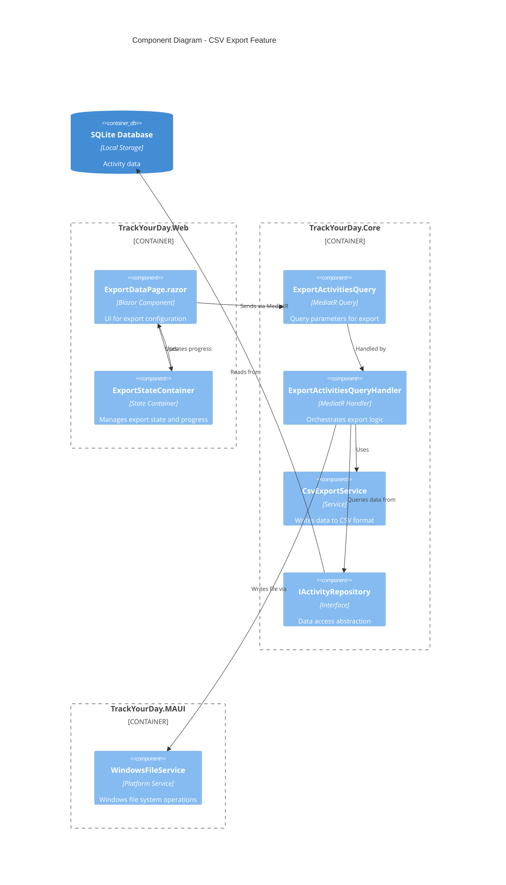
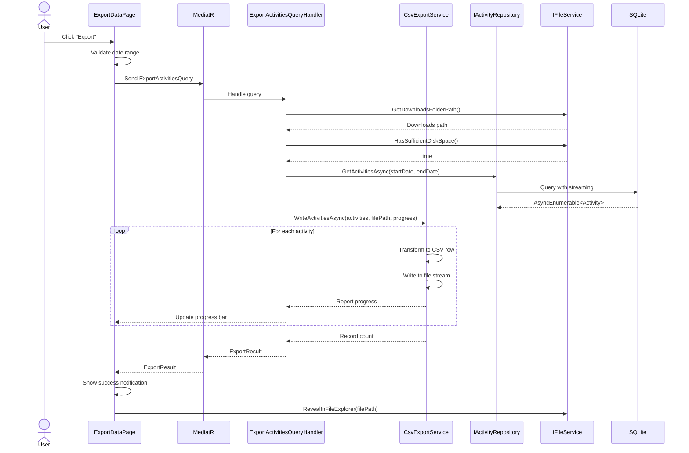

# Architecture: Activity Export to CSV

## Overview
Implements CSV export functionality using CQRS pattern with MediatR. Export handler streams data from repository, transforms to CSV format using CsvHelper library, and writes to file system asynchronously. UI uses Blazor component with MudBlazor date pickers and progress indication.

## Architecture Diagram



## Core Interfaces

### Query and Handler

```csharp
namespace TrackYourDay.Core.Features.Export;

/// <summary>
/// Query to export activities to CSV format.
/// </summary>
public record ExportActivitiesQuery : IRequest<ExportResult>
{
    /// <summary>
    /// Gets the start date for the export range (inclusive).
    /// </summary>
    public required DateTime StartDate { get; init; }

    /// <summary>
    /// Gets the end date for the export range (inclusive).
    /// </summary>
    public required DateTime EndDate { get; init; }

    /// <summary>
    /// Gets whether to include MS Teams meetings in the export.
    /// </summary>
    public bool IncludeMeetings { get; init; } = true;

    /// <summary>
    /// Gets whether to include user tasks in the export.
    /// </summary>
    public bool IncludeTasks { get; init; } = true;

    /// <summary>
    /// Gets the cancellation token for the operation.
    /// </summary>
    public CancellationToken CancellationToken { get; init; } = default;
}

/// <summary>
/// Result of an export operation.
/// </summary>
public record ExportResult
{
    /// <summary>
    /// Gets whether the export was successful.
    /// </summary>
    public required bool Success { get; init; }

    /// <summary>
    /// Gets the full path to the exported file (if successful).
    /// </summary>
    public string? FilePath { get; init; }

    /// <summary>
    /// Gets the number of records exported.
    /// </summary>
    public int RecordCount { get; init; }

    /// <summary>
    /// Gets the error message (if failed).
    /// </summary>
    public string? ErrorMessage { get; init; }
}
```

### CSV Export Service

```csharp
namespace TrackYourDay.Core.Services;

/// <summary>
/// Service for exporting data to CSV format.
/// </summary>
public interface ICsvExportService
{
    /// <summary>
    /// Writes tracked activities to a CSV file.
    /// </summary>
    /// <param name="activities">Activities to export.</param>
    /// <param name="filePath">Destination file path.</param>
    /// <param name="progress">Progress reporter (optional).</param>
    /// <param name="cancellationToken">Cancellation token.</param>
    /// <returns>Number of records written.</returns>
    Task<int> WriteActivitiesAsync(
        IAsyncEnumerable<TrackedActivity> activities,
        string filePath,
        IProgress<int>? progress = null,
        CancellationToken cancellationToken = default);
}
```

### File Service Abstraction

```csharp
namespace TrackYourDay.Core.Abstractions;

/// <summary>
/// Platform-agnostic file system operations.
/// </summary>
public interface IFileService
{
    /// <summary>
    /// Gets the user's Downloads folder path.
    /// </summary>
    string GetDownloadsFolderPath();

    /// <summary>
    /// Checks if there is sufficient disk space for a file.
    /// </summary>
    /// <param name="path">Directory path to check.</param>
    /// <param name="requiredBytes">Required space in bytes.</param>
    /// <returns>True if sufficient space available.</returns>
    bool HasSufficientDiskSpace(string path, long requiredBytes);

    /// <summary>
    /// Opens the file explorer at the specified file location.
    /// </summary>
    /// <param name="filePath">Full path to the file.</param>
    void RevealInFileExplorer(string filePath);
}
```

## Data Flow (MediatR Pipeline)



## DI Registration

```csharp
// In TrackYourDay.Core/ServiceRegistration.cs
public static IServiceCollection AddExportServices(this IServiceCollection services)
{
    services.AddScoped<ICsvExportService, CsvExportService>();
    return services;
}

// In TrackYourDay.MAUI/MauiProgram.cs
builder.Services.AddSingleton<IFileService, WindowsFileService>();
```

## Technical Risks

### Risk 1: Memory Exhaustion with Large Datasets
- **Issue:** Loading 100K+ activities into memory before export
- **Mitigation:** Use `IAsyncEnumerable<T>` for streaming from database and writing to file incrementally
- **Code Pattern:**
  ```csharp
  await foreach (var activity in repo.GetActivitiesAsync(start, end, ct))
  {
      await csvWriter.WriteRecordsAsync([activity], ct);
  }
  ```

### Risk 2: UI Thread Blocking
- **Issue:** Long-running export blocks main thread, freezing UI
- **Mitigation:** 
  - Handler is fully async with proper `ConfigureAwait(false)`
  - UI uses `IProgress<T>` for progress updates
  - MediatR automatically handles async pipeline

### Risk 3: Special Character Escaping
- **Issue:** Window titles may contain quotes, commas, newlines breaking CSV format
- **Mitigation:** Use CsvHelper library which handles RFC 4180 escaping automatically
- **Validation:** Unit test with edge cases (see self-review.md)

### Risk 4: File System Permissions
- **Issue:** Downloads folder may not be writable (corporate policies, permissions)
- **Mitigation:** 
  - Wrap file operations in try-catch with specific error messages
  - Fall back to Documents folder if Downloads is inaccessible
  - Log detailed exception information

## Breaking Changes
None. This is a purely additive feature with no changes to existing code.

## Performance Considerations

### Database Query Optimization
- Add composite index: `CREATE INDEX idx_activities_startdate ON EndedActivities(StartDate, EndDate)`
- Use efficient date range query: `WHERE StartDate >= @start AND EndDate <= @end`
- Leverage SQLite query planner with `EXPLAIN QUERY PLAN`

### Memory Efficiency
- Stream data using `IAsyncEnumerable<T>` to avoid loading entire dataset
- Dispose CSV writer and file stream properly
- Process records in batches of 1000 for progress reporting

### Concurrency
- Use `SemaphoreSlim` to limit concurrent exports to 1 per user
- Cancel previous export if new export is initiated

### File I/O
- Use buffered writing with 8KB buffer
- Flush periodically (every 1000 records) to show progress
- Use async file operations to avoid thread pool starvation

## Security Considerations

### Data Sensitivity Warning
- Display modal before export: "Exported file may contain sensitive information (window titles, meeting names). Store securely."
- User must acknowledge warning before proceeding

### No Automatic Sharing
- File remains local only - no cloud upload or email
- User manually decides what to do with exported file

### Encryption Respect
- If database encryption is enabled, exported CSV is plain text (warn user)
- Consider adding optional encryption for exported files in future
