# Timeline Visualization Architecture

## Overview

A timeline visualization that renders a day's activities as colored periods on a time axis, supporting hierarchical grouping (Teams meetings → activity names → custom groupings). Reuses existing `GroupedActivity` domain model and pluggable `ISummaryStrategy` pattern—**no new domain abstractions needed**. UI-only concern handled by Blazor components.

## Architecture Diagram

```mermaid
graph TB
    subgraph "UI Layer (TrackYourDay.Web)"
        TC[TimelineComponent.razor]
        TVM[TimelineViewModel]
        TRF[TimelineRenderingFactory]
        
        TC --> TVM
        TC --> TRF
    end
    
    subgraph "Core Layer (TrackYourDay.Core)"
        GA[GroupedActivity]
        ISS[ISummaryStrategy]
        AA[ActivitiesAnalyser]
        TA[TrackedActivity]
        
        AA --> ISS
        AA --> GA
        ISS --> TA
    end
    
    subgraph "Data Access (TrackYourDay.MAUI/Core)"
        HDR[IHistoricalDataRepository<T>]
        SPEC[ISpecification<T>]
        
        HDR --> SPEC
    end
    
    TVM --> AA
    TVM --> HDR
    AA --> GA
    
    style TC fill:#e1f5ff
    style TVM fill:#e1f5ff
    style GA fill:#fff3e0
    style ISS fill:#fff3e0
    style AA fill:#fff3e0
```



## Core Interfaces

### Timeline View Model (New - TrackYourDay.Web)

```csharp
namespace TrackYourDay.Web.ViewModels
{
    /// <summary>
    /// View model for timeline visualization. Orchestrates data retrieval and grouping strategies.
    /// </summary>
    public sealed class TimelineViewModel
    {
        private readonly IHistoricalDataRepository<EndedActivity> _activityRepository;
        private readonly IHistoricalDataRepository<EndedMeeting> _meetingRepository;
        private readonly IHistoricalDataRepository<UserTask> _taskRepository;
        private readonly IHistoricalDataRepository<EndedBreak> _breakRepository;
        private readonly ActivitiesAnalyser _analyser;

        /// <summary>
        /// Retrieves timeline data for a specific date with specified grouping strategy.
        /// </summary>
        /// <param name="date">Date to visualize</param>
        /// <param name="groupingStrategy">Strategy for grouping activities (null = no grouping)</param>
        /// <returns>Timeline segments ready for rendering</returns>
        public TimelineData GetTimelineForDate(DateOnly date, ISummaryStrategy? groupingStrategy = null)
        {
            // 1. Retrieve all tracked items for the date
            var activities = _activityRepository.Find(new ActivityByDateSpecification(date));
            var meetings = _meetingRepository.Find(new MeetingByDateSpecification(date));
            var tasks = _taskRepository.Find(new TaskByDateSpecification(date));
            var breaks = _breakRepository.Find(new AndSpecification<EndedBreak>(
                new BreakByDateSpecification(date),
                new NonRevokedBreaksSpecification()));

            // 2. Build timeline segments (ungrouped raw data)
            var rawSegments = BuildRawTimelineSegments(activities, meetings, tasks, breaks);

            // 3. Apply grouping if strategy provided
            if (groupingStrategy != null)
            {
                _analyser.Clear();
                _analyser.SetStrategy(groupingStrategy);
                _analyser.AddActivities(activities);
                _analyser.AddMeetings(meetings);
                _analyser.AddTasks(tasks);
                _analyser.AddBreaks(breaks);

                var grouped = _analyser.GetGroupedActivities();
                return TimelineData.FromGroupedActivities(date, grouped, breaks);
            }

            return TimelineData.FromRawSegments(date, rawSegments);
        }

        private List<TimelineSegment> BuildRawTimelineSegments(
            IEnumerable<EndedActivity> activities,
            IEnumerable<EndedMeeting> meetings,
            IEnumerable<UserTask> tasks,
            IEnumerable<EndedBreak> breaks)
        {
            var segments = new List<TimelineSegment>();

            // Meetings (highest priority in visual hierarchy)
            foreach (var meeting in meetings)
            {
                segments.Add(new TimelineSegment(
                    meeting.Guid,
                    meeting.StartDate,
                    meeting.EndDate,
                    meeting.GetDescription(),
                    TimelineSegmentType.Meeting,
                    GetColorForMeeting(meeting)));
            }

            // Activities
            foreach (var activity in activities)
            {
                segments.Add(new TimelineSegment(
                    activity.Guid,
                    activity.StartDate,
                    activity.EndDate,
                    activity.GetDescription(),
                    TimelineSegmentType.Activity,
                    GetColorForActivity(activity)));
            }

            // Tasks
            foreach (var task in tasks)
            {
                segments.Add(new TimelineSegment(
                    task.Guid,
                    task.StartDate,
                    task.EndDate ?? task.StartDate.AddMinutes(1), // Handle ongoing tasks
                    task.GetDescription(),
                    TimelineSegmentType.Task,
                    GetColorForTask(task)));
            }

            // Breaks (visual overlay, different rendering style)
            foreach (var brk in breaks)
            {
                segments.Add(new TimelineSegment(
                    brk.Guid,
                    brk.StartDate,
                    brk.EndDate,
                    "Break",
                    TimelineSegmentType.Break,
                    "#BDBDBD")); // Gray for breaks
            }

            return segments.OrderBy(s => s.StartDate).ToList();
        }

        private string GetColorForMeeting(EndedMeeting meeting) => "#4CAF50"; // Green
        private string GetColorForActivity(EndedActivity activity)
        {
            // Color by application/context
            var desc = activity.GetDescription();
            if (desc.Contains("Visual Studio")) return "#68217A";
            if (desc.Contains("Chrome") || desc.Contains("Edge")) return "#1976D2";
            if (desc.Contains("Teams")) return "#6264A7";
            return "#FF9800"; // Default orange
        }
        private string GetColorForTask(UserTask task) => "#E91E63"; // Pink
    }

    /// <summary>
    /// Represents a single renderable segment on the timeline.
    /// </summary>
    public sealed record TimelineSegment(
        Guid Id,
        DateTime StartDate,
        DateTime EndDate,
        string Description,
        TimelineSegmentType Type,
        string HexColor)
    {
        public TimeSpan Duration => EndDate - StartDate;
    }

    public enum TimelineSegmentType
    {
        Activity,
        Meeting,
        Task,
        Break
    }

    /// <summary>
    /// Complete timeline data for rendering.
    /// </summary>
    public sealed record TimelineData(
        DateOnly Date,
        IReadOnlyList<TimelineSegment> Segments,
        IReadOnlyList<GroupedActivity> GroupedData)
    {
        public static TimelineData FromRawSegments(DateOnly date, List<TimelineSegment> segments)
            => new(date, segments, Array.Empty<GroupedActivity>());

        public static TimelineData FromGroupedActivities(
            DateOnly date,
            IReadOnlyList<GroupedActivity> grouped,
            IEnumerable<EndedBreak> breaks)
        {
            var segments = new List<TimelineSegment>();

            // Flatten grouped activities back into segments with periods
            foreach (var group in grouped)
            {
                var periods = group.GetIncludedPeriodsWithEvents();
                foreach (var (eventGuid, period) in periods)
                {
                    segments.Add(new TimelineSegment(
                        eventGuid,
                        period.StartDate,
                        period.EndDate,
                        group.Description,
                        TimelineSegmentType.Activity,
                        GetColorForGroupedActivity(group.Description)));
                }
            }

            // Add breaks
            foreach (var brk in breaks)
            {
                segments.Add(new TimelineSegment(
                    brk.Guid,
                    brk.StartDate,
                    brk.EndDate,
                    "Break",
                    TimelineSegmentType.Break,
                    "#BDBDBD"));
            }

            return new(date, segments.OrderBy(s => s.StartDate).ToList(), grouped);
        }

        private static string GetColorForGroupedActivity(string description)
        {
            // Hash-based color assignment for consistency
            var hash = description.GetHashCode();
            var hue = Math.Abs(hash % 360);
            return $"hsl({hue}, 65%, 55%)"; // HSL for better visual distinction
        }
    }
}
```

## Data Flow

### 1. User Interaction Flow

```
User selects date & grouping strategy
    ↓
TimelineComponent invokes TimelineViewModel.GetTimelineForDate()
    ↓
ViewModel queries IHistoricalDataRepository<T> with specifications
    ↓
If grouping selected: ActivitiesAnalyser applies ISummaryStrategy
    ↓
TimelineData returned with segments + optional grouped data
    ↓
TimelineComponent renders via SVG/Canvas/CSS Grid
```

### 2. Rendering Pipeline (SVG Approach Recommended)

**Option A: SVG Timeline (Recommended for flexibility)**
- **Pros**: Zoom, pan, tooltips, click interactions, responsive
- **Cons**: May struggle with 1000+ segments (mitigated by virtualization)

**Option B: CSS Grid Timeline (Simple, performant)**
- **Pros**: Native CSS, fast rendering, accessibility
- **Cons**: Limited interactivity, harder to implement overlaps

**Option C: Canvas Timeline (Overkill for this use case)**
- **Pros**: Maximum performance
- **Cons**: No accessibility, requires custom event handling

### SVG Rendering Implementation

```razor
@* TimelineComponent.razor *@
@using TrackYourDay.Web.ViewModels

<MudPaper Class="pa-4" Elevation="2">
    <MudStack Spacing="2">
        <MudStack Row="true" Justify="Justify.SpaceBetween" AlignItems="AlignItems.Center">
            <MudText Typo="Typo.h5">Timeline: @TimelineData.Date.ToString("D")</MudText>
            <MudSelect T="ISummaryStrategy" Label="Group By" Value="@selectedStrategy" ValueChanged="OnStrategyChanged">
                <MudSelectItem Value="@((ISummaryStrategy)null)">No Grouping</MudSelectItem>
                <MudSelectItem Value="@meetingGroupingStrategy">Teams Meetings</MudSelectItem>
                <MudSelectItem Value="@activityNameStrategy">Activity Names</MudSelectItem>
                <MudSelectItem Value="@contextStrategy">Application Context</MudSelectItem>
                <MudSelectItem Value="@jiraStrategy">Jira Tickets</MudSelectItem>
            </MudSelect>
        </MudStack>

        <svg width="100%" height="@GetTimelineHeight()" viewBox="0 0 1200 @GetTimelineHeight()" 
             style="border: 1px solid #e0e0e0; border-radius: 8px;">
            
            <!-- Time axis (0-24h grid) -->
            @for (int hour = 0; hour <= 24; hour++)
            {
                var x = hour * 50;
                <line x1="@x" y1="0" x2="@x" y2="@GetTimelineHeight()" 
                      stroke="#e0e0e0" stroke-width="1" />
                <text x="@x" y="15" font-size="10" text-anchor="middle" fill="#666">
                    @hour:00
                </text>
            }

            <!-- Segments -->
            @foreach (var segment in TimelineData.Segments)
            {
                var (x, width) = CalculateSegmentPosition(segment);
                var y = GetYPositionForSegmentType(segment.Type);
                var height = GetHeightForSegmentType(segment.Type);

                <rect x="@x" y="@y" width="@width" height="@height" 
                      fill="@segment.HexColor" 
                      stroke="#fff" 
                      stroke-width="2" 
                      rx="4"
                      @onclick="() => OnSegmentClicked(segment)"
                      style="cursor: pointer; opacity: @(segment.Type == TimelineSegmentType.Break ? 0.5 : 1)">
                    <title>@segment.Description (@segment.Duration.ToString(@"hh\:mm"))</title>
                </rect>
            }
        </svg>

        <!-- Legend -->
        <MudStack Row="true" Spacing="2" Justify="Justify.Center">
            <MudChip Color="Color.Success" Size="Size.Small">Meetings</MudChip>
            <MudChip Color="Color.Primary" Size="Size.Small">Activities</MudChip>
            <MudChip Color="Color.Secondary" Size="Size.Small">Tasks</MudChip>
            <MudChip Color="Color.Default" Size="Size.Small">Breaks</MudChip>
        </MudStack>
    </MudStack>
</MudPaper>

@code {
    [Parameter] public DateOnly Date { get; set; } = DateOnly.FromDateTime(DateTime.Now);
    [Inject] private TimelineViewModel ViewModel { get; set; } = null!;

    private TimelineData TimelineData { get; set; } = TimelineData.FromRawSegments(DateOnly.FromDateTime(DateTime.Now), new());
    private ISummaryStrategy? selectedStrategy;

    protected override void OnParametersSet()
    {
        RefreshTimeline();
    }

    private void OnStrategyChanged(ISummaryStrategy? strategy)
    {
        selectedStrategy = strategy;
        RefreshTimeline();
    }

    private void RefreshTimeline()
    {
        TimelineData = ViewModel.GetTimelineForDate(Date, selectedStrategy);
        StateHasChanged();
    }

    private (double x, double width) CalculateSegmentPosition(TimelineSegment segment)
    {
        const double pixelsPerHour = 50;
        var startHour = segment.StartDate.Hour + segment.StartDate.Minute / 60.0;
        var durationHours = segment.Duration.TotalHours;

        var x = startHour * pixelsPerHour;
        var width = Math.Max(durationHours * pixelsPerHour, 2); // Minimum 2px width

        return (x, width);
    }

    private int GetYPositionForSegmentType(TimelineSegmentType type) => type switch
    {
        TimelineSegmentType.Meeting => 30,
        TimelineSegmentType.Activity => 80,
        TimelineSegmentType.Task => 130,
        TimelineSegmentType.Break => 30, // Overlay on top
        _ => 80
    };

    private int GetHeightForSegmentType(TimelineSegmentType type) => type switch
    {
        TimelineSegmentType.Meeting => 40,
        TimelineSegmentType.Activity => 40,
        TimelineSegmentType.Task => 30,
        TimelineSegmentType.Break => 150, // Spans all rows
        _ => 40
    };

    private int GetTimelineHeight() => 200;

    private void OnSegmentClicked(TimelineSegment segment)
    {
        // Navigate to detail view or show popup
    }
}
```

## Technical Risks

- **SVG performance degradation** with >500 segments/day (mitigate with virtualization or canvas fallback)
- **Overlapping segment rendering** requires z-index management (breaks should be semi-transparent overlays)
- **Color assignment consistency** for grouped activities (use deterministic hashing, not random)
- **Time zone handling** if StartDate/EndDate are not UTC-normalized (validate `TrackedActivity` storage)
- **GroupedActivity.GetIncludedPeriodsWithEvents()** bug (line 104-108): Assumes processedEvents and includedPeriods have same indexing—**dangerous assumption**. Fix by storing tuples `List<(Guid, TimePeriod)>` instead.

## Breaking Changes

**None.** This is a purely additive feature in the UI layer.

## Performance Considerations

### Database Queries
- `ActivityByDateSpecification` uses indexed date extraction: `date(json_extract(DataJson, '$.StartDate'))` — **verify SQLite query plan with `EXPLAIN QUERY PLAN`**
- For date range queries (week/month views), batch retrieval with `ActivityByDateRangeSpecification` to avoid N+1

### Memory Allocation
- `TimelineData` should be **cached per date** in `TimelineViewModel` (singleton or scoped service)
- Avoid re-querying database on every render (React to date changes only)
- For large datasets (>1000 segments), implement **viewport-based virtualization** (only render visible time range)

### Rendering Optimization
- **Debounce** zoom/pan interactions (300ms delay)
- Use `@key` directives in Blazor to minimize re-renders
- Consider **incremental rendering** (render grid first, then segments in batches)

### Dependency Injection Lifetimes
```csharp
// ServiceRegistration.cs (TrackYourDay.Web)
services.AddScoped<TimelineViewModel>(); // Scoped to Blazor circuit
```

**Rationale:** `TimelineViewModel` holds per-user state (selected date, strategy). Must be **scoped**, not singleton, to avoid cross-user data leaks.

## Implementation Checklist

1. **Fix `GroupedActivity` bug** (line 104-108): Replace index-based correlation with tuple storage
2. **Add `TimelineViewModel`** in `TrackYourDay.Web/ViewModels/`
3. **Create `TimelineComponent.razor`** in `TrackYourDay.Web/Components/`
4. **Implement color assignment strategy** (deterministic hashing for grouped activities)
5. **Add unit tests** for `TimelineViewModel.GetTimelineForDate()` with mock repositories
6. **Performance test** with 1000+ segments to validate SVG vs Canvas trade-off
7. **Integrate into `DailyOverview.razor`** as collapsible panel

## Future Enhancements (Out of Scope)

- **Multi-day timeline** (week/month view) — requires viewport virtualization
- **Drag-and-drop** to adjust activity times — requires domain event sourcing
- **Export timeline as PNG/PDF** — use server-side rendering (SkiaSharp/Puppeteer)
- **Real-time updates** via SignalR when activities change — requires pub/sub infrastructure
